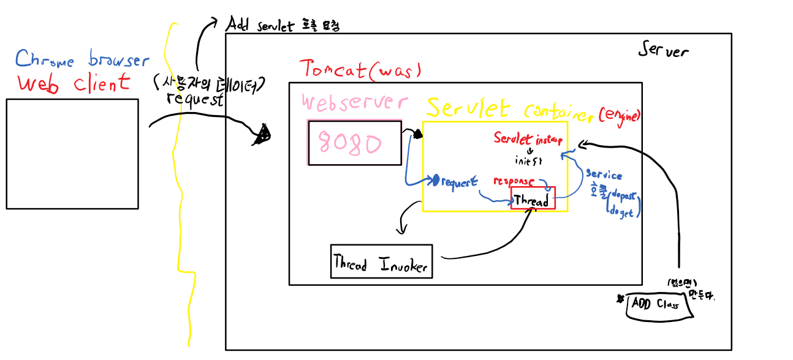
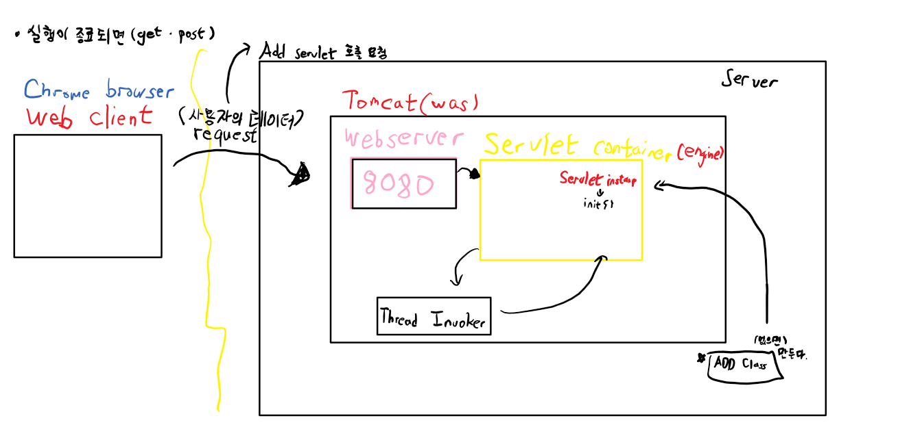

# Maven
```
1. 빌드 (Build)
#1 빌드란?
 - 소스코드 파일을 컴퓨터에서 실행할 수 있는 독립 소프트웨어 가공물로 변환하는 과정 또는 그에 대한 결과물 이다. 소스코드(java), 파일 및 자원 등(.xml, .jpg, .jar, .properties)을 JVM이나 톰캣같은 WAS가 인식할 수 있는 구조로 패키징 하는 과정 및 결과물이라고 할 수 있다.

#2 빌드 도구(Build tool)
 - 빌드 도구란 프로젝트 생성, 테스트 빌드, 배포 등의 작업을 위한 전용 프로그램.
 - 빠른기간동안 계속해서 늘어나는 라이브러리 추가, 프로젝트를 진행하며 라이브러리의 버전 동기화의 어려움을 해소하고자 등장.

빌드 툴
1. Maven (spring Legacy project)
2. Gradle (spring boot)
3. Ant(X)

2. Maven
# 정의 및 특징
 - 프로젝트의 전체적인 라이프 사이클을 관리하는 도구 이며, 많은 편리함과 이점이 있어 널리 사용되고 있다.
 - Maven은 필요한 라이브러리를 특정 문서(pom.xml)에 정의해 놓으면 내가 사용할 라이브러리 뿐만 아니라 해당 라이브러리가 작동하는데에 필요한 다른 라이브러리들까지 관리하여 네트워크를 통해서 자동으로 다운받아 준다.
 - Maven은 중앙 저장소를 통한 자동 의존성 관리를 중앙 저장소(아파치재단에서 운영 관리)는 라이브러리를 공유하는 파일 서버라고 볼 수 있고, 메이븐은 자기 회사만의 중앙 저장소를 구축할수도 있다.
 - 간단한 설정을 통한 배포 관리가 가능 하다.

# Maven LifeCycle
1) LifeCycle
 - 미리 정해진 빌드순서
◎ Default(Build) : 일반적인 빌드 프로세스를 위한 모델이다.
◎ Clean : 빌드 시 생성되었던 파일들을 삭제하는 단계
◎ Validate : 프로젝트가 올바른지 확인하고 필요한 모든 정보를 사용할 수 있는지 확인하는 단계
◎ Compile : 프로젝트의 소스코드를 컴파일 하는 단계
◎ Test : 유닛(단위) 테스트를 수행 하는 단계(테스트 실패시 빌드 실패로 처리, 스킵 가능)
◎ Pacakge : 실제 컴파일된 소스 코드와 리소스들을 jar, war 등등의 파일 등의 배포를 위한 패키지로 만드는 단계
◎ Verify : 통합 테스트 결과에 대한 검사를 실행하여 품질 기준을 충족하는지 확인하는 단계
◎ Install : 패키지를 로컬 저장소에 설치하는 단계
◎ Site : 프로젝트 문서와 사이트 작성, 생성하는 단계
◎ Deploy : 만들어진 package를 원격 저장소에 release 하는 단계
최종 빌드 순서는 compile => test => package 이다. 
① compile : src/main/java 디렉토리 아래의 모든 소스 코드가 컴파일 된다.
② test : src/test/java, src/test/resources 테스트 자원 복사 및 테스트 소스 코드 컴파일 된다. 
③ packaging : 컴파일과 테스트가 완료 된 후, jar, war 같은 형태로 압축
2) Phase(단계)
Build Lifecycle의 각각의 단계를 Phase라고 한다.
Phase는 의존관계를 가지고 있어 해당 Phase가 수행되려면 이전 단계의 Phase가 모두 수행되어야 한다. 모든 빌드단계는 이전 단계가 성공적으로 실행되었을 때 실행된다는 것이 Dependency 입니다.
3) Goal
 - 특정 작업, 최소한의 실행 단위(task).
 - 하나의 플러그인에서는 여러 작업을 수행할 수 있도록 지원하며, 플러그인에서 실행할 수 있는 각각의 기능(명령)을 Goal이라고 한다.
(각각의 Phase에 연계된 Goal을 실행하는 과정을 Build라고 한다.)
 - 플러그인의 goal을 실행하는 방법은 다음과 같다.
■ - mvn groupId:artifactId:version:goal (- mvn plugin:goal)

Build과정
1. project 생성 
2. 라이브러리 설정
3. Code 작성
4. Compile 과정
5. Test 과정
6. packaging 과정
7. 배포 (deploy)

-> 이 과정을 조금 더 효율적으로 처리해 보아요
-> Maven은 특정 IDE에 종속되지 않는다.

### 설치법 
https://maven.apache.org/download.cgi -> Binzry zip archive
환경변수 추가
C:\Program Files\Java\apache-maven-3.9.0 - M2_HOME
Path 설정 
%M2_HOME%\bin

### Maven으로 Java project 생성
cdm -> mvn - BUILD(환경변수 설정 됐는지 확인)
 -> mvn archetype:generate -DgroupId=com.test -DartifactId=myProject -DarchetypeArtifactId=maven-archetype-quickstart
 
프로젝트의 명, 구별하기 위한(Dgroupid) - 패키지명처럼 도메인의 역순으로 쓴다.
기본적인 골격 - Dartifactid
다른 사람이 만든 골격 사용 - -DarchetypeArtifactid

### compile 과정
pom.xml
</dependencies>
  <properties>
	<maven.compiler.source>1.8</maven.compiler.source>
	<maven.compiler.target>1.8</maven.compiler.target>
  </properties>
  </project>

c:\maven_test\myProject>
mvn compile

App.class (결과물)
com\test\App.class 실행하고 싶을떄
java com.test.App 으로 실행
폴더명 = class라고 생각하면 된다.

### packaging 과정
jar로 package 하려면
pom.xml
  <packaging>jar</packaging>
있는 폴더에서
mvn package
치면 된다.
myProject-1.0-SNAPSHOT.jar 생성완료

### 실행
java -cp myProject-1.0-SNAPSHOT.jar com.test.App

## Eclipse와 Maven을 연동 (Maven 프로젝트를 편하게 써보자)
FIle -> Import -> Existing Maven project

| WAR ( Web Application Archive )
.war 확장자 파일은  servlet / jsp 컨테이너에 배치 할 수 있는 웹 어플리케이션(Web Application) 압축 파일 포맷입니다.  JSP,  SERVLET, JAR, CLASS, XML, HTML, JAVASCRIPT 등  Servlet Context 관련 파일들로 패키징 되어있습니다. WAR는 웹 응용 프로그램를 위한 포맷이기 때문에 웹 관련 자원만 포함하고 있으며 이를 사용하면 웹 어플리케이션을 쉽게 배포하고 테스트 할 수 있습니다.
원하는 구성을 할 수 있는 JAR 포맷과 달리 WAR은 WEB-INF 및 META-INF 디렉토리로 사전 정의 된 구조를 사용하며 WAR파일을 실행하려면 Tomcat, Weblogic, Websphere 등의 웹 서버 (WEB)또는 웹 컨테이너(WAS)가 필요합니다.
WAR 파일도 JAVA의 JAR 옵션( java - jar)을 이용해 생성하는 JAR파일의 일종으로 웹어플리케이션 전체를 패키징하기 위한 JAR파일로 생각하시면 될 것 같습니다.

## 변경
<packaging>war</packaging>
Webproject 폴더 생성됨

###실전
perspective -> Java ee
Dynamic Web Project -> MyWebProject
context root - myproject
Configure -> Convert to Maven Project
Group ID : com.test   //   Artifact ID : MyWebProject
혹시 모르니 우클릭 Maven -> Update Project 한번 해주는게 낫다.
Library 추가하기
maven repository
  <dependencies>
	// 추가하기
  </dependencies>
```

### 실행종료시


## 새 web project 프로젝트
```
1. Context root : 우리의 project를 client가 web상에서 식별하기 위한 논리적인 이름
2. Maven project -> dependency 설정
3. Servlet code 생성 -> URL mapping -> 우리 servlet을 클라이언트가 web상에서 식별하기 위한 논리적인 이름
-> /sayHello

```
```
Parameter전달(Data전달)
client가 Servlet에게 Data를 전달하고 싶어요!!!
web에서 URL뒤에 특정문자열을 이용해서 Data를 전달하는 방법!
-> Query String (?key=value&key=value&...)
```
### 문제
클라이언트가 2개의 숫자를 보내요 그 합의 결과를 알려주는 Servlet작성
Query String 사용! 


# Ex)
ClientThread
```java
public class ClientThread extends Thread {
	
	private AddServlet servlet;
	private HttpServletRequest request;
	private HttpServletResponse response;
	
	public ClientThread(AddServlet servlet, HttpServletRequest request, HttpServletResponse response) {
		super();
		this.servlet = servlet;
		this.request = request;
		this.response = response;
	}

	@Override
	public void run() {
		servlet.service(request, response);
	}
}

```
servlet
```java
// Servlet(서블릿)이라고 불리는 클래스는 특정 클래스(HttpServlet)를 상속해서 만들어야 한다.
public class AddServlet {
	public void init() {
		// Servlet Instance의 초기화를 담당! 생성자에서 안하고 여기서한다.
	}

	public void service(HttpServletRequest request, HttpServletResponse response) {
		// 이 메소드는 이미 하는일이 정해져 있다.
		// request객체를 뒤져서 클라이언트의 요청방식이 어떤 방식인지 알아낸다.
		// 만약 GET방식이면 => doGet(request, response); 호출
		// 만약 POST방식이면 => doPost(request, response); 호출
		doPost(request, response);
	}
	public void doGet(HttpServletRequest request, HttpServletResponse response) {
		// 여기에서 request객체와 response객체를 이용해서 입력처리, 로직처리, 출력처리를 진행한다.
	}

	public void doPost(HttpServletRequest request, HttpServletResponse response) {

	}
	// 이번에는 안쓰인다.
	//public void doPut() {}
	//public void doDelete() {}
}

```
ServletContainer
```java
// Tomcat(WAS)안의 Servlet Container역할을 하는 클래스
public class ServletContainer {

	//일반 자바프로그램이기 떄문에 가지고 있고, Servlet Container는 가지고 있지 않다.
	public static void main(String[] args) {
		
		// 1. 사용자의 요청사항(request)를 분석, 어떤 서블릿을 실행하는지 알아내기
		// Add Servlet을 실행
		// 2. Add라는 서블릿의 instance가 있는지를 확인,
		//    Container안에 객체가 있는지를 확인한다.
		// 3. 객체가 없기 떄문에 Add Servlet을 찾아서 객체를 생성한다.
		AddServlet servlet = new AddServlet();
		
		// 4. Servlet instance가 생성되면 바로 다음에 해당 서블릿의 init()을 호출해요
		servlet.init();
		// 5. 클라이언트가 보내준 request 내용을 기반으로 객체를 하나 생성해요
		// 당연히 이 객체에는 클라이언트가 보내준 데이터가 들어가 있어요
		HttpServletRequest request = new HttpServletRequest();
		
		// 6. 클라이언트에게 최종 결과를 보여주기 위해서 response객체를 하나 생성해요
		HttpServletResponse response = new HttpServletResponse();
		
		// 7. 클라이언트의 요청을 실제로 처리하기 위해서 Thread가 있어야 한다.
		ClientThread thread = new ClientThread(servlet, request, response);
		thread.start();
	}

}
```
Sample Web Project
```java
@WebServlet("/myservlet")
public class FirstServlet extends HttpServlet implements Servlet {
	private static final long serialVersionUID = 1L;

    public FirstServlet() {
        // TODO Auto-generated constructor stub
    }
    
    @Override
    public void init(ServletConfig config) throws ServletException {
    	// TODO Auto-generated method stub
    	super.init(config);
    	System.out.println("init()가 호출되었어요!");
    }
    
	protected void doGet(HttpServletRequest request, HttpServletResponse response) throws ServletException, IOException {
		// 클라이언트가 Get방식으로 이 servlet을 호출하면 이 method가 호출된다!
		// 결과적으로 doGet() method가 호출된다.
		// 클라이언트의 호출 URL => http://127.0.0.1:8080/sample/myservlet
		// 이 클래스 안에 있는 doGet()이 호출된다. 여기에 코드를 작성하면 된다.
		// 클라이언트가 호출되었을 떄 해야하는 일을 여기에 작성하면 된다. 프로그램 처리방식대로 작성해 보아요
		// 1. 입력을 받는다.
		// 2. 로직처리한다.
		// 3. 출력처리한다.
		// 처음이라서 1,2 넘어가고 3.해보기
		// 1. 내가 클라이언트에게 전달한 데이터가 어떤 데이터인지 설정부터 해야한다. response.getContentType("");
		// response.setContentType("image/jpeg");
		 response.setContentType("text/html; charset=UTF-8");
		// 2. 클라이언트에게 데이터를 전달하기 위해 stream을 연다.
		PrintWriter out = response.getWriter();
		// 3. 통로가 열렸으니 이제 통로를 통해서 데이터를 전달해요!
		out.println("<html>");
		out.println("<head></head>");
		out.println("<body>이건 서블릿의 결과 입니다.... 소리없는 아우성 !! </body>");
		out.println("</html>");
		
		response.getWriter().append("Served at: ").append(request.getContextPath());
	}

	protected void doPost(HttpServletRequest request, HttpServletResponse response) throws ServletException, IOException {
		doGet(request, response);
	}

}

```
HelloWorld예제
```html
add.html
<!DOCTYPE html>
<html>
<head>
    <meta charset="UTF-8">
    <title>Insert title here</title>
</head>
<body>
    <h1> 두 수를 더한 결과는? </h1>
    <!-- 사용자 입력 양식을 만들거에요! -->
    <form action="http://127.0.0.1:8080/first/sum" method="post">
    <input type="text" name="myNum1"> + <input type="text" name="myNum2">
    <br><br>
    <input type="submit" value ="서버로전송"> 
    <!-- submit은 데이터를 전송하는 타입 -->
	</form>
</body>
</html>
```
HelloWorldServlet
```Java
@WebServlet("/sayHello")
public class HelloWorldServlet extends HttpServlet {
	private static final long serialVersionUID = 1L;
       
    public HelloWorldServlet() {
        super();
    }

	protected void doGet(HttpServletRequest request, HttpServletResponse response) throws ServletException, IOException {
		// Get 방식으로 Thread에 의해서 호출
		// 1. 클라이언트가 보내준 데이터를 받아요
		// 2. 로직처리해요!(DB처리 포함해서)
		
		// 3. 출력처리해요!  => response객체를 이용한다.
		//  처리된 결과를 보내주기 전에.. 먼저 처리한 결과가 어떤데이터인지를 먼저 알려줘야해요
		response.setContentType("text/html; charset=UTF-8");
		// "text/html; charset=UTF-8" -> 문자열이라는 뜻이다. html;-> 오류나면 다운로드 창이 뜬다.
		// 실제 결과 데이터를 전송해야 하기 때문에 stream을 열어서 데이터 전송!
		PrintWriter out = response.getWriter();
		out.println("<html><head></head><body>까꿍!!</body></html>");
		out.close();
	}

	protected void doPost(HttpServletRequest request, HttpServletResponse response) throws ServletException, IOException {
		doGet(request, response);
	}

}
```
AddServlet.java
```java

@WebServlet("/sum")
public class AddServlet extends HttpServlet {
	private static final long serialVersionUID = 1L;
       
    public AddServlet() {
        super();
    }

	protected void doGet(HttpServletRequest request, HttpServletResponse response) throws ServletException, IOException {
		// 이 서블릿을 호출하려면
		// http://127.0.0.1:8080/first/sum?num1=10&num2=20
		
		// 1. 입력처리
		// Query String으로부터 데이터를 받으려면 무조건 문자열
		String num1 = request.getParameter("num1");
		String num2 = request.getParameter("num2");
		
		// 2. 로직처리
		int sum = Integer.parseInt(num1) + Integer.parseInt(num2);

		// 3. 출력처리
		response.setContentType("text/html; charset=UTF-8");
		PrintWriter out = response.getWriter();
		out.println("<html><head></head><body>" + sum + "</body></html>");
		out.close();
		
	}

	protected void doPost(HttpServletRequest request, HttpServletResponse response) throws ServletException, IOException {
		// 1. 입력처리
		// Form으로부터 post형태로 받았다.
		// Query String으로부터 데이터를 받으려면 무조건 문자열
		String num1 = request.getParameter("myNum1");
		String num2 = request.getParameter("myNum2");
		
		// 2. 로직처리
		int sum = Integer.parseInt(num1) + Integer.parseInt(num2);

		// 3. 출력처리
		response.setContentType("text/html; charset=UTF-8");
		PrintWriter out = response.getWriter();
		out.println("<html><head></head><body>" + sum + "</body></html>");
		out.close();
	}

}
```