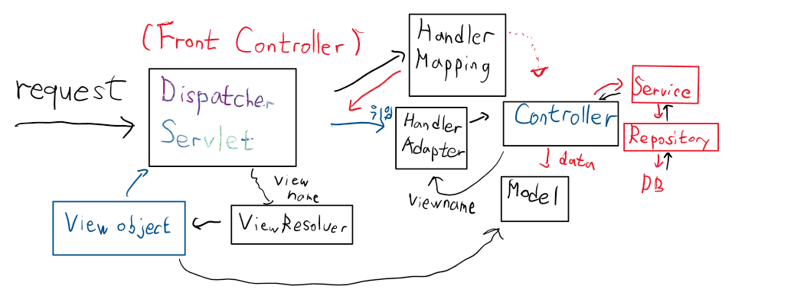
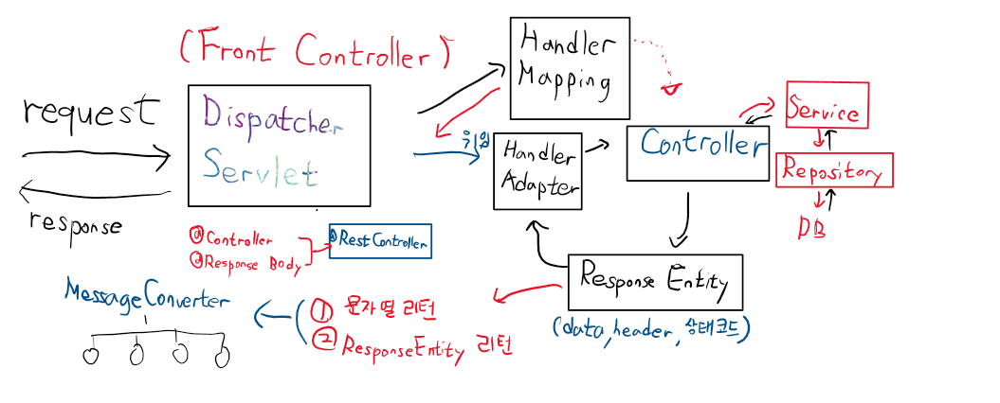

# @RequsetMapping(Value = "_" , ???)
```
??? 
1. consumes (수신)
-> client의 request를 제한하는 Header 용도
-> content-type

Get -> URL 뒤에 QueryString
request - startline, header, body 
header에 content-type이 없기 때문에 get방식으로 사용 할 수 없다.
Post -> 

Get방식으로 하면 415 에러가 뜬다.

POSt방식의 Content-type
Content-Type: text/html;charset=utf-8

보통의 request는 특별한 경우가 아닌 이상 요청을 제한하는 경우가 거의 없다.

위의 경우보다는 요청을 처리한 다음 서버에서 데이터를 전달할 떄 해당 data가 일반적인 HTML, JSON, XML, ....정해줘야 하는 경우가 많다.
content-type을 정해줘야 할 필요가 있다.
-> Request, Response -> Header안에 들어있다. "MIME TYPE"
```
```Java
package my.spring.springweb.sample08;

@Controller
public class RequestMappingConsumesController {

	Logger log = LogManager.getLogger("case3");

	@RequestMapping(value = "/testController1", method = RequestMethod.GET, 
			consumes = { "application/json", "application/xml" })
	public String myMethod1() {
		log.debug("get방식으로 호출 되었어요!");
		return null;

	}

	@RequestMapping(value = "/testController2", method = RequestMethod.POST, 
			consumes = { "application/json", "application/x-www-form-urlencoded" })
	public String myMethod2() {
		log.debug("post 방식으로 호출 되었어요!");
		return null;

	}
}

<!DOCTYPE html>
<html>
<head>
<meta charset="UTF-8">
<title>Insert title here</title>
</head>
<body>
	<h1>Test Link</h1>
	<hr>
	GET방식으로 호출(request header에 content type이 존재하지 않아요):
	<a href="/springweb/testController1"> consumes의 content-type : application/json </a>
	<br><br>
	Post방식으로 호출
	<form action="/springweb/testController2" method="post">
		<input type="submit" value="consumes의 content-type : application/json">
	</form>
</body>
</html>
```

```
2. produces (출력)
-> 클라이언트에게 return하는 data의 content-type을 지정
서버가 클라이언트에게 데이터를 리턴할 때 그 데이터를 해당 타입으로 변환하는건 아니다.
@ResponseBody와 같이 쓰인다.

1차적으로 결정이 되기는 하지만 끝까지 가는 content-type이라는 보장이 없다.
직접 수동으로 Bean을 등록하면 
1. 외부 library(Gson 같은) 를 Bean으로 등록해서 효율적으로 사용이 가능하다.
2. Program이 크기가 커지고 자주 기능이 변경되는 경우에는 interface를 기반으로 구현 class를 수동으로 등록해서 전략패턴을 활용할 수 있기 때문에 자동보다 수동으로 등록하는게 낫다.
```
```java
package my.spring.springweb.sample08;

@Controller
public class RequestMappingProducesController {

	Logger log = LogManager.getLogger("case3");
	
//	@Autowired
//	private Gson gson;
	
	@RequestMapping(value = "/testProduces1")
	public String myMethod1(Model model) {
		
		model.addAttribute("msg", "소리없는 아우성!");
		
		log.debug("get방식으로 호출 되었어요!");
		return "sample08/requestMappingProducesView";

	}

	@RequestMapping(value = "/testProduces2", produces = "application/json; charset=UTF-8")
	public String myMethod2(Model model) {
		
		model.addAttribute("msg", "소리없는 아우성!");
		
		log.debug("get방식으로 호출 되었어요!");
		return "sample08/requestMappingProducesView";

	}
	
	@RequestMapping(value = "/testProduces3", produces = "text/html; charset=UTF-8")
	public void myMethod3(HttpServletResponse response) {
		
		try {
			response.setContentType("text/html; charset=UTF-8");
			PrintWriter out = response.getWriter();
			out.println("<html><head></head>");
			out.println("<body><h1>소리없는 아우성!!</h1></body></html>");
			out.close();
		} catch (IOException e) {
			// TODO Auto-generated catch block
			e.printStackTrace();
		}
	}
	
	@RequestMapping(value = "/testProduces4", produces = "application/json; charset=UTF-8")
	public void myMethod4(HttpServletResponse response) {
		
		try {
			response.setContentType("application/json; charset=UTF-8");
			PrintWriter out = response.getWriter();
			
			Map<String, String> map = new HashMap<String, String>();
			map.put("userName", "홍길동");
			map.put("userAge", "20");
			map.put("userAddr", "서울");
			
			// 이 데이터를 JSON문자열로 변형해야 해요!
			// 이 데이터를 JSOn문자열로 변형하고 Stream을 통해 클라이언트에게 보내주면 되요!
			// Gson gson = new Gson();
			ApplicationContext ctx = ApplicationContextProvider.getApplicationContext();
			Gson gson = ctx.getBean("getGson", Gson.class);
			String str = gson.toJson(map);
			
			out.println(str);
			out.close();
			
		} catch (IOException e) {
			// TODO Auto-generated catch block
			e.printStackTrace();
		}
	}
}

<!DOCTYPE html>
<html>
<head>
<meta charset="UTF-8">
<title>Insert title here</title>
</head>
<body>
	<h1>Test Link</h1>
	<hr>
	GET방식으로 호출(request header):
	<a href="/springweb/testProduces1"> produces 의 content-type : 설정안해요
		- 결과는 JSP로 사용 </a>
	<br>
	<br> GET방식으로 호출(request header):
	<a href="/springweb/testProduces2"> produces 의 content-type :
		text/plain - 결과는 JSP로 사용 </a>
	<br>
	<br> GET방식으로 호출(request header):
	<a href="/springweb/testProduces3"> produces 의 content-type :
		text/html - Stream을 이용해 직접 출력 </a>
	<br>
	<br> GET방식으로 호출(request header):
	<a href="/springweb/testProduces4"> produces 의 content-type :
		application/json - Stream을 이용해 직접 출력 </a>

</body>
</html>
```
## Content type
```
text/css, text/javascript, text/html, text/plain 등이 있습니다. 
file을 실어보내기 위해서는 multipart/form-data가 있고 Application 타입으로는 application/json, application/x-www-urlencoded 가 있다.
```
## Application Context를 직접 사용하는 방법이 있을까?
```java
@Autowired로 bean을 필드에 추가하는 경우가 쉽지만 @Autowired를 쓰지 않고 Bean을 활용하고 싶은 경우가 있다.
-> 있다. 구현체를 만들어야 한다.
interface를 제공해준다. 
ApplicationContextAware
구현한 구현체를 Bean으로 등록한다.
```
```java
Application Context 수동, Bean 수동 등록하는법 
package my.spring.springweb.sample09;

//@Controller
@RestController
@RequestMapping(value = "body")
public class ResponseBodyController {
	
	@RequestMapping(value = "text/{id}", produces = "text/plain; charset=UTF-8")
//	@ResponseBody
	public String method01(@PathVariable String id) {
		return "<h1>이것은 소리없는 아우성" + id + "</h1>";
	}
	
//	@RequestMapping(value = "textObject/{id}", produces = "text/plain; charset=UTF-8")
//	@ResponseBody
//	public ResponseEntity<String> method02(@PathVariable String id) {
//		String msg = "<h1>이것은 소리없는 아우성!! " + id + "</h1>";
//		HttpHeaders headers = new HttpHeaders();
//		headers.setContentType(new MediaType("text", "plain", Charset.forName("UTF-8")));
//		return new ResponseEntity<String>(msg, headers, HttpStatus.CREATED);
//
//	}

	@RequestMapping(value = "textObject/{id}", produces = "text/plain; charset=UTF-8")
//	@ResponseBody
	public ResponseEntity<String> method02(@PathVariable String id) {
		String msg = "<h1>이것은 소리없는 아우성!! " + id + "</h1>";
		HttpHeaders headers = new HttpHeaders();
		headers.setContentType(null);
		return new ResponseEntity<String>(msg, headers, HttpStatus.OK);
		
	}
	
	@RequestMapping(value = "json/{name}", produces = "application/json; charset=UTF-8")
//	@ResponseBody
	public User method03(@PathVariable String name) {
		User user = new User();
		user.setName(name);
		user.setAddr("서울");
		
		return user;
	}
}

<!DOCTYPE html>
<html>
<head>
<meta charset="UTF-8">
<title>Insert title here</title>
</head>
<body>
	<h1>Test Link</h1>
	<hr>
	<a href="/springweb/body/text/3">text/plain 호출(일반문자열 리턴)</a>
	<br><br>
	<a href="/springweb/body/textObject/2">text/plain 호출(ResponseEntity 리턴)</a>
	<br><br>
	<a href="/springweb/body/json/hong">application/json 호출(VO 리턴)</a>

</body>
</html>
```
### produces
```
 -> 유명무실했지만
@RequestBody 와 결합하면 많이 쓰인다.

HTTP의 기본 통신방식
-> Request, Response -> 단순한구조

HTTPRequest
1. Start Line
POST,  /springweb/aaa,  HTTP/1.1
(--------------)
(--------------)
(두 줄 띄우는게 규칙이다.)

2. headers
----------
----------
----------
content-type : ~~
(--------------)
(--------------)

3. body (RequestBody)
JSON
XML
text....

HTTPResponse
1. Status line
404 - 서버가 요청한 페이지를 찾을 수 없다
403 - 서버가 요청을 거부하고 있다
415 - Type이 안맞는다.
500 - 프로그램에러
같은 메시지를 보낸다.
(--------------)
(--------------)
2. headers
(--------------)
(--------------)
3. body (ResponseBody)
"JSON"

JSP가 나오지 않고 직접 ResponseBody로 JSON을 입력할 것이다.
```

## 일반적인경우 (JSP 파일 이용)

## 다른 경우 (Controller가 Data를 직접 client에게 보내는 경우)
```
-> REST 기반으로 client의 AJAX호출에 대한 결과를 return 할 떄
-> JSP를 사용하지 않아요 (produces 속성, @Response속성)
```

```
Responsebody는 항상 나오기 때문에 @RestController라는 annotataion을 쓴다.
```
### Internet 물리적 platform 위에 www(web)이라는 service를 활용한다.
```
1. SOAP 기반의 Web Service
(Simple Object Access Protocal), (일반적인 Enterprise Application에서 사용)
-> 보안, 데이터 무결성 에 장점이 있다.
protocal 자체가 복잡 -> web의 c/s구조와 잘 맞지 않다.

2. HTTP 기반의 Web Service
HTTP 라는 protocal은 web의 구조와 상당히 잘 어울려요
HTTP protocal의 개발자 중 한명이
REST 방식으로 정형화해서 쓰자 (Architecture style)
```
## REST (Representational State Transfer)
```
HTTP, Web을 조금 더 잘 사용하기 위한 Architecture
HTTP URI(Uniform Resource Identifier)를 통해 자원(Resource)을 명시하고, HTTP Method(POST, GET, PUT, DELETE)를 통해 해당 자원에 대한 CRUD Operation을 적용하는 것을 의미한다.
즉, REST는 자원 기반의 구조(ROA, Resource Oriented Architecture) 설계의 중심에 Resource가 있고 HTTP Method를 통해 Resource를 처리하도록 설계된 아키텍쳐를 의미한다.
웹 사이트의 이미지, 텍스트, DB 내용 등의 모든 자원에 고유한 ID인 HTTP URI를 부여한다.

구성요소
1.Resource(자원) : 서버에 존재하는 해당 소프트웨어가 관리하는 모든 것 (file, image, 문서, 프로그램)
"ID가 부여" -> URI
자원의 표현: 그 자원을 표현하기 위한 이름
-> Ex) DB의 학생 정보가 자원일 때, ‘students’를 자원의 표현으로 정한다.

2. 행위(HTTP의 method)
GET, POST, Put, Delete
HTTP MEthod에 의미가 부여된다.
CRUD OPERATION
(Create)자원을 조회 -> GET
(Read)자원을 생성 -> POST
(Update)자원을 수정 -> PUT
(Delete)자원을 삭제 -> DELETE
HEAD: header 정보 조회(HEAD)

3. 표현(Representation)
서버가 처리를 끝내면 적절한 응답(TEXT,JSON,XML)을 보내요
```
## REST API
```
RESTful이란
RESTful은 일반적으로 REST라는 아키텍처를 구현하는 웹 서비스를 나타내기 위해 사용되는 용어이다.
‘REST API’를 제공하는 웹 서비스를 ‘RESTful’하다고 할 수 있다.

REST API 디자인 가이드
1. URI는 resource를 표현하는 수단이어야해요
GET /member/delete/3  (X)
->
DELETE /member/3
GET /member/3 ->"@PathVariable"
POST /member

2. URI의 마지막은 '/'로 끝나지 않아요
/member/3  (o)
/member/3/ (X)

3. 특수문자를 URI에 쓰는건 X
/member/student_score (X)'_'쓰지마세요
/member/student-score (O)'-'사용

4. 소문자로 URI는 작성

5. 확장자는 URI에 포함하지 않아요
/member/flower.gif (X) -> 확장자 : Accpet-header에 명시한다. (image/gif)

REST의 응답.
REST원칙에 따라 서버는 client에게 상태정보를 보내줘야 해요
ex) 200 201 404 415 500

1. HTTP 인증 -> 데이터 암호화시켜서
2. key base 인증 -> 서버가 client에게 key 발급, request마다 key 포함
3. OAuth 인증 -> 복잡한 인증 process

```
Servers - tomcat -server.xml 63번쨰 줄에  parseBodyMethods="POST, PUT, DELETE" 추가

### put과 delete 방식
post와 똑같다.
```java
package my.spring.springweb.sample10;

@RestController
@RequestMapping(value = "/rest/user")
public class MyRestController {
	
	Logger log = LogManager.getLogger("case3");
	
	@GetMapping
	public ResponseEntity<?> method01(String id, String name){
		
		log.debug("Get방식으로 호출되었어요!");
		log.debug(id + "," + name);
		return null;
	}
	
	@DeleteMapping
	public ResponseEntity<?> method02(String id, String name){
		
		log.debug("Delete 방식으로 호출되었어요!");
		log.debug(id + "," + name);
		return null;
	}
	
}

<!DOCTYPE html>
<html>
<head>
<meta charset="UTF-8">
<title>Insert title here</title>
<script src="https://code.jquery.com/jquery-2.2.4.min.js"
	integrity="sha256-BbhdlvQf/xTY9gja0Dq3HiwQF8LaCRTXxZKRutelT44="
	crossorigin="anonymous"></script>
<script>
	
	function myFunc(restMethod){
		  $.ajax({
		    url: '/springweb/rest/user',
		    method: restMethod,
		    data: {
		      id: $("#id").val(),
		      name: $("#name").val()
		    },
		    success: function(){
		      alert("성공해씀");
		    },
		    error: function(){
		      alert("에러떴음");
		    }
		  });
		}
</script>

</head>
<body>

	<h1>AJAX로 호출해 보아요!</h1>
	id :
	<input type="text" id="id">
	<br>
	<br> name :
	<input type="text" id="name">
	<br>
	<br>
	<button onclick="myFunc('get')">Get방식 호출</button>
	<button onclick="myFunc('delete')">DELETE방식 호출</button>

</body>
</html>
```