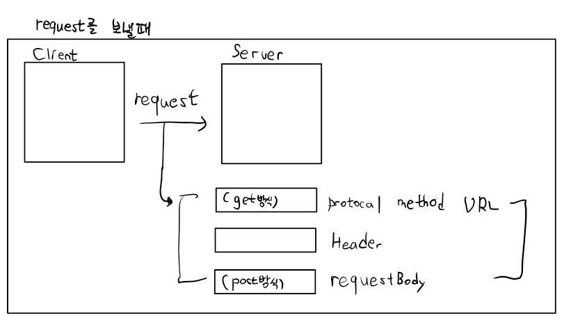
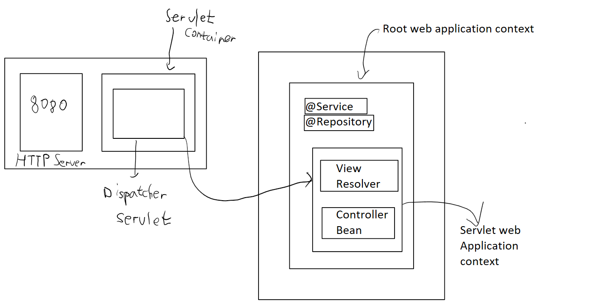

# 수업 복습
```
1. Log4J
2. @Controller
3. @RequestMapping
4. InternalResourceVIew (HTML)
5. Model
6. EL
7. Lombok
8. JSTL
```

## Lombok
```
//@Setter
//@Getter
//@NoArgsConstructor // 기본 생성자 만들기
//@AllArgsConstructor // 모두 들어가있는 생성자 만들기
//@RequiredArgsConstructor // 일부분 들어가 있는 생성자 //@NonNull을 붙여서 넣는다.
//@ToString	//@ToString.Exclude -> ToString할떄 그 인자를 뺄 수 있다.
//@EqulasAndHashCode 

@Data // 한방에 다 들어온다
```
## "JSTL"
```
-> Tag library
<% %>
if문 for문 JSP에서 이용 -> 유지보수가 힘들다

JSP에서 JSTL을 사용하려면 tglib라는 directive를 명시해야 해요
앞으로 JSP구현은 JSTL + EL로 구현해야한다.
```

## C태그
```
<c:set />   변수의 선언 및 제거
설명 
c:set 태그를 사용해 값을 설정하는 방식은 두 가지가 있습니다. 첫 번째 방법은 var, value 속성을 이용해 변수를 설정하는 방법입니다.
// 첫 번째 방법
<c:set var="변수명" value="값" scope="영역"/>
// 두 번쨰 방법
<c:set var="변수명" scope="영역">값</c:set>
var속성에는 만들 변수명을 입력하고 value속성에는 변수에 들어갈 값을 입력합니다. scope속성에는 해당 변수가 저장될 영역으로, page, request, session, application 중 하나를 입력합니다. 
입력하지 않으면 기본값인 page로 지정됩니다.

ex)
<c:set var="name" value="1"/> // name = 1;
<c:remove /> 
<c:out />  변수의 출력 
<c:catch /> 예외 처리 
<c:if />  조건문 (else는 없다) 
<c:choose />  Switch문과 비슷 
<c:when />
<c:otherwise /> 
<c:forEach /> 반복문
ex 1) <c:forEach var="tmp" begin="1" end="5" stp="1">
ex 2) <c:forEach var="name" items="${ myList }">
	  <li>${ name }</li> </c:forEach>
<c:forTokens /> 구분자로 분할하여 반복문 
<c:url /> URL 생성 
<c:param /> 파라미터 추가 
<c:import /> 페이지 첨부 
<c:redirect /> URL 이동 
```
## fmt
```
requestEncoding	value   속성을 통해 지정한 문자 셋으로 변경
setLocale	통화 기호나 시간 대역을 설정한 지역에 맞게 표시
timeZone	특정 영역의 시간대를 설정
setTimeZone	특정 영역의 시간대 설정 정보를 변수에 저장
bundle  	basename 속성에 지정된 properties 파일을 읽어옴
setBundle	properties 파일을 읽어와 다양한 영역에서 참조할 수 있게 설정
message	    bundle 태그를 통해 저장된 key로 value를 가져온다
formatNumber	숫자를 특정 양식에 맞추어 출력
parseNumber	    문자열을 숫자 형식으로 변환
formatDate	    날자 정보를 가진 객체(Date)를 특정 형식으로 변호나하여 출력
parseDate	    문자열을 날짜 형식으로 변환하여 출력
value   	원하는 표현 방식으로 사용하기 위한 숫자 데이터
type    	표시할 타입 지정(NUMBER, CURRENCY, PERCENT)
pattern	    화면에 표현할 데이터 스타일을 지정하며 패턴은 java.text.DecimalFormat   클래스의 포맷 방식을 따름	
currencyCode	type 속성이 "currency"일 경우 인식할 화폐 단위
currencySymbol	type 속성이 "currency"일 경우 표시할 화폐 단위
groupingUsed	',' 와 같은 각 숫자 단위의 구분자 표시 여부
maxIntegerdigits	화면에 표시할 숫자의 최대 자릿수
minIntegerDigits	화면에 표시할 숫자의 최소 자릿수
maxFractionDigits	화면에 표시할 소수점 이하 숫자의 최대 개수
minFractionDigits	화면에 표시할 소수점 이하 숫자의 최소 개수
var	    변환된 숫자 데이터를 담을 변수 생성
```

## @RequestParam
```java
간단하게 -> ModelAttributes
```


## Log4J2 (형식이 달라진다.)

web.xml
```xml
<!-- Creates --!>
</listner>
// 밑에추가
     <!-- Log4j 설정 -->
      <context-param>
          <param-name>log4jConfiguration</param-name>
          <param-value>classpath:/log4j2.xml</param-value>
      </context-param>
        
      <listener>
          <listener-class>org.apache.logging.log4j.web.Log4jServletContextListener
          </listener-class>
      </listener>

```

## @PathVariable
★ REST API 구현할떄 사용
ex) http://localhost:8080/springweb/mybook/

## @ModelAttributes
```
parameter VO로 받을때
method에 사용가능
sessionAttributes와 같이 사용
```

## @Autowired
```
+ @Qualifier
-> 자동주입, 기본적으로 Type을 기반으로 주입할 Bean을 찾아요
만약 못찾으면 이름가지고 찾는다.
```
## @Resource
```
@Autowierd와 같은 기능을 해요 (자동주입)
이름으로 Bean을 찾고 못 찾으면 Type으로 찾아요
```

## @Component의 하위 annotation
### @Service
### @Repository

```
tomcat에서 server 젤 아래 
      <Context docBase="springweb" path="/springweb" reloadable="true" source="org.eclipse.jst.jee.server:springweb"/></Host>
설정이 있기때문에 Contextroot를 붙였다.
```


```java
정적 리소스일시 Dispatcher Servlet -> default servlet 으로 전달

[1]스프링 어플리케이션에 application context는 2개가 들어간다.
- ContextLoaderListener에 의해서 만들어지는 Root WebApplicationContext
- DispatcherServlet에 의해서 만들어지는 WebApplicationContext
1. Root WebApplicationContext 이름 그대로 최상단에 위치한 Context 이다
1.1 서비스 계층이나 DAO를 포함한, 웹 환경에 독립적인 빈들을 담아둔다.
1.2 서로 다른 서블릿컨텍스트에서 공유해야 하는 빈들을 등록해놓고 사용할 수 있다.
1.3 Servlet context에 등록된 빈들을 이용 불가능하고 servlet context와 공통된 빈이 있다면 servlet context 빈이 우선된다.
1.4 WebApplication 전체에 사용가능한 DB연결, 로깅 기능들이 이용된다.

2. WebApplicationContext 서블릿에서만 이용되는 Context이다
2.1 DispatcherServlet이 직접 사용하는 컨트롤러를 포함한 웹 관련 빈을 등록하는 데 사용한다.
2.2 DispatcherServlet은 독자적인 WebApplicationContext를 가지고 있고, 모두 동일한 Root WebApplicationContext를 공유한다.

*WebAppliCationContext vs ApplicationContext
 스프링에서 말하는 "애플리케이션 컨텍스트"는 스프링이 관리하는 빈들이 담겨 있는 컨테이너라고 생각하시면 됩니다. 스프링 안에는 여러 종류의 애플리케이션 컨텍스트 구현체가 있는데, ApplicationContext라는 인터페이스를 구현한 객체들이 다 이 애플리케이션 컨텍스트입니다. 웹 애플리케이션 컨텍스트는 ApplicationContext를 확장한 WebApplicationContext 인터페이스의 구현체를 말합니다. WebApplicationContext는 ApplicationContext에 getServletContext() 메서드가 추가된 인터페이스입니다. 이 메서드를 호출하면 서블릿 컨텍스트를 반환됩니다. 결국 웹 애플리케이션 컨텍스트는 스프링 애플리케이션 컨텍스트의 변종이면서 서블릿 컨텍스트와 연관 관계에 있다는 정도로 정리가 됩니다. 

View Resolver
- DispatcherServlet에게 뷰 정보를 전달하는 방법은 두 가지가 있어요
1) View 타입의 오브젝트를 주는 방법
2) String 타입의 뷰 이름을 주는 방법
- String 뷰 이름을 주는 경우, 
이름으로부터 실제로 사용할 뷰 객체를 결정해주는 뷰 리졸버가 필요해요.
- 뷰 오브젝트를 넘겨주는 것 보다, 뷰 이름을 넘겨주어서 뷰 리졸버를 사용하는 것이 성능 면에서 유리해요. 뷰 리졸버는 보통 뷰 오브젝트를 캐싱하기 때문이에요.
- 뷰 리졸버는 뷰 이름으로부터 사용할 뷰 오브젝트를 매핑해줘요.
- 뷰 이름으로부터 뷰 오브젝트를 매핑해주는 방법에도 여러 가지가 있어요. 선택해서 사용해요.
- 특정 뷰 리졸버를 빈으로 등록하지 않는다면, 
DispatcherServlet은 기본 뷰 리졸버인 InternalResourceViewResolver를 사용해요.
- 가장 기본적으로 JSP를 사용하기 위한 InternalResourceViewResolver만 알아볼게요.

1. InternalResourceViewResolver
- Default(기본) 뷰 리졸버. JSP를 뷰로 사용할 때 쓰여요.
- DispatcherServlet에게 아무런 뷰 리졸버를 등록하지 않으면, 기본으로 동작하는 뷰 리졸버에요. 하지만 뷰 리졸버를 등록하지 않고 사용하는 일은 거의 없어요. 왜냐하면, 기본 뷰 리졸버도 아래와 같이 프로퍼티를 수정해 줘야 편리하게 사용할 수 있기 때문이에요.
 Ex. InternalResourceViewResolver 빈 등록 & prefix,suffix 설정
<!-- 컨트롤러에서 리턴하는 뷰 이름에 접두,접미어를 붙여서 JSP페이지의 경로를 찾아요. -->
<!-- 만약 컨트롤러가 “kbh"라는 문자열로 된 뷰 이름을 리턴하면, 
뷰 리졸버는 "/WEB-INF/view/kbh.jsp"라는 위치의 JSP 뷰를 참고해서 모델을 이용하여 페이지를 만들어요 -->

<bean class="org.springframework.web.servlet.view.InternalResourceViewResolver">
<property name="prefix" value="/WEB-INF/view"/>
<property name="suffix" value=".jsp"/>
</bean>

- 장점 : 모델은 그대로고, 뷰의 형식만 바꾸고 싶다면 컨트롤러는 그대로고 뷰 리졸버만 변경하면 되요. suffix를 “.jsp"가 아닌 다른 뷰의 형태를 입력하면 되요.

<default-servlet-handler />
resource 찾는데 활용
ex)
// Handles HTTP GET requests for /resources/** by efficiently serving up static resources in the ${webappRoot}/resources directory -->
	<resources mapping="/resources/**" location="/resources/" />

<default-servlet-handler />는 웹 애플리케이션에서 사용되는 웹 서버 구성 요소 중 하나입니다.
일반적으로, 웹 서버는 클라이언트에서 요청된 파일을 찾기 위해 해당 파일이 위치한 디렉토리를 탐색합니다. 그러나, 만약 클라이언트가 요청한 파일이 해당 디렉토리에 존재하지 않는다면, 웹 서버는 "404 Not Found"와 같은 오류 메시지를 반환하게 됩니다.
<default-servlet-handler />는 이러한 상황에서 디폴트로 처리할 서블릿을 설정하는 데 사용됩니다. 예를 들어, 클라이언트가 요청한 파일이 존재하지 않는 경우, 이 서블릿은 해당 요청에 대한 기본 응답을 생성할 수 있습니다.
일반적으로, <default-servlet-handler />는 Spring Framework에서 사용되며, 기본적으로 DefaultServletHttpRequestHandler 클래스와 관련됩니다. 이 클래스는 클라이언트가 요청한 파일을 처리하거나, 디렉토리 탐색을 통해 해당 파일을 찾는 등의 작업을 수행합니다.
```

```java
package my.spring.springweb.sample02;

@Controller
public class MemberController {

	@PostMapping(value = "member1")
	public ModelAndView myMethod1(
			@RequestParam(value = "name", defaultValue = "없음") String name,
			@RequestParam(value = "phone", defaultValue = "없음") String phone,
			@RequestParam(value = "name", defaultValue = "없음") String id,
			@RequestParam(value = "password", defaultValue = "없음") String password, Model model) {

		ModelAndView mav = new ModelAndView();
//		mav.addObject("name", name);
//		mav.addObject("id", id);
//		mav.addObject("phone", phone);
//		mav.addObject("password", password);

		model.addAttribute("name", name);
		model.addAttribute("id", id);
		model.addAttribute("phone", phone);
		model.addAttribute("password", password);

		mav.setViewName("sample02/memberView");
		return mav;
	}

	// @ModelAttribute -> VO로 받을 수 있다. @ModelAttribute Member vo == Member vo
	@PostMapping(value = "member2")
	public ModelAndView myMethod2(Member vo) {

//		logger.debug(vo.toString());
		// 확인하면 정말로 클라이언트가 보내준 데이터가 VO로 생성되는지 확인가능

		ModelAndView mav = new ModelAndView();
		mav.addObject("member", vo);

		mav.setViewName("sample02/memberView");

		return mav;
	}

	@PostMapping(value = "member3")
	public String myMethod3(@ModelAttribute Member vo) {
		// 이름도 정해줄 수 있다.

//		logger.debug(vo.toString());
		// 확인하면 정말로 클라이언트가 보내준 데이터가 VO로 생성되는지 확인가능

		return "sample02/memberView";
	}

	@PostMapping(value = "member4")
	// @ModelAttribute(value = "mem") Member vo, @RequestParam String address = Member vo, String address
	public String myMethod4(@ModelAttribute Member vo,
			@RequestParam String address) {
		// 이름도 정해줄 수 있다.

//		logger.debug(vo.toString());
		// 확인하면 정말로 클라이언트가 보내준 데이터가 VO로 생성되는지 확인가능

		return "sample02/memberView";
	}
}

```

```java
package my.spring.springweb.sample05;

@Controller
@SessionAttributes
public class ModelAttributesController {
	
	Logger log = LogManager.getLogger("case3");
	
	// method에 @ModelAttribute를 지정할 떄는 이름을 하나 명시해야한다.
	// 이 method는 handler가 호출되기 이전에 자동으로 호출되요!
	// 그리고 해당 메소드의 리턴값이 Model에 자동으로 등록되요!
	@ModelAttribute("v1")
	public String createString() {
		log.debug("문자열 객체 생성!!");
		return "이것은 소리없는 아우성";
	}
	
	@ModelAttribute("v2")
	public User createUser() {
		log.debug("VO 객체 생성!!");
		User user = new User(25, "홍길동", "철학과");
		
		return user;
	}
	
	@ModelAttribute("data1")
	public int createNumber1() {
		log.debug("첫번째 숫자 생성!");
		return 100;
	}
	
	@ModelAttribute("data2")
	public int createNumber2() {
		log.debug("두번째 숫자 생성!");
		return 200;
	}
	
	@RequestMapping(value = "modelAttributes1")
	public String myMethod1(@ModelAttribute("data1") int num1, @ModelAttribute("data2") int num2
			, Model model) {
		log.debug("handler 호출!!");
		
		model.addAttribute("sum",num1+num2);
		
		return "sample05/modelResult";
	}
	
	@PostMapping(value = "modelAttributes2")
	public String myMethod2(@ModelAttribute("myUser") User user) {

		// 클라이언트가 보내준 데이터로 객체를 생성할 수 있어요
		// Command 객체라고 부른다. 대부분 VO를 이용해서 Command 객체를 생성해요!
		// 이게 사실 순서가 있다.
		// 1.만약 class level에서 @sessionAttributes가 지정되어 있으면
		// @ModelAttribute User user 이 코드는 session에서 User를 찾아요
		// 지금 우리는 @SessionAttributes를 사용안해서 넘어간다.
		// 2. User의 생성자를 찾아 호출해서 객체를 생성해요
		// public 생성자를 찾아요
		// 만약 여러개면.. 그 중 인자가 가장 적은 생성자를 찾는다. -> 일반적으로 default생성자가 선택
		// 생성자를 이용해서 객체를 생성한다.
		// 3. setter를 이용해서 클라이언트가 보내준 데이터를 VO에 저장해요!
		// 4. @ModelAttribute는 Model객체에 해당 VO를 저장해줘요!
		// 기본적으로는 class의 이름을 앞글자 소문자로 만들어서 Model에 저장해요
		// 만약 이름을 달리해서 저장하고 싶으면 @ModelAttribute("myUser")이런 형식으로 이름을 변경해서 Model에 저장할 수 있어요
		log.debug("handler 호출!!");
//		model.addAttribute("sum",num1+num2);
		return "sample05/modelResult";
	}
}
```

```jsp
<%@ page language="java" contentType="text/html; charset=UTF-8"
	pageEncoding="UTF-8"%>
<%@ taglib uri="http://java.sun.com/jsp/jstl/core" prefix="c"%>
<%@ taglib uri="http://java.sun.com/jsp/jstl/fmt" prefix="fmt"%>
<!--  taglib 안에 있는 기본적인 명령어 -core  -->

<!DOCTYPE html>
<html>
<head>
<meta charset="UTF-8">
<title>Insert title here</title>
</head>
<body>

	<h1>회원정보입니다.</h1>

	<c:choose>
		<c:when test="${!empty requestScope.memverVO }">
			<ul>
				<li>이름 : ${ memberVO.name }</li>
				<li>전화 : ${ memberVO.phone }</li>
				<li>아이디 : ${ memberVO.id }</li>
				<li>패스워드 : ${ memberVO.password }</li>
				<li>주소 : ${ memberVO.addrress }</li>
			</ul>
		</c:when>
		<c:when test="${!empty requestScope.mem }">
			<ul>
				<li>이름 : ${ mem.name }</li>
				<li>전화 : ${ mem.phone }</li>
				<li>아이디 : ${ mem.id }</li>
				<li>패스워드 : ${ mem.password }</li>
			</ul>
		</c:when>
		<c:when test="${!empty requestScope.memberVO }">
			<ul>
				<li>이름 : ${ memberVO.name }</li>
				<li>전화 : ${ memberVO.phone }</li>
				<li>아이디 : ${ memberVO.id }</li>
				<li>패스워드 : ${ memberVO.password }</li>
			</ul>
		</c:when>
		<c:otherwise>
			<ul>
				<li>이름 : ${ name }</li>
				<li>전화 : ${ phone }</li>
				<li>아이디 : ${ id }</li>
				<li>패스워드 : ${ password }</li>
			</ul>
		</c:otherwise>
	</c:choose>

	<a href="${ header.referer }">뒤로가기!</a>

</body>
</html>
```