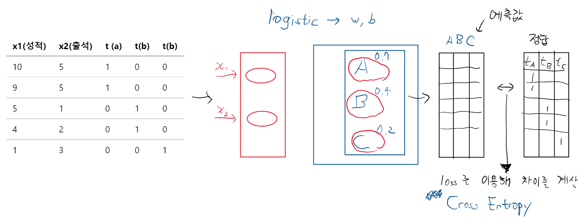
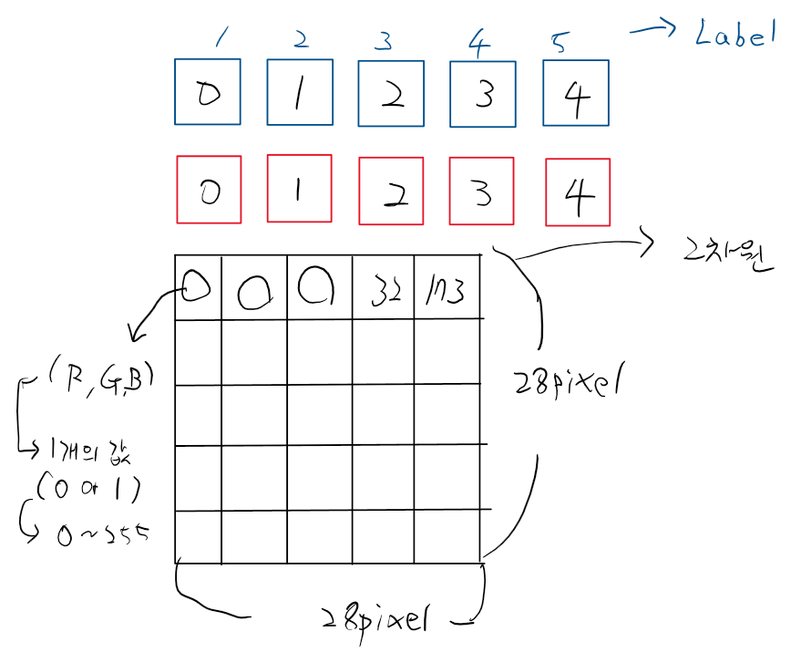

# AI
```
Strong AI
Weak AI

-> Machine Learning (Data 기반 학습을 통해 predict)
1. 지도학습(supervised Learning)
2. 비지도학습(Unsupervised Learning)
3. 준지도 학습(Semi supervised Learning)
4. 강화학습  -> "알파고"

지도학습
->
1. Regression (통계에서 가져왔다.)
2. SVM (Support Vector Machine)
3. Decision Tres, Random Forest
4. KNN
5. Naive Bayes
6. Artificial Neutral Netwark(ANN)인공신경망 -> 발전 Deep Learning
7. K-Means, DBSCAN
8. Reinforcement Learning(강화학습)

1. Regression -> Linear Regression Model -> simple, multiple
2. Classfication -> Logistic Regression Model -> binary classfication, Multitional classification
```

Training Data Set

feature 독립변수        종속변수(Target label)
| x1(성적) | x2(출석) | t (grade)   | 
|----|----|-----|
| 10 | 5  | A   |  
| 9  | 5  | A   |  
| 5  | 1  | B   |
| 4  | 2  | B   |
| 1  | 3  | C   |

-> 이런 다항분류는 binary classification (여러개 모아놓기)

sigmoid A(0.7)  B(0.4)  C(0.1) => 1.2

softmax를 거쳐서
          0.6     0.3     0.1  ->  1

```
one-hot encoding
One-hot encoding은 범주형 데이터(categorical data)를 수치형 데이터(numerical data)로 변환하는 방법 중 하나입니다. 범주형 데이터는 명목형 데이터와 순서형 데이터로 나뉩니다. 명목형 데이터는 순서 개념이 없는 데이터로 예를 들면 색상, 지역, 성별 등이 있으며, 순서형 데이터는 순서 개념이 있는 데이터로 예를 들면 학점, 선호도 등이 있습니다. 범주형 데이터를 그대로 수치형 데이터로 사용하는 것은 잘못된 해석을 유발할 수 있습니다. 따라서 범주형 데이터를 수치형 데이터로 변환하는 과정이 필요합니다.

One-hot encoding은 각 범주형 데이터가 해당하는 열(column)에만 1을 표시하고, 나머지 열에는 0을 표시하여 범주형 데이터를 수치형 데이터로 변환하는 방법입니다. 예를 들어, "성별" 컬럼이 있고 "남성"과 "여성"이라는 두 가지 범주형 데이터가 있다면, "성별" 컬럼을 "남성"과 "여성" 두 개의 컬럼으로 분리하고, "남성" 컬럼에는 "남성"이라는 데이터에만 1을, "여성" 컬럼에는 "여성"이라는 데이터에만 1을 표시하고, 나머지 컬럼에는 0을 표시합니다.

이러한 방식으로 One-hot encoding을 수행하면, 범주형 데이터의 각 범주(category)가 하나의 수치형 데이터로 변환됩니다. 이는 머신러닝 분석에서 범주형 데이터를 처리하기 쉬운 수치형 데이터로 변환하기 위해 많이 사용되는 방법 중 하나입니다.
```


```python
# 필요한 module을 불러들여요!
import numpy as np
import pandas as pd
# 학습데이터와 테스트데이터를 분리해야 해요!
from sklearn.model_selection import train_test_split
# 정규화
from sklearn.preprocessing import MinMaxScaler
# 우리 데이터에는 결측치와 이상치가 없어요
from tensorflow.keras.models import Sequential
from tensorflow.keras.layers import Flatten, Dense
from tensorflow.keras.optimizers import Adam
# 다중분류를 하다보니.. one-hot encoding 작업을 해야해요!
import tensorflow as tf
# Raw Data Setting
df = pd.read_csv('./data/bmi.csv', skiprows=3)
# display(df.head(). df.shape)
​
# 데이터를 분리할 거에요!
# 학습데이터와 테스트데이터를 분리할거에요!

x_data_train, x_data_test, t_data_train, t_data_test = \
train_test_split(df[['height', 'weight']].values,
                 df['label'].values,
                 test_size=0.3)
# print(x_data_train, x_data_train.shape) #(14000, 2)

# 정규화 진행!
scaler = MinMaxScaler()
scaler.fit(x_data_train)
x_data_train_norm = scaler.transform(x_data_train)
x_data_test_norm = scaler.transform(x_data_test)
# print(x_data_train_norm, x_data_train_norm.shape) #(14000, 2)

# One-Hot 처리를 해야할 것 같아요
# print(t_data_train) # 1차원인데 one-hot으로 바꾸면 2차원이된다.
# depth는 class의 수 -> 분류의 개수
print(tf.one_hot(t_data_train, depth=3))
# 데이터를 분리할 거에요!
# 학습데이터와 테스트데이터를 분리할거에요!
​
x_data_train, x_data_test, t_data_train, t_data_test = \
train_test_split(df[['height', 'weight']].values,
                 df['label'].values,
                 test_size=0.3)
# print(x_data_train, x_data_train.shape) #(14000, 2)
​
# 정규화 진행!
scaler = MinMaxScaler()
scaler.fit(x_data_train)
x_data_train_norm = scaler.transform(x_data_train)
x_data_test_norm = scaler.transform(x_data_test)
# print(x_data_train_norm, x_data_train_norm.shape) #(14000, 2)
​
# One-Hot 처리를 해야할 것 같아요
# print(t_data_train) # 1차원인데 one-hot으로 바꾸면 2차원이된다.
# depth는 class의 수 -> 분류의 개수
print(tf.one_hot(t_data_train, depth=3))

# Model
model = Sequential()

# Layer 추가
model.add(Flatten(input_shape=(2, )))
model.add(Dense(3, activation='softmax'))

# Model 설정
model.compile(optimizer=Adam(learning_rate=1e-4),
              loss='sparse_categorical_crossentropy', # Onehot의 단축
             metrics=['accuracy'])

# Model 학습
model.fit(x_data_train_norm,
         t_data_train,
          epochs = 500,
          validation_split=0.2,
         verbose = 1)
# Model
model = Sequential()
​
# Layer 추가
model.add(Flatten(input_shape=(2, )))
model.add(Dense(3, activation='softmax'))
​
# Model 설정
model.compile(optimizer=Adam(learning_rate=1e-4),
              loss='sparse_categorical_crossentropy', # Onehot의 단축
             metrics=['accuracy'])
​
# Model 학습
model.fit(x_data_train_norm,
         t_data_train,
          epochs = 500,
          validation_split=0.2,
         verbose = 1)
```

MNIST   
-> 이미지 데이터셋을 이용한 다중분류 문제
사람이 손글씨로 숫자를 쓴 이미지




Overfitting (과적합)

```python
# 필요한 모듈을 불러들여요!
import numpy as np
import pandas as pd
import matplotlib.pyplot as plt

# Raw Data Loading
# 이 데이터에는 결측치, 이상치가 없어요!
# df = pd.read_csv('./data/mnist/train.csv')
# display(df.head(), df.shape)  # (42000, 785)

df = pd.read_csv('./data/fashion-mnist/fashion-mnist_train.csv')

# 이미지 확인
img_data = df.drop('label', axis=1, inplace=False).values

fig = plt.figure()
fig_arr = []

# interpolation은 보간법을 뜻하며, 픽셀들의 축 위치 간격을 보정하여 이미지가 자연스러운 모양으로 
# 보일 수 있게 하는 방법입니다. 
# imshow()에서는 16가지 보간법이 있고, 'nearest'는 가장 고해상도인 보간법입니다.

for n in range(10):
    fig_arr.append(fig.add_subplot(2,5,n+1))
    fig_arr[n].imshow(img_data[n].reshape(28,28), 
                      cmap='Greys', 
                      interpolation='nearest')
    
plt.tight_layout()
plt.show()


# 이 데이터를 이용해서 머신러닝을 해 보아요!
from sklearn.model_selection import train_test_split
from sklearn.preprocessing import MinMaxScaler

# Training Data Set

# 1. 학습데이터와 테스트데이터 분리
x_data_train, x_data_test, t_data_train, t_data_test = \
train_test_split(df.drop('label', axis=1, inplace=False).values,
                 df['label'].values,
                test_size=0.2)

# 2. 정규화 진행
scaler = MinMaxScaler()
scaler.fit(x_data_train)
x_data_train_norm = scaler.transform(x_data_train)
x_data_test_norm = scaler.transform(x_data_test)

# 3. one-hot처리는 따로 하지 않아요. keras를 이용해서 처리할꺼예요!

from tensorflow.keras.models import Sequential
from tensorflow.keras.layers import Flatten, Dense, Dropout
from tensorflow.keras.optimizers import Adam
from tensorflow.keras.callbacks import EarlyStopping

# Model 생성
model = Sequential()

# Model에 Layer를 추가

# Input Layer
model.add(Flatten(input_shape=(784,)))

# Hidden Layer
model.add(Dense(256, activation='relu'))
model.add(Dropout(rate=0.25))
model.add(Dense(128, activation='relu'))
model.add(Dropout(rate=0.25))
model.add(Dense(64, activation='relu'))

# Output Layer
model.add(Dense(10, activation='softmax'))

# print(model.summary())


my_early_stopping = EarlyStopping(monitor='val_loss',
                                  patience=3,
                                  mode='auto',
                                  restore_best_weights=True,
                                  verbose=1)

# Model 설정
model.compile(optimizer=Adam(learning_rate=1e-4),
              loss='sparse_categorical_crossentropy',              
              metrics=['accuracy'])


# model 학습
history = model.fit(x_data_train_norm,
                    t_data_train,
                    epochs=50,
                    validation_split=0.2,
                    verbose=1,    
                    callbacks=[my_early_stopping],
                    batch_size=100)


# 학습과정을 그래프로 한번 살펴보아요!
import matplotlib.pyplot as plt

fig = plt.figure(figsize=(10,10))

fig_acc = fig.add_subplot(1,1,1)

# epoch이 증가할때마다 나오는 accuracy, val_accuracy를 그래프로 그려보아요!
fig_acc.plot(history.history['accuracy'], color='b')
fig_acc.plot(history.history['val_accuracy'], color='r')

plt.show()

# 우리 모델에 대한 마지막 평가
print(model.evaluate(x_data_test_norm, t_data_test))

# Fashion MNIST 데이터를 이용해서 같은 작업을 진행해보면되요!
# 이미지가 복잡해질때 정확도가 얼마나 떨어지는지 확인해 보아요!
# 84% 정도 나와요!

# 결론적으로 말하면..
# 비정형데이터는 일반 머신러닝 기법을 이용하면 학습에 효율이 떨어져요!
# 학습의 정확도가 많이 떨어집니다.!
# => NN


# 몇번을 돌려야 할지 몰라요! => Epoch의 수를 결정하기가 쉽지 않아요!
# 그러면 어떻게 해야 하나요? 그냥 경험적으로 미친듯이 막 해봐야 하나요?
# 지금은 데이터량이 작아서 시간이 오래 걸리지 않아요. 이런 수작업이 가능
# 데이터량이 커지면 학습에 시간이 오래 걸려요. 이런경우 당연히 수작업은 불가능!
# 그래서 자동으로 Epoch을 진행하는 Mechanism이 필요하고 
# => Early Stopping(조기종료) 기능이 제공(Keras)
# 위쪽에 코드를 추가해 보아요!
```