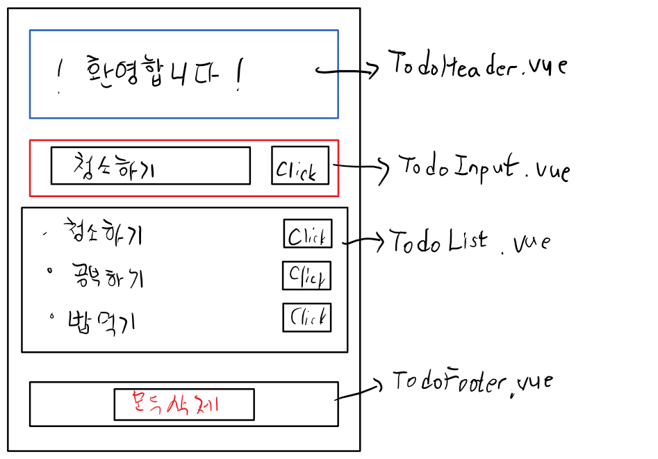

# 기존 방식
HTML 파일 내에 Javascript code로 포함하고 component를 생성할떄 template 속성을 이용한다.
사용하기도 불편하고 유지 보수도 불편하다.

좋은 방법 있나요? -> Single file Component
Componenet 1개가 File 1개로 구현된다.

xxx.Vue라는 확장자를 가진 파일을 만든다.
## xxx.Vue file의 구조
```
<template>
<!--component의 template속성에 들어있던 HTML 내용-->
</template>

<script>
export default {
<--data, methods, props, created, computed, ...-->
-> Javascript 객체가 module화
-> 다른 Javascript file에서 이 객체를 사용하려면??

}
</script>

<style>
위에 있는 HTML 부분에 대한 CSS
</style>

```

.Vue
file로 browser가 해석이 불가능한 file이다.
이 문제를 해결 하기 위해 module bundler를 이용한다.
## module bundler
-> Html, CSS, Javascript를 1개의 파일로 생성한다.
대표적인 제품 두가지 
1. Webpack (웹팩)
2. Brouserify(브라우져리파이) X (안쓰인다.)

## Webpack
과정이 복잡하다. 설치하고 설정하고 사용해야 한다.
Vue core 개발 team 에서 Vue CLI를 제공해준다.

## Vue CLI
-> Node.js의 모듈로 제공된다.
ModeJs를 이용해서 일단 Vue CLI를 설치해야한다.
1. Node.Js를 설치
2. npm(node package manager)를 이용해서 Vue CLI 설치한다. module 이면서 다른 module를 관리한다.
npm install vue-cli --location=global
3. Vue , enter(실행)
4. Vue Cli를 project 생성시 6개의 option이 있다.
Ex) Vue init webpack-simple
-> C:\vue-todo 폴더생성
-> visual studio code 에서 terminal-> 우측 아래 command prompt -> vue init webpack-simple -> 전부 enter -> npm install(필요한 라이브러리를 다운로드받는다.)
5. Extension Vetur 설치
6. 서버실행 - npm run dev 

### 간단한 To-do app을 만들어 봅시다.
화면은 mobile , css를 제공


index.html -> <>