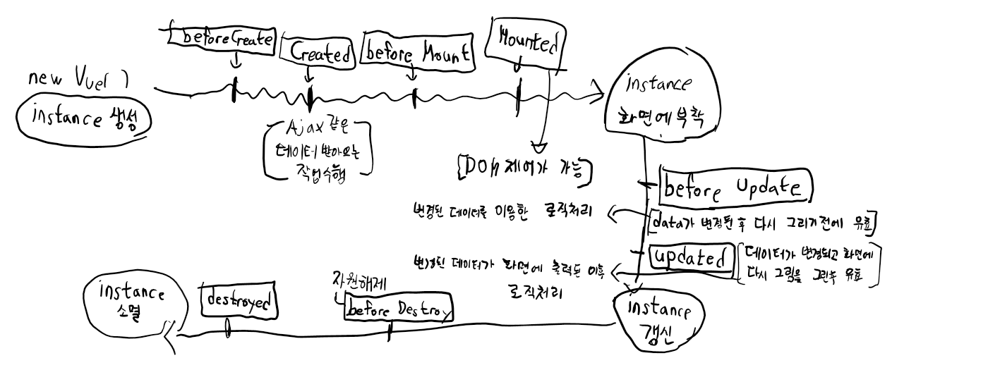

# (복습) Javascript
```
ECMAScript 2015(ES6)
client-side web API 
1. DOM(Documnet Object Model)
2. BOM(Browser Object Model)
InderedDB
localStrage
Worker
canvas
.... XMLHTTPRequest(AJAX)화

ECMASCRIPT로 제어하는게 쉽지않다. -> "JQuery"
```

### Jquery
```
$() -> selector 을 이용한 화면처리
method
AJAX
event
```
### 동기화 비동기화
```
함수의 동작방식
Blocking(function, method)   
장점 -> 순차처리에 적합, 코드작성이 쉽다.   
단점 -> 비효율적이 될떄가 많다.

Non-blocking
함수의 역할, 동작이 충족되지 않았는데 함수가 Return되는 경우

동기 -> process가 실행한 순서대로 동작하는 개념
비동기 -> process가 실행한 순서와 무관하게 동작
```
# Vue.js
```
웹 화면을 개발하기 위한 Framework
Angular - 어렵다. 사람들이 잘 안 쓴다.
React(ES6, JSX)
Vue는 React와 Anguar의 장점을 추출, 상대적으로 쉽다.
역사가 오래되지는 않았다.
Vue.js 2.x -> 없애서 사용
Vue.js 3.x -> 최신버젼
하지만 2.x버젼을 사용할것이다.

Vue.js
1. Cone library -> 한번에 데이터를 표현
2. component 기반
"UI구현" -> "MVVM패턴을 이용"
```
# UI 개발 pattern!

```
MVVM 패턴은 MVC 패턴에서 Controller를 빼고 ViewModel을 추가한 패턴입니다.
역할 및 동작 원리
View
사용자가 보여지는 View를 생각하면 된다. 유저 인터랙션을 받는 역할, 인터랙션을 받을 시 ViewModel에게 명령을 내립니다.
ViewModel
View를 표현하기 위해 만들어진 View를 위한 Model
View와는 Binding을 하여 연결후 View에게서 액션을 받고 또한 View를 업데이트합니다.
Model
데이터, 비즈니스 로직, 서비스 클라이언트 등으로 구성 실제적 데이터
1. View에 입력이 들어오면 ViewModel에게 명령을 합니다
2. ViewModel은 필요한 데이터를 Model에게 요청합니다
3. Model은 ViewModel에게 요청된 데이터를 응답합니다
4. ViewModel은 응답 받은 데이터를 가공해서 저장합니다
5. View는 ViewModel과의 Data Binding으로 인해 자동으로 갱신됩니다

장점
View와 Model이 서로 전혀 알지 못하기에 독립성을 유지할 수 있습니다
독립성을 유지하기 때문에 효율적인 유닛테스트가 가능합니다
View와 ViewModel을 바인딩하기 때문에 코드의 양이 줄어듭니다
View와 ViewModel의 관계는 N:1 관계입니다
유닛테스트를 하기가 좋습니다. 그 이유는 ViewModel에는 UIKit 관련 코드가 없고 Controller와의 의존성도 없기 때문입니다
단점
간단한 UI에서 오히려 ViewModel을 설계하는 어려움이 있을 수 있습니다
데이터 바인딩이 필수적으로 요구됩니다
복잡해질수록 Controller처럼 ViewModel이 빠르게 비대해집니다
표준화된 틀이 존재하지 않아 사람마다 이해가 다릅니다

Data Binding
데이터 바인딩의 개념은 쉽게 말해 Model과 UI 요소 간의 싱크를 맞춰주는 것이라 할 수 있습니다.
이 패턴을 통해 View와 로직이 분리되어 있어도 한 쪽이 바뀌면 다른 쪽도 업데이트가 이루어져 데이터의 일관성을 유지할 수 있습니다.

```

## component 기반의 Framework
-> 화면을 구조화(component)화 해서 개발!

"Vue instance 생성" => component 로 등록
## Vue instance
```
->Vue로 화면을 개발하기 위해 필수적으로 생성해야하는 기본 단위
new Vue()->설정을 객체로 명시
생성자함수   정해져 있는 속성 (el, data(변수들), template, methods(함수들), life cycle hook())
Vue instance는 life cycle을 가지고 있다.
```

```
상태에 따라 Hook method가 호출   
어디에서 정의하나,  정확한 호출시점 파악해야한다.   
8개 -> 6개 -> 4개 (Update 관련 호출시점파악)   
```
```
Vue의 반응성
-> 데이터가 변하면 화면의 연결 데이터도 자동으로 변경된다.

component -> Javascript 객체 { = } -> property의 key가 정해져있어요
component는 2가지 형태로 등록 할 수 있다.
1. Global component(전역 component)
-> 여러 instance에서 공통적으로 사용이 가능하다.
2. Local component(지역 component)
-> 특정 instance 내에서만 유효한 component

1. 전역 component의 등록
Vue() -> 생성자 함수 -> 객체-> property를 가져요 -> 이름 component라는 property가 있는데 -> 함수

2. 지역 Component의 등록/사용 code로 알아보아요!
