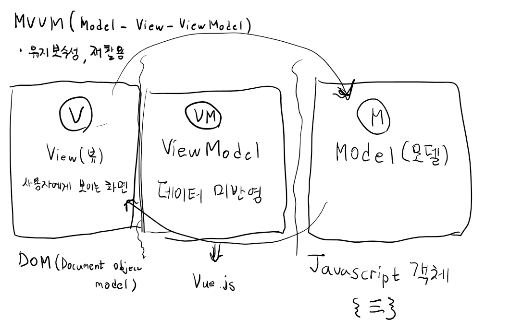
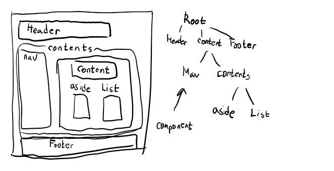

# Javascript
ECMAScript 2015(ES6)
client-side web API 
1. DOM(Documnet Object Model)
2. BOM(Browser Object Model)
InderedDB
localStrage
Worker
canvas
.... XMLHTTPRequest(AJAX)화

ECMASCRIPT로 제어하는게 쉽지않다. -> "JQuery"
### Jquery
```
$() -> selector 을 이용한 화면처리
method
AJAX
event
```
### 동기화 비동기화
```
함수의 동작방식
Blocking(function, method)   
장점 -> 순차처리에 적합, 코드작성이 쉽다.   
단점 -> 비효율적이 될떄가 많다.

Non-blocking
함수의 역할, 동작이 충족되지 않았는데 함수가 Return되는 경우

동기 -> process가 실행한 순서대로 동작하는 개념
비동기 -> process가 실행한 순서와 무관하게 동작
```
# Vue.js
```
웹 화면을 개발하기 위한 Framework
Angular - 어렵다. 사람들이 잘 안 쓴다.
React(ES6, JSX)
Vue는 React와 Anguar의 장점을 추출, 상대적으로 쉽다.
역사가 오래되지는 않았다.
Vue.js 2.x -> 없애서 사용
Vue.js 3.x -> 최신버젼
하지만 2.x버젼을 사용할것이다.

Vue.js
1. Cone library -> 한번에 데이터를 표현
2. component 기반
"UI구현" -> "MVVM패턴을 이용"
```
# UI 개발 pattern!


## component 기반의 Framework
-> 화면을 구조화(component)화 해서 개발!

"Vue instance 생성" => component 로 등록
## Vue instance
```
->Vue로 화면을 개발하기 위해 필수적으로 생성해야하는 기본 단위
new Vue()->설정을 객체로 명시
생성자함수   정해져 있는 속성 (el, data(변수들), template, methods(함수들), life cycle hook())
Vue instance는 life cycle을 가지고 있다.
```

```
상태에 따라 Hook method가 호출   
어디에서 정의하나,  정확한 호출시점 파악해야한다.   
8개 -> 6개 -> 4개 (Update 관련 호출시점파악)   
```
```
Vue의 반응성
-> 데이터가 변하면 화면의 연결 데이터도 자동으로 변경된다.

component -> Javascript 객체 { = } -> property의 key가 정해져있어요
component는 2가지 형태로 등록 할 수 있다.
1. Global component(전역 component)
-> 여러 instance에서 공통적으로 사용이 가능하다.
2. Local component(지역 component)
-> 특정 instance 내에서만 유효한 component

1. 전역 component의 등록
Vue() -> 생성자 함수 -> 객체-> property를 가져요 -> 이름 component라는 property가 있는데 -> 함수

2. 지역 Component의 등록/사용 code로 알아보아요!
