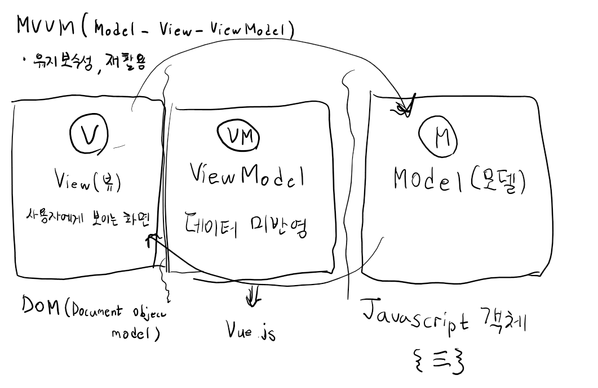
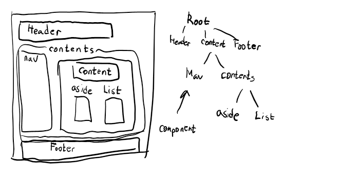
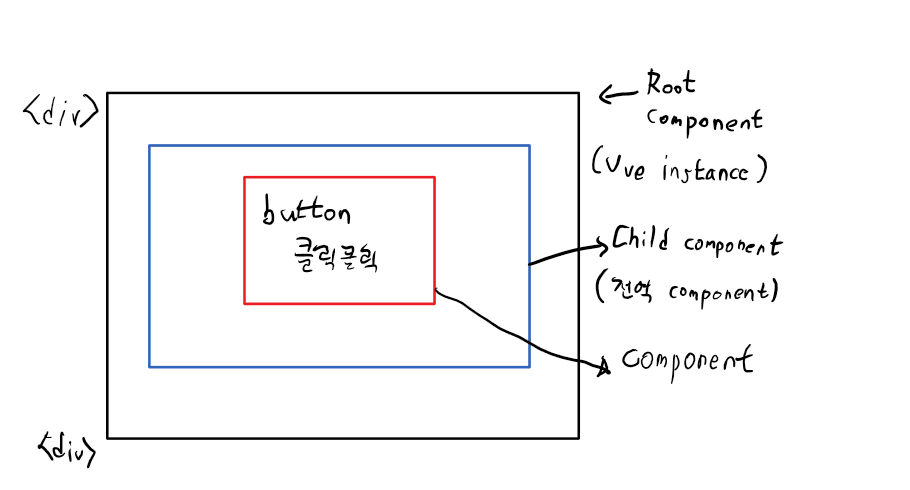

web UI개발 -> MVVM(Model-View-ViewModel)
# UI 개발 pattern!


## component 기반의 Framework
-> 화면을 구조화(component)화 해서 개발!

"Vue instance 생성" => component 로 등록

## data 속성
```
Root component -> Vue instance
-- data 속성을 가지고 있다.
-> data : {
    myName : '홍길동'
}

다른 하위 component들(전역과 지역에 상관없이)
-> 재사용이 목적이에요 -> Root component 하단에 여러개가 반복해서 나올수 있다.
-> 그래서 data속성을 반드시 함수로 표현해야 한다. -> "객체를 리턴해야해요"
```

### component Scope
-> code로 알아보아요
```
component의 data는 scope가 각 component로 한정된다.
그래서 하나의 component에서 다른 component의 data를 직접적으로 access할수없다.
그러면 어떻게 해야 component간 데이터 통신을 할 수 있을까?
Vue가 몇가지 방법을 제공해준다.
기본은 component가 상하관계일때
상위component -> props -> 하위component
하위component -> event전달(Data를 붙여서) -> 상위component
하위 component에서 상위 component로 데이터를 전달하려면 하위 component에서 event로 emit시켜서 상위 compononet에게 신호를 보내면 됩니다.!
```
ex) Vue05.html

