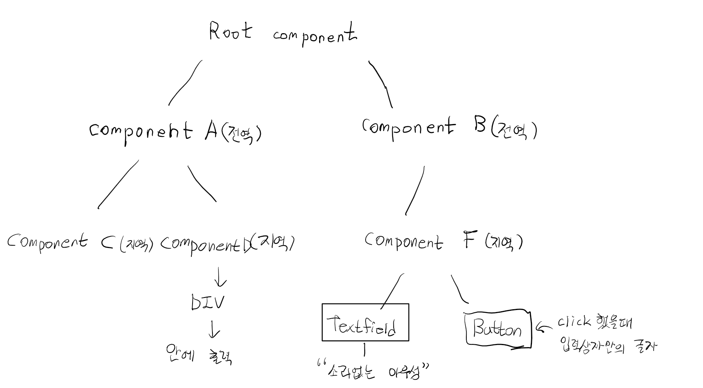

web UI개발 -> MVVM(Model-View-ViewModel)
# UI 개발 pattern!


## component 기반의 Framework
-> 화면을 구조화(component)화 해서 개발!

"Vue instance 생성" => component 로 등록

## data 속성
```
Root component -> Vue instance
-- data 속성을 가지고 있다.
-> data : {
    myName : '홍길동'
}

다른 하위 component들(전역과 지역에 상관없이)
-> 재사용이 목적이에요 -> Root component 하단에 여러개가 반복해서 나올수 있다.
-> 그래서 data속성을 반드시 함수로 표현해야 한다. -> "객체를 리턴해야해요"
```

### component Scope
-> code로 알아보아요
```
component의 data는 scope가 각 component로 한정된다.
그래서 하나의 component에서 다른 component의 data를 직접적으로 access할수없다.
그러면 어떻게 해야 component간 데이터 통신을 할 수 있을까?
Vue가 몇가지 방법을 제공해준다.
기본은 component가 상하관계일때
상위component -> props -> 하위component
하위component -> event전달(Data를 붙여서) -> 상위component
하위 component에서 상위 component로 데이터를 전달하려면 하위 component에서 event로 emit시켜서 상위 compononet에게 신호를 보내면 됩니다.!
```
ex) Vue05.html


component간 data를 전달하는 방법
1. 상위 component (props) -> 하위 component 
    (event를 전달하는 방법이다.(Data도 같이 전달이 가능))
2. component간에 data전달을 하기위해 필요없는 component를 만들어야하나?
그래서 사용하는 방법이 EventBus이다.

## Evnet Bus
보통 emit 같은 기능을 사용해서 구현을 하겠지만 비 부모-자식간 통신을 해야하지만 EventBus를 활용하여 컴포넌트간 메소드를 호출할 수 있다. EventBus라는 공간에 각 프로젝트에 맞는 규격을 만들어 규격에 따라 활용하면 된다.
구성하는 코드는 별도로 빼든 main.js에 선언하든 크게 상관은 없다. 기본적인 구성은 아래와 같다.
//main.js

import Vue from 'vue'
import App from './App.vue'

// EventBus 생성
Vue.prototype.$EventBus = new Vue();

new Vue({
	...
    render: h => h(App)
}).$mount('#app')

자 그럼 만들어진 EventBus를 가지고 어떻게 활용을 하는가?
A 컴포넌트의 버튼을 클릭하면 B컴포넌트의 메서드를 실행하는 예시이다.
A Component
<template>
	...생략
    <button @click="onAClick">
    	버튼
    </button>
    ...생략
</template>

... 생략
    method: {
    	onAClick() {
        	this.$EventBus.$emit('fetchData')
        }
    }

B Component
<template>
	...생략
</template>

... 생략
  created() {
    this.$EventBus.$on('fetchData', () => {
      this.fetchData();
    })
  },

A 컴포넌트에서 버튼 클릭하여 EventBus를 통해 emit을 실행한다.
그리고 B컴포넌트에선 리스너로 실행한다.
만약 파라미터를 전송해야 한다면 어떤식으로 구성할까?
아래와 같이 구현이 가능하다.

// call
this.$EventBus.$emit('fetchData', param)
// listen
this.$EventBus.$on('fetchData', (param) => {
	this.fetchData(param);
})

## 과제

```html Vue01
<body>
    <div id="app">
        안녕하세요! {{ this.myID }}
        <my-component></my-component>
        <my-local-component></my-local-component>
    </div>

    <script>
        // 전역 컴포넌트 등록!
        // 컴포넌트(자바스크립트 객체)부터 하나 생성해 보아요!
        let myCmp = {
            template: '<div>여기는 DIV입니다.</div>'
        }

        // 전역 컴포넌트 등록!
        // 컴포넌트 이름은 케밥케이스, 2단어 이상
        // 사용하지 않을거면 파스칼케이스 권장
        // 결국은 HTML 태그명으로 사용된다.
        Vue.Component('my-component', myCmp);

        let localCmp = {
            template: '<div>여기는 로컬입니다.</div>'
        }

        new Vue({
            el: '#app',
            data: {
                myID: '홍길동',
                myAge: '20'
            },
            components: {
                'my-local-componet': localCmp
            }
            /* template: '<div>아우성</div>' 안녕하세요 -> 아우성*/
        })
    </script>

</body>
```

```html Vue02
<body>
    <div id="app">
        Root component의 변수값은: {{ myName }}
        <global-component></global-component>
        <global-component></global-component>
        <global-component></global-component>
    </div>

    <script>
        let tmp = {
            myName: '홍길동', //property
            myFunc: function () {
                //constructor
            }, //property(method가 아니에요!)
            // ES6에서 나온 method표현 방식
            mySum() {       //method
                // non-constructor
            }
        }
        Vue.component('global-component', {
            template: '<div>변수의 값은: {{ myData }}</div>'/*this.myData = myData 생략*/,
            // data: function(){
            //   return{
            //     myData: 200
            //   };

            data() {
                return {
                    myData: 200
                }  // 둘다 같다.
            }
        }       // 데이터 공유문제 떄문에 하부컴퍼넌트에서는 다르게 표현한다. data: {myData: 100} X
        );

        new Vue({
            el: '#app',
            data: {
                myName: '홍길동'
            }
        })
    </script>
</body>
```

```html vue03
<body>
    <div id="app">
        <my-component1></my-component1>
        <my-component2></my-component2>
    </div>

    <script>
        // 지역 component 2개를 만들어서 사용해 보아요
        let cmp1 = {
            template: '<div>첫번째 지역 component : {{ cmp1Data }}</div>',
            data: function () {
                return {
                    cmp1Data: 100
                }
            }
        }

        let cmp2 = {
            template: '<div>두번째 지역 component : {{ cmp2Data }}</div>',
            data: function () {
                return {
                    // 어떻게 해야 첫번째 component의 data를 사용 할 수 있나요
                    // 안된다! (한 컴포넌트에서 다른 컴포넌트의 데이터를 직접 access하는건 허용되지 않는다.)
                    cmp2Data: cmp1.data.cmp1Data
                }
            }
        }

        new Vue({
            el: '#app',
            components: {
                'my-component1': cmp1,
                'my-component2': cmp2
            }
        })
    </script>

</body>
```

```html 004
<body>
    <div id="app">
        <child-component v-bind:props-data="message"></child-component>
    </div>

    <script>
        Vue.component('child-component', {
            // data() {
            //   return{
            //     myData:200
            //   }
            // },
            // props를 이용해서 상위 컴포넌트가 전달하는 데이터를 받는 변수(카멜케이스)를 선언한다.
            // props: ['propsData', 'secondData'], 이렇게 쓸수도 있다.
            props: {
                propsData: String,  // value값은 데이터타입을 나타내는 생성자 함수

            },
            template: '<div>여기는 하위 컴포넌트에요! => {{ propsData }}</div>'
        })
        // Vue instance에 하위 컴포넌트로 해당 컴포넌트를포함시킬거에요
        new Vue({
            el: '#app',
            data: {
                message: '소리없는 아우성'
            }
        });
    // 컴포넌트 하나를 전역 컴포넌트로 등록하고
    // Vue instance에 하위 컴포넌트로 해당 컴포넌트를 포함시킨다.
    // Vue instance가 상위 컴포넌트가 되고 포함되는 전역 컴포넌트는 하위 컴포넌트가 된다.
    // props를 이용하면 상위 component에서 하위 component로 데이터를 전달할 수 있다.
    // Vue instance의 data를 전역 컴포넌트에게 전달 할 수있다.
    </script>

</body>
```

```html 005
<body>
    <div id="app">
        <child-component></child-component>
    </div>

    <script>
        // 전역 component로 만들꺼고 Root Component의 하위로 사용할 거에요
        Vue.component('child-component', {
            template: '<button v-on:click="childFunc">클릭클릭</button>',
            data() {
                return {
                    myData: 20
                }
            },
            methods: {
                childFunc: function () {
                    this.$emit('print_msg', 100, 'Hello', {
                        msg: '전달된 이벤트'
                    })
                }
            }
        })

        new Vue({
            el: '#app',
            methods: {
                printText: function (...args) {
                    console.log('이벤트 발생');
                    console.log(args[0]); // 100
                    console.log(args[1]); // 'Hello'
                    console.log(args[2]); // 'Hello'
                }
            }
        });
    </script>

</body>
```

```html 006
<body>
    <!-- EventBus를 이용해서 하위 component에서 상위 component로 event를 전달.-->
    <div id="app">
        <child-component></child-component>
    </div>

    <script>
        // EventBus를 이용하기 위해서 Vue instance를 생성
        let eventBus = new Vue();
        // 하위 componenet로 사용할 전역 component를 등룍해보아요!
        Vue.component('child-component', {
            template: '<button v-on:click="btnClick">클릭클릭</button>',
            methods: {
                btnClick: function () {
                    // eventBus에 대해서 event를 발생시켜요
                    eventBus.$emit('generateEvent', 200)
                }
            }
        })

        // Root component
        new Vue({
            el: '#app',
            created() {
                eventBus.$on('generateEvent', function (value) {
                    console.log('이벤트발생', value);
                })
            }
        })
    </script>

</body>
```

```html 007
<body>
    <div id="app">
        <global-component-a></global-component-a>
        <global-component-b></global-component-b>
    </div>

    <script>
        Vue.component('global-component-a', {
            template: `<div>
         <local-component-c></local-component-c>
         <local-component-d></local-component-d>
      </div>`,
            components: {
                'local-component-c': {
                    template: '<div>local component c</div>'
                },
                'local-component-d': {
                    template: '<div> 처리된 데이터: {{ }} </div>'
                },
            }
        });

        Vue.component('global-component-b', {
            template: '<local-component-f></local-component-f>',
            components: {
                'local-component-f': {
                    template: `
            <div>
                <input type=text id='inputTxt'>
                <button v-on:click="btnClick">클릭클릭</button>
            </div>
            `,
                    methods: {
                        btnClick: function () {
                            alert($('#inputTxt').val());
                        }
                    }

                }
            }
        });

        new Vue({
            el: '#app'
        });
    </script>

</body>

</html>
<!-- 
/////////////////////////////////////////////

},
brforeCreate: function () { },
created: function () { this.myFunc(); },
beforeMount: function () { },
mounted: function () {
// 화면에 Vue instance가 붙어 화면제어 가능!!
// $('#myDiv').text('하이하이!')
const myDiv = document.getElementById('myDiv')
myDiv.innerText = '하이하이' },
beforeUpdate: function () { }
});

<script>
  Vue.component('my-component',  /* '소문자 + -' 케밥스타일*/ {
    template: '<div>여기는 DIV 전역 컴포넌트입니다.</div>'
  });

  let cmp = {
    template: '<div>여기는 DIV Local 컴포넌트입니다.</div>'
  }

  new Vue({
    el: '#app',
    data: {
      myMsg: '안녕'
    },
    components: {
      'my-local-cmp': cmp
    }
  })

  let myCmp = {
    template: '<div>여기는 DIV입니다.</div>'
  }
  Vue.Component('my-component', myCmp);

  let localCmp = {
    template: '<div>여기는 로컬입니다.</div>'
  }

  new Vue({
    el: '#app',
    data: {
      myID: '홍길동',
      myAge: '20'
    },
    components: {
      'my-local-componet': localCmp
    }
  })

  let tmp = {
    myName: '홍길동', //property
    myFunc: function () {
      mySum(){       //method
      }
    }
    Vue.component('global-component', {
      template: '<div>변수의 값은: {{ myData }}</div>'/*this.myData = myData 생략*/,
      data() {
        return {
          myData: 200
        }  // 둘다 같다.
      }
    }       // 데이터 공유문제 떄문에 하부컴퍼넌트에서는 다르게 표현한다. data: {myData: 100} X
    );

    new Vue({
      el: '#app',
      data: {
        myName: '홍길동'
      }
    })
    let cmp1 = {
      template: '<div>첫번째 지역 component : {{ cmp1Data }}</div>',
      data: function () {
        return {
          cmp1Data: 100
        }
      }
    }

    let cmp2 = {
      template: '<div>두번째 지역 component : {{ cmp2Data }}</div>',
      data: function () {
        return {
          cmp2Data: cmp1.data.cmp1Data
        }
      }
    }
    new Vue({
      el: '#app',
      components: {
        'my-component1': cmp1,
        'my-component2': cmp2
      }
    })
</script>

Vue.component('child-component', {
props: {
propsData: String, // value값은 데이터타입을 나타내는 생성자 함수
},
template: '<div>여기는 하위 컴포넌트에요! => {{ propsData }}</div>'
})
new Vue({
el: '#app',
data: {
message: '소리없는 아우성'
}
});
Vue.component('child-component', {
template: '<button v-on:click="childFunc">클릭클릭</button>',
data() {
return {
myData: 20
}
},
methods: {
childFunc: function () {
this.$emit('print_msg', 100, 'Hello', {
msg: '전달된 이벤트'
})
}
}
})

new Vue({
el: '#app',
methods: {
printText: function(...args) {
console.log('이벤트 발생');
console.log(args[0]); // 100
console.log(args[1]); // 'Hello'
console.log(args[2]); // 'Hello'
}
}
});

let eventBus = new Vue();
Vue.component('child-component', {
template: '<button v-on:click="btnClick">클릭클릭</button>',
methods: {
btnClick: function () {
eventBus.$emit('generateEvent', 200)
}
}
})

new Vue({
el: '#app',
created() {
eventBus.$on('generateEvent', function (value) {
console.log('이벤트발생', value);
})
}
}) -->
```