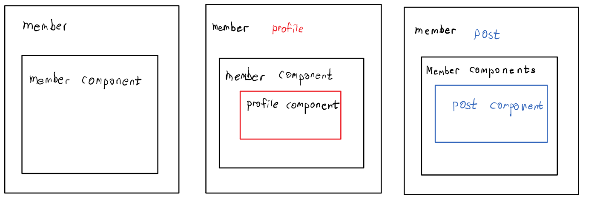
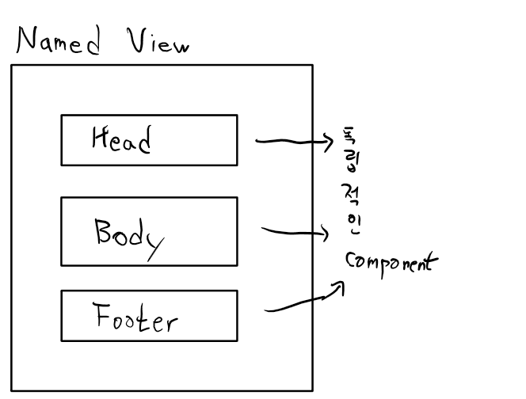

### Vue instance

### Component
```
상위 Component
하위 Component

전역 Component
지역 Component

{ } -> component - 특수한 property들이 들어간다.
template, data, methods, components, props -> 속성

component data 전달
- props, event 처리
```
# Routing
```
웹 페이지간의 이동을 의미하는데 우리는 지금 SPA를 하고 있다.
그래서 전체 page를 다시 그리는게 아니라 필요한 부분만 다시 그리는 방식으로 page를 전환한다.
Routing 라이브러리 중 가장 대표적인것은 router.js 
범용(React, Angular, Vue)

Vue.js에서는 Vue라우터를 이용한다.
Vue.js의 공식 library
```
## Nested Routing(네스티드 라우팅)
상위 component에서 하위 component를 routing


## Named- View(네임드 뷰)

Url 하나에 여러개의 component를 박을 수 있다.

## Vue의 HTTP 통신 (외부 API 호출해서 결과 가져오고 싶어요)
기존에 JQuery가 제공하는 AJAX문법을 이용해서 처리해 보았어요!!
Vue에서는 AjAX를 어떻게 해야하나요
1. Vue resource (X, 원래 공식 library였다가 빠졌어요)
2. Axics

## "template" 
```
template에 대해 알아보아요
1. template 속성을 이용해서 component를 화면에 출력한다.
(이 방법은 쉽고 간단하지만 한계가 있다.)
2. Single File Component 방식