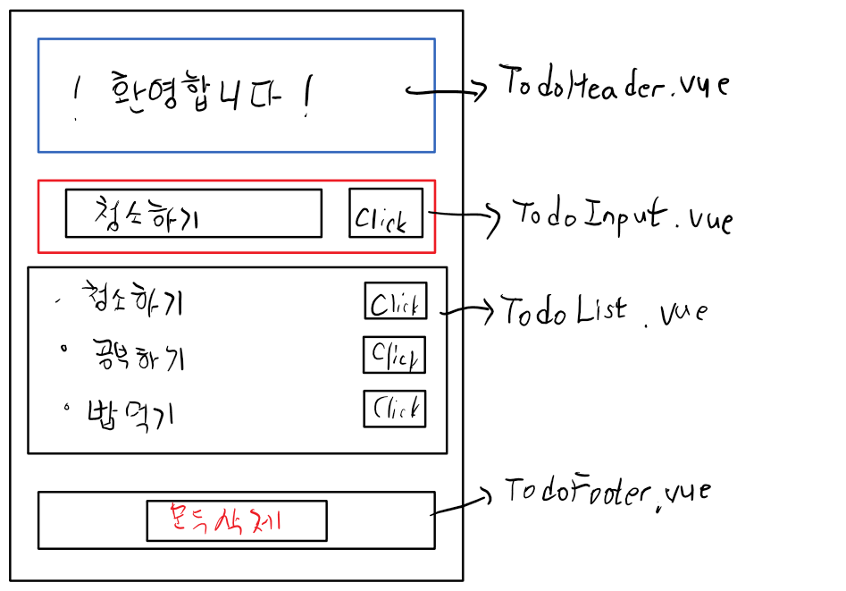

# 기존 방식
HTML 파일 내에 Javascript code로 포함하고 component를 생성할떄 template 속성을 이용한다.
사용하기도 불편하고 유지 보수도 불편하다.

좋은 방법 있나요? -> Single file Component
Componenet 1개가 File 1개로 구현된다.

xxx.Vue라는 확장자를 가진 파일을 만든다.
## xxx.Vue file의 구조
```
<template>
<!--component의 template속성에 들어있던 HTML 내용-->
</template>

<script>
export default {
<--data, methods, props, created, computed, ...-->
-> Javascript 객체가 module화
-> 다른 Javascript file에서 이 객체를 사용하려면??

}
</script>

<style>
위에 있는 HTML 부분에 대한 CSS
</style>

```

.Vue
file로 browser가 해석이 불가능한 file이다.
이 문제를 해결 하기 위해 module bundler를 이용한다.
## module bundler
-> Html, CSS, Javascript를 1개의 파일로 생성한다.
대표적인 제품 두가지 
1. Webpack (웹팩)
2. Brouserify(브라우져리파이) X (안쓰인다.)

## Webpack
과정이 복잡하다. 설치하고 설정하고 사용해야 한다.
Vue core 개발 team 에서 Vue CLI를 제공해준다.

## Vue CLI
-> Node.js의 모듈로 제공된다.
ModeJs를 이용해서 일단 Vue CLI를 설치해야한다.
1. Node.Js를 설치
2. npm(node package manager)를 이용해서 Vue CLI 설치한다. module 이면서 다른 module를 관리한다.
npm install vue-cli --location=global
3. Vue , enter(실행)
4. Vue Cli를 project 생성시 6개의 option이 있다.
Ex) Vue init webpack-simple
-> C:\vue-todo 폴더생성
-> visual studio code 에서 terminal-> 우측 아래 command prompt -> vue init webpack-simple -> 전부 enter -> npm install(필요한 라이브러리를 다운로드받는다.)
5. Extension Vetur 설치
6. 서버실행 - npm run dev 

### 간단한 To-do app을 만들어 봅시다.
화면은 mobile , css를 제공


https://www.favicon-generator.org/ - 파비콘 만들어주는 사이트

ex)
main.js
```js
import Vue from 'vue'
import App from './App.vue'

const EventBus = new Vue();

export default EventBus;

new Vue({
  el: '#app',
  render: h => h(App)
})
```

``` html
index.html
<!DOCTYPE html>
<html lang="en">
  <head>
    <meta charset="utf-8">
    <!-- 반응형 웹 형태로 구현 할것이다. -->
    <!-- mobile 형태로 구현할것이기 때문에 meta 설정이 들어간다. -->
    <meta name="viewport" content="width=device-width, initial-scale=1.0">
    <!-- viewport 설정을 해줘야한다. -->
    
    <!-- 웹 아이콘을 사용할것, 가장 대표적인 fontawesome을 이용한다. -->
    <link rel="stylesheet" href="https://cdnjs.cloudflare.com/ajax/libs/font-awesome/6.2.0/css/all.min.css">

    <!-- 기본적인 favicon 설정-->
    <link rel="shortcut icon" href="src/assets/favicon.ico" type="image/x-icon">
    <link rel="icon" href="src/assets/favicon.ico" type="image/x-icon">  

    <!-- 폰트도 웹 폰트를 이용한다. -->
    <link href='https://fonts.googleapis.com/css?family=Ubuntu' rel='stylesheet'>
    
    <title>vue-todo</title>
  </head>
  <body>
    <div id="app"></div>
    <script src="/dist/build.js"></script>
  </body>
</html>
```

ToDolist
```html
<template>
  <section>
    <ul>
      <li v-for="(todoItem, index) in todoItems" 
          :key="todoItem" 
          class="shadow">
        <i class="checkBtn fa fa-check" aria-hidden="true"></i>
        {{ todoItem }}
        <!-- @click은 v-on:click과 동일하게 동작합니다. 
                추가적으로 @click="[method1(), method2()]" 와 같이 사용하면
                클릭이벤트를 여러개 설정할 수 있습니다.
            -->
        <span
          class="removeBtn"
          type="button"
          @click="removeTodo(todoItem, index)"
        >
          <i class="fa fa-trash" aria-hidden="true"></i>
        </span>
      </li>
    </ul>
  </section>
</template>

<script>
import EventBus from "../main";

export default {
  data : function() {
    return {
      todoItems: [],
    };
  },
  methods: {
    removeTodo(todoItem, index) {
      localStorage.removeItem(todoItem);
      // splice() 함수는 JavaScript 내장함수로 트겆 인덱스에서 부여한 숫자만큼의 인덱스를 삭제합니다.
      this.todoItems.splice(index, 1);
    },
  },
  created: function () {
    // localStorage에서 데이터를 가져다가 todoItems에다 넣어요
    for (let i = 0; i < localStorage.length; i++) {
      if (localStorage.key(i) !== "loglevel:webpack-dev-server")
        this.todoItems.push(localStorage.key(i));
    }

    EventBus.$on('clearTodo', (todoItems) => {
        this.todoItems = todoItems;
      }
    )
    // EventBus.$on('addTodo', function(newTodoItem) {
    //     this.todoItems.push(newTodoItem);
    //     console.log(newTodoItem);
    //   }.bind(this)
    // )
    EventBus.$on('addTodo', (newTodoItem) => {
        this.todoItems.push(newTodoItem)
        console.log('받음');
      }
    )
  }
};
</script>
```

Todolist.html
```html
<template>
  <div>
    <input type="text" placeholder="할일을 입력하세요" v-model="newTodoItem" v-on:keyup.enter="test">

    <!-- <button v-on:click="addTodo">추가</button> -->

    <span class="addContainer" v-on:click="addTodo">
      <i class="addBtn fa fa-plus" aria-hidden="true"></i>
      <!-- 아이콘 속성  =   <button @click="addTodo">추가</button> -->
    </span>
    <!-- v-on = 한개 @ = 여러개 사용 할 수 있다. -->
    <!-- <button @click="[addTodo(), test()]">추가</button> -->
  </div>
</template>

<script>
import EventBus from "../main";

export default {
  data() {
    return {
      newTodoItem: "",
      todoItems: []
    };
  },
  methods: {
    test() {
      console.log('찍혀요');
    },
    addTodo() {
      // 현재 입력한 할 일 목록을 저장해야 하는데 서버프로그램에 연결 x 데이터베이스에 저장이 안된다.
      // 그래서 browser가 가지고 있는 저장 장소를 이용해야한다.
      // 저장장소가 크게 2가지 있는데 Storage와 IndexedDB가 있다.
      // 그 중 Storage를 사용해 보자. Storage는 LocalStoage와 SessionStorage로 나뉜다.
      // 일반적인 LocalStorage를 이용할 것이다.
      // JavaScript를 이용해 원하는 데이터를 Map형태로 저장이 가능하다.
      // 데이터는 Map형태로 (key,value의 쌍)으로 저장이 가능하다.
      // 여러프로그램에 의해 데이터가 중복되는걸 방지하기 위해 각 데이터는 domain으로 구분되어서 저장된다.
      if (this.newTodoItem !== "") {
        localStorage.setItem(this.newTodoItem, this.newTodoItem);
        EventBus.$emit('addTodo', this.newTodoItem);
        this.newTodoItem = "";
        
      }
      // 버튼을 누르면 (키값, 변수값)을 넣는다.
      
    },
  },
};
</script>
```
TodoFooter
```html
<template>
  <div class="clearAllContainer">
    <span class="clearAllBtn" @click="clearTodo">모두 삭제</span>
  </div>
</template>

<script>
import EventBus from "../main";

export default {
  methods: {
    clearTodo() {
      localStorage.clear();
      EventBus.$emit('clearTodo', this.todoItems);
    }
  }
};
</script>
```
app.vue
```html

<template>
  <div id="app">
    <TodoHeader></TodoHeader>
    <TodoInput></TodoInput>
    <TodoList></TodoList>
    <TodoFooter></TodoFooter>
  </div>
</template>

<script>
import TodoHeader from "./components/TodoHeader.vue";
import TodoInput from "./components/TodoInput.vue";
import TodoList from "./components/TodoList.vue";
import TodoFooter from "./components/TodoFooter.vue";

export default {
  components: {
    TodoHeader,
    TodoInput,
    TodoList,
    TodoFooter,
  },
  // data: function() {
  //   return {

  //   }
  // }    축약형
  data() {
    return {
      message: "소리없는 아우성",
    };
  },
};
</script>

```

.png)