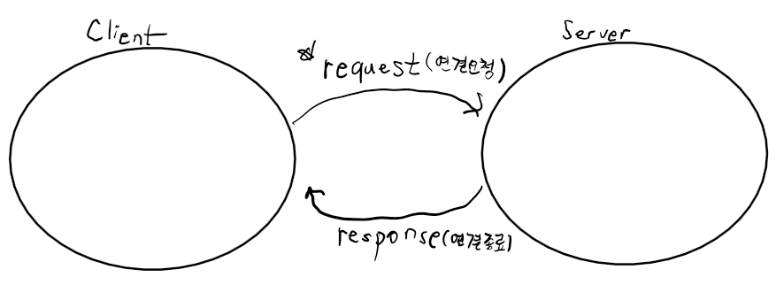
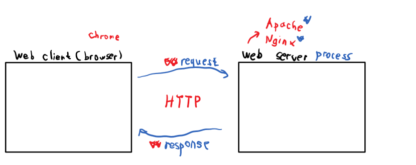
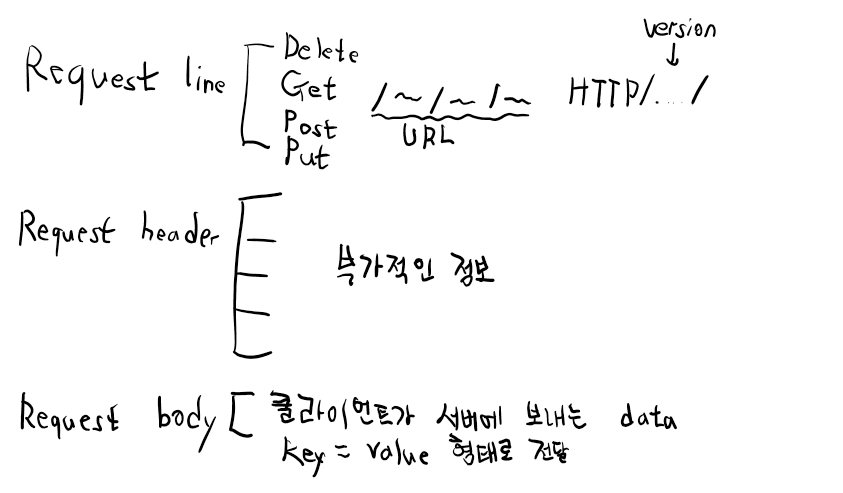
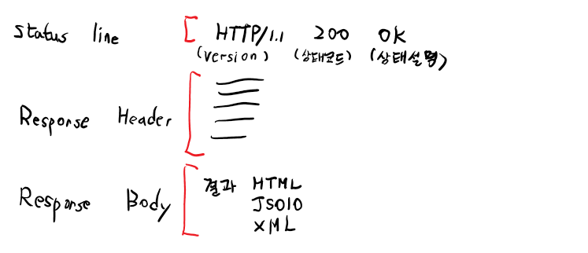
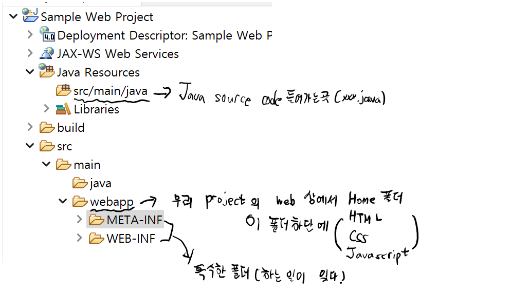
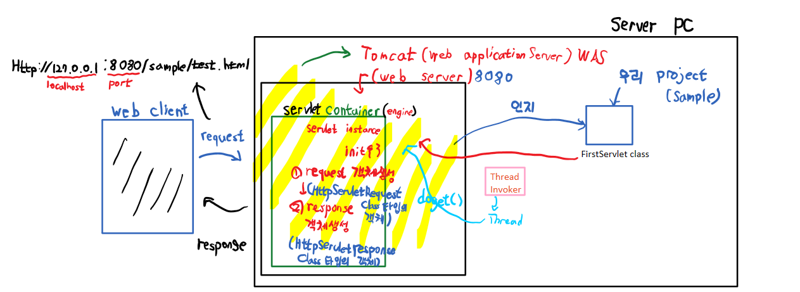

# Java Servlet
```
Java 웹 페이지(HTML,CSS,Javascript)를 동적으로 생성하는 Java program
    
기본개념 & 용어
1. Internet -> network of network -> 물리적인 Infrastructure

2. Service
internet 위에서 동작하는 여러가지 응용 (Email, www, torrent)

3. Ip address
internet상의 여러개의 computer 들이 서로 data를 주고 받아야 해요
-> 상대방 컴퓨터를 식별할 수 이는 식별자가 필요하다.
4자리로 구성된 숫자를 이용하자
IP address v4 32bit로 주소를 설정한다.
ex) 14(0~255). 1(0~255). 1(0~255). 1(0~255)
-> 이런 IP address를 어디에 할당하는가? NIC (Network Interface Card)랜카드
그래서 한 computer에 IP adsress 를 여러개 할당 받을 수 있다.
이런 IP address는 당연히 정해진 체계가 있다.
IP address는 할당을 요청하고 받는 구조이기 떄문에 논리적인 주소다.
오늘은 x.x.x.1 주소를 쓰고 있는데 바꿀 수 있는가? 가능
이런 논리적인 주소를 대신해서 물리적인 주소를 사용하는데 통신을 이용 -> MAC address
대표적인 IP address : 127.0.0.1 (loopback)
세상이 변하면서 IP 주소가 부족해졌다. -> IP6
하나의 IP address를 이용하여 다수의 가상 IP address를 사옴 -> subnet

4. IP address는 "숫자" -> "문자"로 변환시켜서 사용하면 된다. ->DNS(Domain Name System) Domain name server의 의미도 있다.

5. Port : 숫자(0~65535)
Computer내에 실행되고 있는 프로그램(process)에 할당된 번호!!
모든 process(프로그램)이 가지고 있는건 아니다.

Network통신에서 한 computer의 process가 다른 computer의 process를 식별하기 위한 수단이다.
하나의 process가 Network로 연결된 다른 process와 데이터 통신을 하려면?
①. IP address
②. port
③. 데이터 통신 규칙(규약) -> protocal
형식 => protocal : // IP : port

6. Hypertext
사용자의 선택에 따라서 관련된 정보 쪽으로 옮겨 갈 수 있도록 만들어진 조직화된 정보. -> naver로 가기 (링크라고 표현한다.)
HTML Element -> <a nref="...">~~~</a>

7. WWW (World Wide Web)
-> Internet위에서 동작하는 service
우리가 흔히 인터넷이라고 부르기도 해요

8. 데이터 통신을 위해 정해놓은 통신 규약
-> Protocal 이라고 해요
www 상에서 사용되는 protocal -> HTTP(Hypertext Transfer protocal)
이 protocal의 특징을 잘 알고 있어야 해요
① HTTP protocal로 client-server 구조 (c/s 구조)
```

```
request 발생시 바로 response를 하는 구조이다.
ex) 서버연결 -> "안녕하세요" -> 서버종료
서버연결 -> "안녕못해요" -> 서버종료
왜 이렇게 통신하는가?
서버는 상대적으로 소수이고 client가 절대 다수이기 떄문이다.
그래서 client와 지속적인 연결을 유지하기가 힘들어요!
② protocal 자체가 복잡하지 않다.

9. ★REST★
-> Representational State Transfer
(표현이 가능한 상태(정보)를 전송한다.)
애플리케이션 개발의 *아키텍처 중 하나

자원을 이름으로 구분해서 자원의 정보를 주고 받는것을 의미한다.
ex) car.jpg -> 이미지 데이터를 전송, index.html -> 문자열을 전송, boxoffice.json -> json
이러한 REST는 기존 web의 HTTP방식과 거의 유사하다.
HTTP를 REST로 활용 할 수있다. URI, URL(주소, 좌표)
풀어서 얘기해보면 HTTP URI (Uniform Resource Identifier)
URI -> HTTP URI 웹 상에 있는 특별한 리소스에 대해서 다른 리소스와 구별하기 위해 이름을 붙여주는 것이다.

자원을 명시!
HTTP의 method(Get,Post,Put,Delete)를 통해서 자원에 대한 CRUD operation을 적용한 후 그 결과를 JSON, XML로 받는다.
Create : 데이터 생성(POST)
Read : 데이터 조회(GET)
Update : 데이터 수정(PUT, PATCH)
Delete : 데이터 삭제(DELETE)
Rest를 적용하기 위해 별도의 infra가 필요없다.
Web HTTP Protocal을 그대로 이용한다.
method에 따라 작업이 구분되므로 명확한 코드처리가 가능하다.
만약 REST기반의 API를 작성한다고 하면 "REST API 작성규칙" 이걸 준수해야 한다.

10. SOAP (Simple Object Access Protocal)
Web과 잘 맞지 않아요 -> 일반적인 network program에 활용한다. (보안적인 측면이 강하다.)

11. Web browser (web client)

12. Web Server
```

```
13. HTTP Request
```

```
14. HTTP Response
```
  

### Rest 자세히
```
REST는 기본적으로 아래의 개념입니다.
웹 애플리케이션 상에 존재하는 모든 리소스(미디어, DB데이터)에 대해 고유의 URI를 부여하고 HTTP Method(GET, POST, PUT, DELETE)를 이용해 리소스에 대해 CRUD 명령을 적용한다.
즉 위에서 말한 '대표 상태 전송'이 URI가 부여된 리소스(URI가 리소스를 대표)의 상태를 응답으로 전송한다는 의미라고 이해할 수 있겠습니다.

REST의 구성 요소
REST는 다음 3가지의 요소로 구성됩니다.
1. 자원(Resource)
- 자원은 서버에 존재하는 데이터의 총칭입니다. 모든 자원은 고유의 URI(URL)을 가지며 클라이언트는 이 URI를 지정하여 해당 자원에 대해 CRUD 명령을 수행할 수 있습니다. (ex: /resource/1)

2. 행위(Verb)
- 행위는 클라이언트가 HTTP Method를 이용하여 자원을 조작하는 것을 의미합니다.

3. 표현(Representation)
- 클라이언트가 HTTP Method로 자원을 조작하면 서버가 그에 대한 응답(JSON, XML)을 보내는데 그것을 의미합니다.

REST의 특징
1. 서버-클라이언트 구조(Server-Client Architecture)
- 서버는 API 제공, 클라이언트는 유저에 대한 처리를 전담하는 구조를 가지기 때문에 서버와 클라이언트의 역할을 분명하게 구분할 수 있습니다.
2. 무상태성(Stateless)
- HTTP를 이용하는 만큼 Stateless의 특성을 가집니다. 각각의 요청에 대한 정보를 저장하지 않고 별개의 요청으로 처리합니다. 덕분에 구현이 쉽고 서버의 부담을 덜어줄 수 있습니다.
3. 캐시 가능(Cacheable)
- HTTP를 사용하기 때문에 웹의 기본 인프라를 사용할 수 있습니다. 따라서 캐시 기능을 이용해 같은 URI에 대한 반복된 요청을 효율적으로 처리할 수 있습니다.
4. 일관된 인터페이스(Uniform Interface)
- HTTP를 사용할 수 있는 환경이라면 플랫폼에 상관없이 사용할 수 있으며 리소스의 타입에 상관 없이 같은 형태의 요청으로 처리됩니다.
5. 자체적인 표현 구조(Self-Descriptiveness)
- JSON, XML 등을 이용하는 메세지 구조로 해당 메세지가 무엇을, 어떤 행위를 의미하는지 직관적으로 이해할 수 있습니다.
6. 계층 구조(Layered System)
- 클라이언트는 대상 서버와 직접 통신하는지 아니면 중간 서버와 통신하는지 알 수 없습니다. 따라서 클라이언트와 서버의 통신 사이에 보안이나 로드 밸런싱등을 위한 중간 계층을 추가할 수 있습니다.

REST의 장단점
장점
1. 별도의 인프라 구축 필요x
- HTTP를 사용하기 때문에 별도의 인프라를 구축할 필요가 없습니다.
2. 클라이언트와 서버의 분리
- 클라이언트와 서버는 REST API를 통해 정보를 주고 받기 때문에 둘 간의 역할이 명확하게 분리됩니다.
3. 플랫폼에 독립적
- HTTP를 사용 가능한 환경이라면 플랫폼에 상관없이 사용 가능합니다.
4. 쉬운 사용
- 메세지가 자체적으로 무엇을 의미하는지 표현하고 있기 때문에 사용이 쉽습니다.

단점
1. 표준이 존재하지 않음
- 명확한 표준이 존재하지 않습니다. 따라서 REST의 특징을 따르지 않으면서 REST API로 설계되는 이상한 API가 탄생할 수 있으며 관리가 어렵습니다.
2. HTTP Method의 한계
- HTTP Method를 사용하기 때문에 CRUD라는 단순한 행위의 Method만 지원합니다.
3. RDBMS와 맞지 않음
- REST에서는 리소스를 JSON, XML등의 형태로 표현하는데 이는 RDBMS와는 맞지 않는 형태입니다. 그래서 NoSQL쪽이 더 선호되는 추세입니다.
```
### 환경설정
```
Java버전 -> Java 11버전
현재 현업은 Java 8 버전을 사용한다.
우리도 나중을 위한 Java 8 버전으로 "downgrade"
Java (무료) -> Oracle에 인수되고 JDK-> 무료, JRE-> 무료 (JWS,폰트)->유료
Open JDK, 라이센스 -> Oracle JDK

Java 8버전 사용, 시스템속성, 환경 변수 -> JAVA_HOME추가 및 C:\Program Files\Java\jdk1.8.0_361 붙여넣기

환경설정(encoding)
Unicode(UTF-8)로 설정하기
General - Content Types - Default encoding: UTF-8 -> UPDATE
General - Editors - Text Editors - Spelling -> Encoding UTF-8
Web- Css Files, HTML Files, XML Files
```
```
web project 생성
- Static web project

- ★Dynamic web project(Servlet)
생성할떄 context root 
-> web상에서 우리 project에 대한 identifier(식별화)
sample -> 나중에 변경이 가능하다

web project는 설정이 필요하다
1. xml파일 (spring framework 에서 사용된다.)
2. annotation으로 설정 (@~~) -> Servlet 3.0 이후 부터 가능하다. (선호)
```
## Sample Web project

project(test.html)를 완성하고 -> web에 deploy 해서 client가 이용할 수 있게끔 서비스 하고 싶다!! ->
1. web server가 있어야 한다. (Apache, Ngin X)
Apache Tomcat -> web server + servlet   Containner
2. Tomcat을 download해요
google에 Tomcat을 친다. Download -> Tomcat 9 -> 64-bit Windows zip
-> 압축풀어서 Java에 복사
3. eclipse 와 Tomcat을 연동
하단 Servers - No servers are available. Click~~~~~~ 클릭
젤 위(Apache) Tomcat 9.0v  클릭 
4. Tomcat이 우리 project를 인지해야 해요(Configure)
서버에서 우클릭 -> Add and Remove
5. Tomcat을 이용해 우리 project를 web에 deploy한다.
-> Tomcat을 실행한다. (5시 초록색 재생버튼)

### static resource를 요청하고 응답하는 구조
(HTML, CSS, Javascript, Image, 동영상)

### dynamic resource를 요청하고 응답하는 구조
(Java program)

### 클라이언트가 호출할 Java program(servlet)을 작성해요!!!
src/main/java -> 우클릭, Servlet -> servlet class 작성 -> URL Mappings (시작은 무조건 /로 한다.)
ex) /myservlet -> web상에서 URL을 이용해 클라이언트가 이 servlet을  실행시키기 위한 Identifire이다.
-> class 를 완성 -> "하지만 오류가 났다." ??? -> servlet은 자바의 기본 API가 아니라서 라이브러리가 없다. Java Build Path에 추가!!
Classpath -> Add Library -> Server Runtime [Apache Tomcat v9.0]



1. Servlet container 에서 객체를 만든다 -> servlet instance
- request 객체생성
(HttpServletRequest classtype의 객체)
- response 객체생성
(HttpServletResponse classtype의 객체)
2. container instance -> inint(){} -> request 객체생성 -> response 객체생성
3. Thread Invoker -> Thread -> service() 
Thread
4. Service
Service() 가 client의 request종류가
get이면 doGet()호출
post면 doPost()호출

Servlet instance -> 나머지가 다 사라져도 남아있다.
새로운 client가 들어올떄마다 Thread가 만들어지고 남아있는 Servlet instance가 (공용객체)로 만들어진다.
이것을 싱글톤패턴이라고 부른다.

### ->>>> 싱글톤 (singletone)
```
싱글톤 패턴은 '하나'의 인스턴스만 생성하여 사용하는 디자인 패턴이다.
인스턴스가 필요할 때 인스턴스를 만들지 않고 기존의 인스턴스를 활용하는 것
생성자가 여러번 호출되도, 실제로 생성되는 객체는 하나이며 최초로 생성된 이후에 호출된 생성자는 이미 생성한 객체를 반환시키도록 만드는 것이다
(java에서는 생성자를 private으로 선언해 다른 곳에서 생성하지 못하도록 만들고, getInstance() 메소드를 통해 받아서 사용하도록 구현한다)

#왜 쓰나요?
싱글톤으로 구현한 인스턴스는 '전역'이므로, 다른 클래스의 인스턴스들이 데이터를 공유하는 것이 가능한 장점이 있다.

#많이 사용하는 경우가 언제인가요?
주로 공통된 객체를 여러개 생성해서 사용해야하는 상황
데이터베이스에서 커넥션풀, 스레드풀, 캐시, 로그 기록 객체 등

#단점도 있나요?
객체 지향 설계 원칙 중에 개방-폐쇄 원칙이란 것이 존재한다.
만약 싱글톤 인스턴스가 혼자 너무 많은 일을 하거나, 많은 데이터를 공유시키면 다른 클래스들 간의 결합도가 높아지게 되는데, 이때 개방-폐쇄 원칙이 위배된다.
또한, 멀티 스레드 환경에서 동기화 처리를 하지 않았을 때, 인스턴스가 2개가 생성되는 문제도 발생할 수 있다.
따라서, 반드시 싱글톤이 필요한 상황이 아니면 지양하는 것이 좋다고 한다. 
```
