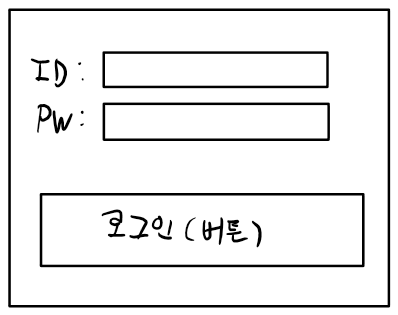

# ServletContext
```
항상 써야하나요? 필요한 경우가 있다.
저장공간(Map 구조) -> Key와 Value의 쌍으로 데이터를 저장한다.
ServletContainer 안에 위치 -> client thread가 호출하는 doGet(doPost)안에서 이 객체의 reference를 얻어서 사용 가능
```

```
웹 애플리케이션 단위로 정보를 서버 쪽에 유지할 수 있는 방법은 ServletContext 객체를 사용하는 것입니다. 
ServletContext는 서블릿 컨테이너와 통신하기 위해서 사용되는 메소드를 지원하는 인터페이스입니다. 서블릿 컨테이너가 시작될 때 웹서버에 등록된 웹 애플리케이션 단위로 하나의 ServletContext 객체가 자동으로 생성되고 중지될 때 소멸합니다. 즉, ServletContext 객체는 웹 애플리케이션과 생명주기(life cycle)가 같습니다.
WAS에 등록된 웹 애플리케이션 단위로 컨텍스트가 생성되는 이유는 서블릿 컨테이너가 웹 애플리케이션 단위로 모든 자원을 관리할 수 있게 하기 위해서입니다. 즉, 웹 애플리케이션 내에 있는 모든 서블릿 그리고 JSP 간에 정보를 공유할 수 있고, 서블릿 컨테이너에 대한 정보를 추출할 수 있게 하는 기술이 바로 ServletContext입니다.
웹 애플리케이션 서비스가 시작될 때 생성된 ServletContext 객체의 추출 방법은 메소드를 이용합니다. 메소드를 이용해 추출되는 객체는 웹 애플리케이션 단위로 사용하기 때문에 동일한 웹 애플리케이션에 존재하는 서블릿들은 동일한 객체를 사용하게 됩니다. ServletContext를 추출하는 메소드는 ServletConfig의 getServletContext()입니다.
서블릿을 실행할 때 최초의 요청이면 ServletConfig 객체가 생성되며 init() 메소드의 인자값으로 전달됩니다. ServletConfig 객체에서 현재 웹 어플리케이션에 할당된 ServletContext 객체의 주솟값을 추출할 수 있는 getServletContext() 메소드를 제공합니다.
```
# Session (session처리, session Tracking)
```
우리가 사용하는 "web"은 HTTP 프로토콜을 사용
HTTP Protocal은 간단한 protocal -> 동작방식도 단순하다
Client 가 server에게 request 요청을 한 이후 response 를 받을 때 연결을 종료한다.
서버와 연결성이 없고 client의 상태(정보)가 서버에 남아있지 않다!!
-> Stateless protocal (HTTP)

1. login 처리를 해보아요
Servlet Context -> 같이 쓰는 것
session객체 -> 나만 쓰는 것
```
# JSP (Java Server Pages)
```
Jakarta -> Template Engine -> Vue.js
Template : '<HTML>.....' -> Vue CLI

Jsp == Servlet -> 출력부분이 영 좋지 않다.
Java 를 이용한 서버 사이드 템플릿 엔진이다. 
jsp 는 자바를 웹서버에서 쉽게 쓰기 위한 기술이며 언어가 아니다. 
Java Server Pages의 약자이며, 오라클에서 자바상표권 문제로 오픈소스인 jsp는 자카르타 서버페이지로 이름을 바꾸었다. 
확장자는 당연히 .jsp를 사용한다.
ASP와 마찬가지로 <% ... %>로 둘러싸인 스크립트 영역이 있으며, 실행시에 javax.servlet.http.HttpServlet 클래스를 상속받은 Java 소스 코드로 변환한 다음 컴파일되어 실행된다. 
이 JSP 파일을 Servlet 클래스로 변환하고 실행시켜 주는 역할을 하는 프로그램은 서블릿 컨테이너라고 부른다. 
대표적인 것으로 오픈 소스 웹 컨테이너인 Tomcat이 있다. 
하나의 JSP 페이지가 하나의 Java 클래스이기 때문에 모든 Java 라이브러리를 끌어다 쓸 수 있다.

JSP -> HTML + JSP요소 포함된 구조
JSP요소 -> Java code + 특수한 표기법
```


## JSP 동작원리


## JSP 코드
```
1. JSP file 내에서 HTMl 내용은 out.println("~") ~안으로 다 들어간다.
2. JSP file 내에서 <%~~%> Scriptlet
 일반 Java Code - (변수선언, for.if.while -> 제어문, 객체생성, method 호출)
3. Jsp file 내에서 <%= %> 문자열로 표현이 가능한 값
4. <%@ %> 로직처리가 아니라 설정을 해준다.
```
## 간단한 게시판을 만들어 보아요
MVC pattern + JSP를 이용한 View처리
1. 일반적인 Round-Trip 방식
2. JQuery AJAX를 이용해서 View처리 분리
3. Vue.js 같은 framework를 이용해 Front-End와 Bace-End를 분리

### 일반적인 Round-Trip 방식활용
Story Board를 만들어야 해요 (화면 Navigation)
1. 로그인기능
2. 댓글 게시판 기능   

   
```
1.
src - member - controller, dao, vo, service
    - board - controller, dao, vo, service
2.
src - controller - member, board
    - board - controller, dao, vo, service

1번 방법이 단체 프로젝트할때 오류발생이 덜하기 때문에 1번방법으로 해볼것이다.
```


## ex)
login_jsp.jsp
```jsp
<%@ page language="java" contentType="text/html; charset=EUC-KR"
	pageEncoding="EUC-KR"%>
<!DOCTYPE html>
<body>
<%
	// 1. 입력받고
	// 2. 로직처리하고 했지만 지금은 출력용도로만 사용한다.
	// 3. 출력은 HTML에 끼워넣기
%>
	<%
	String name = "홍길동"; //지역변수
	for (int i = 0; i < 5; i++) {
	%>
	<h1>반복</h1>
	<%
	}
	%>
	이것은 소리없는 아우성!!
	사용자의 이름은 : <%= name %> 입니다.
</body>

결과값은 5번 반복
```
BoardServlet
```java
	protected void doGet(HttpServletRequest request, HttpServletResponse response) throws ServletException, IOException {
		// 여기는 로그인한 사람만 들어올 수 있어요!
		
		// request.getSession(false);
		// 나(클라이언트)에게 기존에 할당된 세션객체가 있으면 그거 주세요!
		// 만약 없으면 만들지 말고 null을 리턴하세요!
		HttpSession session = request.getSession(false);
		response.setContentType("text/html; charset=UTF-8");
		PrintWriter out = response.getWriter();

		out.println("<html><head></head>");
		out.println("<body>");
		if(session != null) {
			String name = (String)session.getAttribute("loginName");
			out.println("<h1>" + name + "님 게시판에 오신것을 환영합니다.</h1>");	
		} else {
			out.println("<h1>로그인을 해야 사용할 수 있어요! 페이지 재설정</h1>");
		}
		
		out.println("</body></html>");
		
	}
```
LoginServlet
```java
@WebServlet("/login")
public class LoginServlet extends HttpServlet {
	private static final long serialVersionUID = 1L;

	public LoginServlet() {
		super();
	}

	protected void doGet(HttpServletRequest request, HttpServletResponse response)
			throws ServletException, IOException {
	}

	protected void doPost(HttpServletRequest request, HttpServletResponse response)
			throws ServletException, IOException {
		request.setCharacterEncoding("UTF-8");

		String id = request.getParameter("userID");
		String pw = request.getParameter("userPW");

		Member member = new Member();
		member.setId(id);
		member.setPassword(pw);

		SqlSession sqlSession = MyBatisConnectionFactory.getSqlSessionFactory().openSession();

		Member result = sqlSession.selectOne("myMember.login", member);
		
		if(result != null) {
			// 로그인 성공
			// servlet container에게 session객체를 요청해요!
			// request.getSession(true);의 의미는..
			// 만약 기존에 내가 할당받은 세션객체가 있으면 그거 주세요!
			// 기존에 할당받은 세션객체가 없으면 만들어 주세요!
			HttpSession session = request.getSession(true);
			// 이 세션객체는 Map형태예요..
			session.setAttribute("loginName", result.getName());
		}
		// 3. 결과처리
		response.setContentType("text/html; charset=UTF-8");
		PrintWriter out = response.getWriter();
		out.println("<html><head></head>");
		out.println("<body>");
		if(result != null) {
			out.println(result.getName() + "님 환영합니다.!!");
			out.println("<br><br>");
			out.println("<a href='board'>게시판 들어가기</a>");
			// 로그인이 성공한 상태
		} else {
			// 로그인이 실패한 상태
			out.println("로그인에 실패했습니다.");
		}		
		out.println("</body></html>");
	}
}
```
NameServlet
```java
@WebServlet("/saveName")
public class NameServlet extends HttpServlet {
	private static final long serialVersionUID = 1L;
       
    public NameServlet() {
        super();
    }

	protected void doGet(HttpServletRequest request, HttpServletResponse response) throws ServletException, IOException {
		response.getWriter().append("Served at: ").append(request.getContextPath());
	}

	protected void doPost(HttpServletRequest request, HttpServletResponse response) throws ServletException, IOException {
		request.setCharacterEncoding("UTF-8");
		
		// 1. 입력처리
		String name = request.getParameter("userName");
		// 2. 로직처리
		// ServletContext를 가져와서 이름을 저장할 거에요
		ServletContext context = this.getServletContext();
		context.setAttribute("memberName", name);
		// 3. 결과처리
		response.setContentType("text/html; charset=UTF-8");
		PrintWriter out = response.getWriter();
		
		out.println("<html><head></head>");
		out.println("<body>");
		out.println("<a href='secondServlet'>두번째 서블릿 호출</a>;" + name);
		out.println("</body><html>");
	}
}
```
## ex) 로그인페이지 구현중

html -> servlet -> service -> dao -> service -> controller -> jsp(servlet) -> client

loginSuccess.jsp
```jsp
<%@ page language="java" contentType="text/html; charset=EUC-KR"
    pageEncoding="EUC-KR"%>
<%@ page import="member.vo.Member" %>
<!DOCTYPE html>
<body>
	<!-- JSP에서는 나에게 할당된 session객체를 그냥 사용 할 수 있어요 어떤 이름을 사용해야 하나요?? =>> session -->
	<h1><%= ((Member)session.getAttribute("member")).getMemberName() %>님 환영합니다.</h1>
</body>
```
LoginServlet
```java
@WebServlet("/login")
	protected void doPost(HttpServletRequest request, HttpServletResponse response) throws ServletException, IOException {
		// Servlet은 MVC(Model-View-Controller) pattern에서 Controller의 역할을 해요!
		// Model : 1. Data Model (VO class), 2. Business Logic Model (Service class)
		// View : HTML, JSP
		// Controller : View와 Model을 연결해주는 역할을 담당 => Servlet
		// 				View로부터 사용자 데이터를 받아서 Model(Service)에게 전달해서 
		//              로직처리시키고 로직처리된 결과를 Model(Service)로부터 받아와요
		//              그 결과를 보고 특정View를 선택(HTML, JSP)해서 그 View를 클라이언트에게
		//				전달하도록 시킨다.
		
		// 1. 입력받고
		request.setCharacterEncoding("UTF-8");
		String userId = request.getParameter("userID");
		String userPW = request.getParameter("userPW");
		
		// 입력받은 데이터로 VO를 생성해요!
		// 데이터베이스 테이블을 기준으로 VO를 생성해야 하니.. 당연히 Table이 있어야 해요
		Member member = new Member();
		member.setMemberId(userId);
		member.setMemberPw(userPW);
		
		// 2. 로직처리하고
		// 로직처리를 하기위해서 Service객체를 생성해야 해요!
		MemberService service = new MemberService();
		// 객체가 생성되었으면 이제 일을 시켜요!
		// 만약 로그인이 성공하면 VO안에 회원의 이름까지 포함해서 들고오고
		// 실패하면 null을 리턴받는다.
		Member result = service.login(member);
		
		// 3. 출력처리해요
		if(result != null) {
			// 로그인 성공
			// 로그인에 성공한 흔적을 남겨놔야 해요! => session에 남겨 놓으면 좋아요!
			HttpSession session = request.getSession(true);
			session.setAttribute("member", result);
			// 게시판 HTML페이지를 클라이언트에게 전송해요! (JSP 전달, 프로그램적 요소를 전달하여야 하기 떄문이다.)
			// JSP는 그 실체가 Servlet이다.
			// html -> servlet -> service -> dao -> service -> controller -> jsp(servlet) -> client
			RequestDispatcher dispatcher = request.getRequestDispatcher("loginSuccess.jsp");
			dispatcher.forward(request, response);
			// 하나의 서블릿이 다른 호출하기위해 사용한다.
		} else {
			// 로그인 실패
			// 오류 HTML페이지를 전송한다. (HTML 전달)
			response.sendRedirect("loginFail.html");
		}
	}
```
MemberDao
```java
public class MemberDao {

	public Member select(Member member) {
		// 데이터베이스 처리
		// MyBatis를 이용해서 Database처리를 할거에요
		// SqlSession이라는게 있어야 해요! => 이걸 가지고 XML에 있는 Query를 실행할 수 있어요!
		// SqlSession은 누가 만들어 주나요? => SqlSessionFactory가 만들어줘요
		// SqlSessionFactory가 있어야 해요! => 이 공장을 만드려면 데이터베이스 연결정보와 같은 XML정보를 줘서 만들어야해요
		// 공장 짓는 코드는 어느정도 정해져 있어요!
		SqlSession sqlSession = MyBatisConnectionFactory.getSqlSessionFactory().openSession();
		
		Member result = sqlSession.selectOne("myMember.login", member);
		
		sqlSession.close();
		
		return result;
	}
}
```
MemberService
```java
public class MemberService {

	public Member login(Member member) {
		// 로그인이라는 Transaction (작업) 처리를 진행해요
		// 하지만 로그인이라는 작업은 별다른 로직처리할게 없다.
		// Database처리가 사실 전부이다. -> DAO에서 한다.
		MemberDao dao = new MemberDao();
		
		Member result = dao.select(member);
		
		return result;
	}
}
```