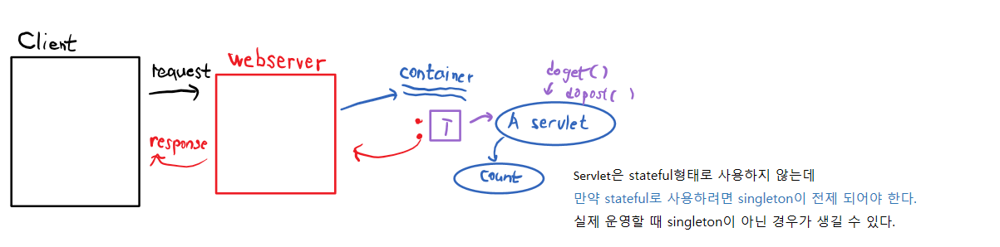

# ServletContext
```
항상 써야하나요? 필요한 경우가 있다.
저장공간 -> Map 구조 -> Key와 Value의 쌍으로 데이터를 저장한다.
ServletContainer 안에 위치 -> client thread가 호출하는 doGet(doPost)안에서 이 객체의 reference를 얻어서 사용 가능
```

```
웹 애플리케이션 단위로 정보를 서버 쪽에 유지할 수 있는 방법은 ServletContext 객체를 사용하는 것입니다. 
ServletContext는 서블릿 컨테이너와 통신하기 위해서 사용되는 메소드를 지원하는 인터페이스입니다. 서블릿 컨테이너가 시작될 때 웹서버에 등록된 웹 애플리케이션 단위로 하나의 ServletContext 객체가 자동으로 생성됩니다. 그리고 웹 애플리케이션 서비스가 중지될 때 소멸합니다. 즉, ServletContext 객체는 웹 애플리케이션과 생명주기(life cycle)가 같습니다.
WAS에 등록된 웹 애플리케이션 단위로 컨텍스트가 생성되는 이유는 서블릿 컨테이너가 웹 애플리케이션 단위로 모든 자원을 관리할 수 있게 하기 위해서입니다. 즉, 웹 애플리케이션 내에 있는 모든 서블릿 그리고 JSP 간에 정보를 공유할 수 있고, 서블릿 컨테이너에 대한 정보를 추출할 수 있게 하는 기술이 바로 ServletContext입니다.
웹 애플리케이션 서비스가 시작될 때 생성된 ServletContext 객체의 추출 방법은 메소드를 이용합니다. 메소드를 이용해 추출되는 ServletContext 객체는 웹 애플리케이션 단위로 사용하기 때문에 동일한 웹 애플리케이션에 존재하는 서블릿들은 동일한 ServletContext 객체를 사용하게 됩니다. ServletContext를 추출하는 메소드는 ServletConfig의 getServletContext()입니다.
서블릿을 실행할 때 최초의 요청이면 ServletConfig 객체가 생성되며 init() 메소드의 인자값으로 전달됩니다. ServletConfig 객체에서 현재 웹 어플리케이션에 할당된 ServletContext 객체의 주솟값을 추출할 수 있는 getServletContext() 메소드를 제공합니다.
```
# Session (session처리, session Tracking)
```
우리가 사용하는 "web"은 HTTP 프로토콜을 사용
HTTP Protocal은 간단한 protocal -> 동작방식도 단순
Client 가 server에게 request 요청을 한 이후 response 를 받을 때 연결을 종료한다.
서버와 연결성이 없고 client의 상태(정보)가 서버에 남아있지 않다!!
-> Stateless protocal (HTTP)

1. login 처리를 해보아요

Servlet Context -> 같이 쓰는 것
session객체 -> 나만 쓰는 것
```
# JSP (Java Server Pages)
```
Jakarta -> Template Engine -> Vue.js
Template : '<HTML>.....' -> Vue CLI

Jsp == Servlet -> 출력부분이 영 좋지 않다.

Java를 이용한 서버 사이드 템플릿 엔진이다. 
jsp 는 자바를 웹서버에서 쉽게 쓰기 위한 기술이며 언어가 아니다. 
Java Server Pages의 약자이며, 오라클에서 자바상표권 문제로 오픈소스인 jsp는 자카르타 서버페이지로 이름을 바꾸었다. 
Java의 점유율을 대폭 상승시킨 1등공신이다. 
같은 부류에 속하는 것으로 ASP가 있다. 
확장자는 당연히 .jsp를 사용. ASP와 마찬가지로 <% ... %>로 둘러싸인 스크립트 영역이 있으며, 실행시에 javax.servlet.http.HttpServlet 클래스를 상속받은 Java 소스 코드로 변환한 다음[2] 컴파일되어 실행된다. 
이 JSP 파일을 Servlet 클래스로 변환하고 실행시켜 주는 역할을 하는 프로그램은 서블릿 컨테이너라고 부른다. 
대표적인 것으로 오픈 소스 웹 컨테이너인 Tomcat이 있다. 
하나의 JSP 페이지가 하나의 Java 클래스이기 때문에 모든 Java 라이브러리를 끌어다 쓸 수 있다.

JSP -> HTML + JSP요소 포함된 구조
JSP요소 -> Java code + 특수한 표기법
```


## JSP 동작원리


## JSP 코드
```
1. JSP file 내에서 HTMl 내용은 out.println("~") ~안으로 다 들어간다.

2. JSP file 내에서 <%~~%> Scriptlet
 일반 Java Code - (변수선언, for.if.while -> 제어문, 객체생성, method 호출)

3. Jsp file 내에서 <%= %> 
                    문자열로 표현이 가능한 값

4. <%@ %> 로직처리가 아니라 설정을 해준다.
```
## 간단한 게시판을 만들어 보아요
MVC pattern + JSP를 이용한 View처리
1. 일반적인 Round-Trip 방식
2. JQuery AJAX를 이용해서 View처리 분리
3. Vue.js 같은 framework를 이용해 Front-End와 Bace-End를 분리