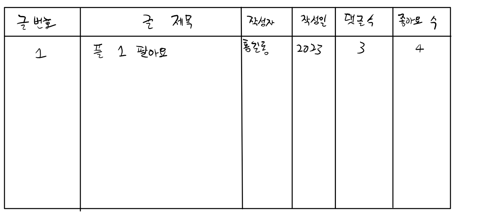
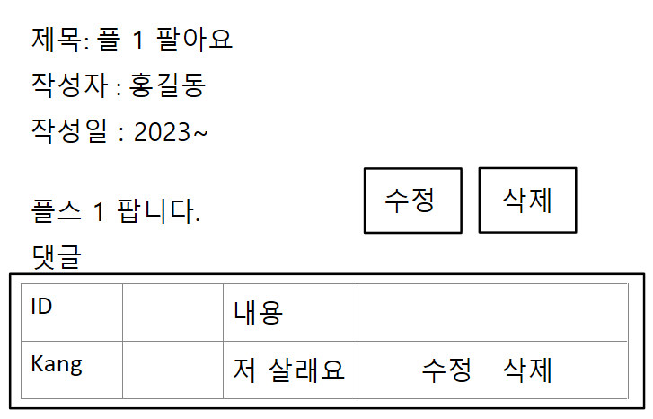

# 오늘 할 일
```
1. 게시판 구현 (이어서)
게시판 구현 (이어서)
오늘의 일정
오전: 스토리보드 완성, 게시글 리스트 화면

오후: 나머지 기능 구현 시작
글 작성
수정
삭제
댓글 등록
수정
삭제
다음주 수요일: 기능 구현 완료

목~금: Vue.js 적용

그 다음주: 스프링 시작
```
스토리보드



```
댓글 수정, 등록, 삭제는 JQuery를 이용한 AJAX 요청으로 구현
```
구현
로그인 성공 후 게시글 리스트    
loginSuccess.jsp 수정
```jsp
</head>
<body>
    <!-- JSP에서는 나에게 할당된 session객체를 그냥 사용할 수 있어요! 
         어떤 이름을 사용해야 하나요? ==> session
    -->
	<h1><%= ((Member)session.getAttribute("member")).getMemberName() %>님 환영합니다.</h1>
	
	<h3>게시글 목록</h3>
	<table border="2">
		<thead>
			<th>글번호</th>
			<th>글제목</th>
			<th>작성자</th>
			<th>작성일</th>
			<th>댓글수</th>
			<th>좋아요</th>
		</thead>
		<tbody>
		
		 <%  
		    List<Board> list = (List<Board>)request.getAttribute("boardList");
		    
		    for(Board board: list)  { 
		 %>
		
				<tr>
					<td><%= board.getBoardNum() %></td>
					<td><a href="#"><%= board.getBoardTitle() %></a></td>
					<td><%= board.getBoardAuthor() %></td>
					<td><%= board.getBoardDate() %></td>
					<td>0</td>
					<td><%= board.getBoardLike() %></td>
				</tr>
		<%
		    } 
		%>	
		</tbody>
	</table>	
</body>
</html>
```