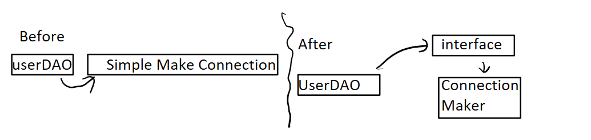
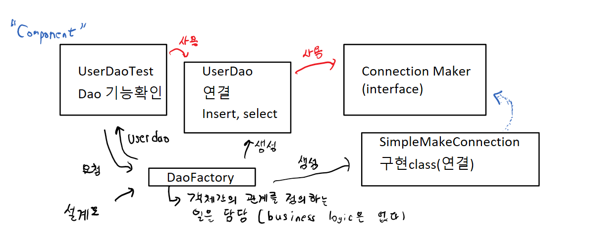

# Spring
```
개발 환경 setting 방법
1. Eclipse에 Spring plugin을 설치
사용하고 싶은 것만 설치가능
2. STS(Spring Tool Suite) 현재 사용방법
모든것이 다 들어있으나 무겁다!

1.Spring
-> 여기부터 시작해야 원리를 알고 쓸수 있다. 
혹시나 강의 들을 떄 스프링 부트 듣지 않기
2.Spring Boot

```
## 설정법
https://dist.springsource.com/release/STS/index.html   
-> Eclipse 2020-03 (4.15) windows 64bit 설치
   
->sts.exe 실행   
worspace = C:\springedu\sts-workspace

### 인코딩 설정
UTF-8


CSS, HTML, JSP

### 기본지식에 대해 코드로 알아보기
Spring Legacy project -> simple java project
project를 생성 -> 사용자 ID,이름,PW(VO)를 JDBC API를 이용(DAO)해서 Database에 저장 + 조회하는 코드를 작성한다.

```Java (VO생성)
package step1.vo;

// JavaBeans라는 규칙이 있어요
// class를 작성하는 규칙
// 3가지 정도만 기억하면 되요
// 1. 인자가 없는 기본 생성자가 존재해야 해요!
// 2. field는 private로 설정해야해요
// 3. getter와 setter를 만들어 줍니다. public으로

public class User {
	
	public User() {
		
	}
	private String id;
	private String password;
	private String name;
    // getter setter, field 설정해주기
}
```

[database table] 생성 -> Mybatis
Dao작성
```java
package step1.dao;

import step1.vo.User;

// Database처리하는 코드
// 2개의 method를 작성할거에요. (사용자 입력, 조회)

public class UserDao {

	public void insert(User user) throws Exception {

		// pure JDBC를 이용해서 Database처리를 해보아요
		// 6단계로 처리를 해요
		// 1. Driver Loading
		Class.forName("com.mysql.cj.jdbc.Driver");

		// 2. 연결해보아요!
		String jdbcUrl = "jdbc:mysql://127.0.0.1:3306/spring?characterEncoding=UTF-8&serverTimezone=UTC&useSSL=false&allowPublicKeyRetrieval=true";
		String id = "root";
		String pw = "test1234";

		Connection con = DriverManager.getConnection(jdbcUrl, id, pw);

		// 3. PreparedStatement를 만들어요!
		String sql = "INSERT INTO users VALUES (?, ?, ?)";
		PreparedStatement pstmt = con.prepareStatement(sql);
		pstmt.setString(1, user.getId());
		pstmt.setString(2, user.getPassword());
		pstmt.setString(3, user.getName());

		// 4. SQL구문을 실행
		int result = pstmt.executeUpdate();

		// 5. 결과처리
		if(result ==1) {
			System.out.println("정상적으로 입력되었어요!");
		}

		// 6. resource 해제
		pstmt.close();
		con.close();

	}

	public User select(String userId) throws Exception {

		// 1. Driver Loading
		Class.forName("com.mysql.cj.jdbc.Driver");

		// 2. 연결해보아요!
		String jdbcUrl = "jdbc:mysql://127.0.0.1:3306/spring?characterEncoding=UTF-8&serverTimezone=UTC&useSSL=false&allowPublicKeyRetrieval=true";
		String id = "root";
		String pw = "test1234";

		Connection con = DriverManager.getConnection(jdbcUrl, id, pw);

		// 3. PreparedStatement를 만들어요!
		String sql = "SELECT * FROM users WHERE id = ?";
		PreparedStatement pstmt = con.prepareStatement(sql);
		pstmt.setString(1, userId);

		// 4. SQL구문을 실행
		ResultSet result = pstmt.executeQuery();

		// 5. 결과처리
		result.next();
		User user = new User();
		user.setId(result.getString("id"));
		user.setPassword(result.getString("password"));
		user.setName(result.getString("name"));

		// 6. resource 해제
		pstmt.close();
		con.close();

		return user;
	}
}
```

Testcode.java
```java
package step1;

import step1.dao.UserDao;
import step1.vo.User;

public class UserDaoTest {
	
	public static void main(String[] args) throws Exception {
		
		// 1. 사용자를 생성(VO)해봐요
		User user = new User();
		user.setId("hong");
		user.setPassword("1234");
		user.setName("홍길동");
		
		// 2. DAO 생성
		UserDao dao = new UserDao();
		
		// 3. 사용자 입력
		dao.insert(user);
		System.out.println("사용자 등록 성공!");
		
		// 4. 사용자 조회
		User result = dao.select("hong");
		System.out.println(result.getName());
		
	}
}

```

## 우리가 code를 작성할 때 항상 염두해 두어야 하는 사항은??
```
요구사항이 변화함에 따라 우리의 코드가 이런 변화에 잘 대응할 수 있도록 작성되어야 한다.
어떻게 작성해야하는가??
1. 분리
2. 확장
을 고려한 설계를 통해 구현이 이루어져야 한다.
```
## 분리
```Java
SOC(separation of concern) 관심사의 분리
같은 concern(주제)가 한곳에 분리되어 존재해야한다.
Step2 -> 메소드를 통해 중복코드 분리
DAO ->
package step2.dao;

import step2.vo.User;

public class UserDao {

	private Connection getConnection() throws Exception {
		
		Class.forName("com.mysql.cj.jdbc.Driver");

		String jdbcUrl = "jdbc:mysql://127.0.0.1:3306/spring?characterEncoding=UTF-8&serverTimezone=UTC&useSSL=false&allowPublicKeyRetrieval=true";
		String id = "root";
		String pw = "test1234";

		Connection con = DriverManager.getConnection(jdbcUrl, id, pw);

		return con;
	}
	public void insert(User user) throws Exception {
		
		Connection con = getConnection();
		// 3. PreparedStatement를 만들어요!
		String sql = "INSERT INTO users VALUES (?, ?, ?)";
		PreparedStatement pstmt = con.prepareStatement(sql);
// ~~~~~~~~~~~~~ 중략~~~~~~~~~~~~~~~~~~

	}

	public User select(String userId) throws Exception {

		Connection con = getConnection();
		// 3. PreparedStatement를 만들어요!
		String sql = "SELECT * FROM users WHERE id = ?";
		PreparedStatement pstmt = con.prepareStatement(sql);
		pstmt.setString(1, userId);

// ~~~~~~~~~~~~~ 중략~~~~~~~~~~~~~~~~~~
	}

}
```

## 확장
```
혼자 사용하는데는 무리가 없지만 UserDAO를 판매해야할떄 ??
(.class file을 제공한다., source code는 제공하지 않는다.)

How?? -> 자바에 Class 기능의 확장 -> Inheritance
변할수 있는 여지가 있는코드(Concern) -> 추상화시켜야한다.
```
Step3
```java
User Dao
public abstract class UserDao {
	
	protected abstract Connection getConnection() throws Exception;
	
	public void insert(User user) throws Exception {
~~~~~~~~~~~~~~ 중략~~~~~~~~~~~~~~~~~~~
}

NUser Dao
package step3.dao;

import java.sql.Connection;
import java.sql.DriverManager;

public class NUserDao extends UserDao {

	@Override
	protected Connection getConnection() throws Exception {
		// UserDao를 구입한 회사에서
		// 나름대로 Database 연결 코드를 여기에 넣어서 우리 UserDao를 확장시켜 사용 할 수있다.
	
		Class.forName("com.mysql.cj.jdbc.Driver");

		String jdbcUrl = "jdbc:mysql://127.0.0.1:3306/spring?characterEncoding=UTF-8&serverTimezone=UTC&useSSL=false&allowPublicKeyRetrieval=true";
		String id = "root";
		String pw = "test1234";

		Connection con = DriverManager.getConnection(jdbcUrl, id, pw);

		return con;
	}
	
}

UserDaoTest
->
UserDao dao = new UserDao();
->> Dao 코드변경
UserDao dao = new NUserDao();
```

### Step4 (Template method pattern)
```
☆★상속관계★☆에 있어서
UserDao 로직처리흐름은 여기에 있다.
NUserDao 기능의 일부 (로직의 일부)분을 가지고 있어요

Template method pattern
상위 클래스가 가지고 있는 로직의 일부를
aa() {
    call_A();
    call_B();
    call_C();
}
```


### Step5 (Factory method pattern)
```java
상속관계에 있어서 
상위 class -> userDao getConnection() -> 객체생성
추상화시켜서 직접생성하지 않는다.
하위 class -> NUserDao
getConnection() -> 직접객체생산

구체적인 객체 생성 방법을 하위 class에서
결정하는 Design Pattern -> Factory Method Pattern
```

### Step6 (Inheritance(상속))
```java
단점 1. Java는 Single Inheritance(단일상속)만을 지원한다.
2. 상속은 class가 tightly coupled 된다.

그럼 Inheritnace를 사용하지 않고 확장성을 가지려면??
UserDao를 어떻게 만들어야 하나??
분리를 통해 확실하게 두개의 class 로 분리한다.

userDAO
public class UserDao {

	SimpleMakeConnection simpleMakeConnection;

	public UserDao() {
		simpleMakeConnection= new SimpleMakeConnection();
	}

	public void insert(User user) throws Exception {

		Connection con = simpleMakeConnection.getConnection();
	}
}

SimpleMakeConnection

package step4.dao;

import java.sql.Connection;
import java.sql.DriverManager;

public class SimpleMakeConnection {

	public Connection getConnection() throws Exception {

		// pure JDBC를 이용해서 Database처리를 해보아요
		// 6단계로 처리를 해요
		// 1. Driver Loading
		Class.forName("com.mysql.cj.jdbc.Driver");

		// 2. 연결해보아요!
		String jdbcUrl = "jdbc:mysql://127.0.0.1:3306/spring?characterEncoding=UTF-8&serverTimezone=UTC&useSSL=false&allowPublicKeyRetrieval=true";
		String id = "root";
		String pw = "test1234";

		Connection con = DriverManager.getConnection(jdbcUrl, id, pw);

		return con;
	}
}

현재 UserDao는 연결 정보를 가져오는 클래스에 대해 너무 상세하게 알고있다. (Class 이름을 Userdao안에 명시하고 있기 때문이다. ) tightly coupled가 되어있다.
해결법 -> ☆"Interface"
```
class 연결성


### Step7
```java
많이 좋아졌다. (interface를 통해 확장성을 확보했다)
하지만 class 안에서 다른 class 이름이 나오지 않도록 하고싶다.

지금까지는
1. UserDaoTest -> UserDao -> ConnectionMaker -> SimpleMakeConnection 이였지만
2. 현재는 UserDaoTest -> SimpleMakeConnection인 형태로 만드려고 한다. (UserDao, ConnectionMaker) 생략

UserDao.java

public class UserDao {

	ConnectionMaker connectionMaker;

	public UserDao(ConnectionMaker connectionMaker) {
		this.connectionMaker= connectionMaker;
	}

	public void insert(User user) throws Exception {
~~~~~~~~~~~~~~~~~~~중략~~~~~~~~~~~~~
	}
}

UserDaoTest.java

public class UserDaoTest {
	
	public static void main(String[] args) throws Exception {
~~~~~~~~~~중략~~~~~~~~~~~~~~~
		ConnectionMaker connectionMaker = new SimpleMakeConnection();
		(SimpleMakeConnection 클래스로 연결)
		
	// 2. DAO 생성
		UserDao dao = new UserDao(connectionMaker);
~~~~~~~~~~중략~~~~~~~~~~~~~~~
	}
}
```
## Step8 (Strategy pattern : 전략패턴) 
```java
자신의 기능 context의 일부분을 interface를 통해 통쨰로 외부로 분리시키는 design pattern 
같은 문제를 해결하는 여러 알고리즘이 클래스별로 캡슐화되어 있고 이들이 필요할 때 교체할 수 있도록 함으로써 동일한 문제를 다른 알고리즘으로 해결할 수 있게 하는 디자인 패턴

어떤 목적을 달성하기 위해 일을 수행하는 방식, 비즈니스 규칙, 문제를 해결하는 알고리즘 등(전략)을 쉽게 바꿀 수 있도록 해주는 디자인 패턴이다.
이 예제는 Strategy pattern을 이용하고 있고 pattern을 사용하여 외부로 분리시키는 design pattern이다. 스프링의 가장 대표적인 패턴이고 전략 pattern을 이용하는 경우는 젼략을 주입하는 또 다른 객체가 필요하다.
```
## IOC (Inversion of Control) -> 제어의 역전
```
Spring은 IOC Container

앞에서 Step 6까지 진행한 코드를 보면, UserDaoTest -> UserDao의 기능이 정상적으로 동작하는지 확인하는 기능
여기에 기능이 추가되었다. (객체간의 Runtime 연관성)
```

```
현재까지는
before -> main()시작 -> 객체를 어떤 class이용 생성할건지 결정 -> 객체생성 -> method 호출

(제어의 역전)
IOC는 제어의 흐름을 거꾸로 뒤집는 현상을 지칭한다.
객체는 자신이 사용할 객체를 직접 스스로 선택하지 않는다.
당연히 생성하지도 않는다.
```
## Annotation (@)
```
1. 정해져 있는 키워드(Java) -> 사용할 예정이다.
2. 사용자가 생성 가능
이런 annotation은 주석이라고 해석되는데 주석은 아니다.
-> 로직에는 영향을 주지 않는다. 대신에 구조에 영향을 미친다.
```

## Spring의 IOC
```
Spring은 상당히 방대한 기능을 가지고 있다.
가장 핵심적인 기능
"Bean Factory" 기능 -> 	Application Context
-> DaoFactory와 같은 IOC 기능을 일반화시킨 Container

Spring이 제어권을 가지고 직접만들고 관계를 부여하는 객체를 "Bean"이라고 한다.

(Spring -> Application Context는 설정정보를 통해서 Bean을 관리한다.)
XML, annotation 방식이 있고 둘다 써야한다.

## Bean
Application Context라고 불리는 Bean Factory에서 관리하는 객체

Bean의 구성요소
1. class -> Bean으로 등록한 Java Class(full package)
2. id -> Bean의 고유 식별자
3. scope -> singleton, prototype, request, session
4. constructor -arg : Bean 생성시 생성자에게 전달할 인자를 표현
5. property : Bean 생성시 setter에게 전달할 인자를 표현

이와 같은 내용을 기반으로 Bean을 등록하고 Bean을 Singleton (기본적으로 객체를 하나만 잡는다)으로 생성해서 관리한다.

Bean을 등록하기 위한 방법 -> 수동방법 (annotation으로 알아보아요)

public class MyResource{

} -> 이 class의 객체를 Bean으로 관리할거에요
Application Context 설정정보를 바탕으로 Bean을 관리한다
-> 설정클래스에 annotation을 다른 클래스에 등록한다.

설정 클래스가 있어야한다.
1. Bean을 수동으로 등록하는 방법
@configuration
public class MyResourceConfig {
	@Bean
	public MyResource getResource(){
		return new MyResource();
	}
}
----------> 이 클래스도 자동적으로 Bean으로 등록된다
Spring Container (Application Context)는 @configuration 이 붙은 class를 Bean으로 등록한다.
-> 해당 class를 해석해서 @Bean을 찾아 해당 method에 의해 생성되는 객체를 Bean으로 생성한다.
```