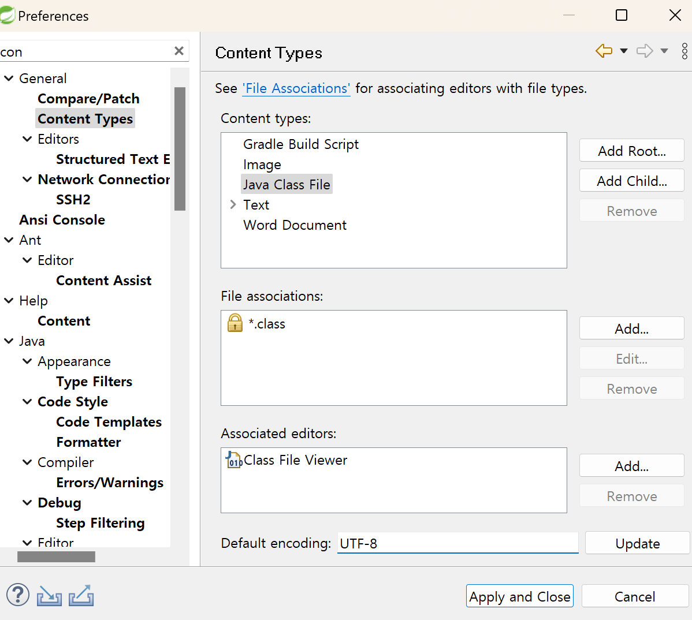
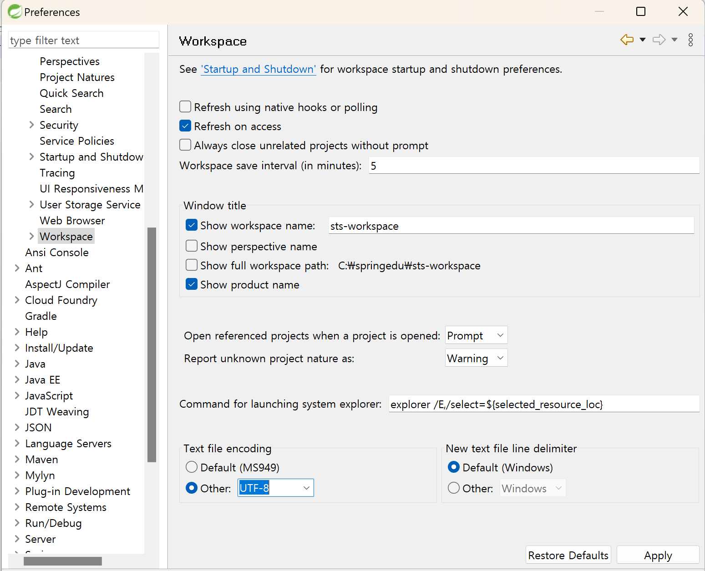
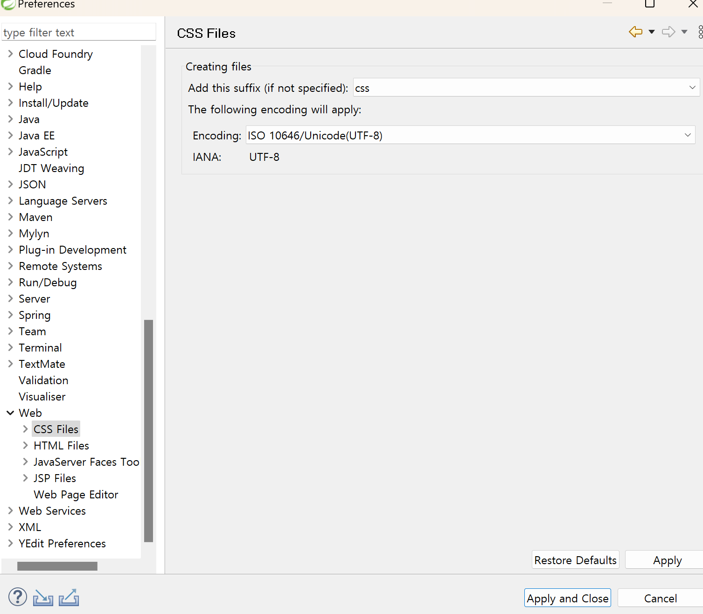

# Spring
```
개발 환경 setting
1. Eclipse에 Spring plugin을 설치
사용하고 싶은 것만 설치가능
2. STS(Spring Tool Suite)
모든것이 다 들어있으나 무겁다!

1.Spring
-> 여기부터 시작해야 원리를 알고 쓸수 있다. 혹시나 강의 들을 떄 스프링 부트 듣지 않기
2.Spring Boot

```
## 설정법
https://dist.springsource.com/release/STS/index.html   
-> Eclipse 2020-03 (4.15) windows 64bit 설치
   
->sts.exe 실행   
worspace = C:\springedu\sts-workspace

### 인코딩 설정
UTF-8




CSS, HTML, JSP

### 기본지식에 대해 코드로 알아보기
Spring Legacy project -> simple java project
project를 생성 -> 사용자 ID,이름,PW(VO)를 JDBC API를 이용(DAO)해서 Database에 저장 +조회하는 코드를 작성한다.

```Java (VO생성)
package step1.vo;

// JavaBeans라는 규칙이 있어요
// class를 작성하는 규칙
// 3가지 정도만 기억하면 되요
// 1. 인자가 없는 기본 생성자가 존재해야 해요!
// 2. field는 private로 설정해야해요
// 3. getter와 setter를 만들어 줍니다. public으로

public class User {
	
	public User() {
		
	}

	private String id;
	private String password;
	private String name;

    // getter setter, field 설정해주기
}
```

[database table] 생성 -> Mybatis
Dao작성
```java
package step1.dao;

import step1.vo.User;

// Database처리하는 코드
// 2개의 method를 작성할거에요. (사용자 입력, 조회)

public class UserDao {

	public void insert(User user) throws Exception {

		// pure JDBC를 이용해서 Database처리를 해보아요
		// 6단계로 처리를 해요
		// 1. Driver Loading
		Class.forName("com.mysql.cj.jdbc.Driver");

		// 2. 연결해보아요!
		String jdbcUrl = "jdbc:mysql://127.0.0.1:3306/spring?characterEncoding=UTF-8&serverTimezone=UTC&useSSL=false&allowPublicKeyRetrieval=true";
		String id = "root";
		String pw = "test1234";

		Connection con = DriverManager.getConnection(jdbcUrl, id, pw);

		// 3. PreparedStatement를 만들어요!
		String sql = "INSERT INTO users VALUES (?, ?, ?)";
		PreparedStatement pstmt = con.prepareStatement(sql);
		pstmt.setString(1, user.getId());
		pstmt.setString(2, user.getPassword());
		pstmt.setString(3, user.getName());

		// 4. SQL구문을 실행
		int result = pstmt.executeUpdate();

		// 5. 결과처리
		if(result ==1) {
			System.out.println("정상적으로 입력되었어요!");
		}

		// 6. resource 해제
		pstmt.close();
		con.close();

	}

	public User select(String userId) throws Exception {

		// 1. Driver Loading
		Class.forName("com.mysql.cj.jdbc.Driver");

		// 2. 연결해보아요!
		String jdbcUrl = "jdbc:mysql://127.0.0.1:3306/spring?characterEncoding=UTF-8&serverTimezone=UTC&useSSL=false&allowPublicKeyRetrieval=true";
		String id = "root";
		String pw = "test1234";

		Connection con = DriverManager.getConnection(jdbcUrl, id, pw);

		// 3. PreparedStatement를 만들어요!
		String sql = "SELECT * FROM users WHERE id = ?";
		PreparedStatement pstmt = con.prepareStatement(sql);
		pstmt.setString(1, userId);

		// 4. SQL구문을 실행
		ResultSet result = pstmt.executeQuery();

		// 5. 결과처리
		result.next();
		User user = new User();
		user.setId(result.getString("id"));
		user.setPassword(result.getString("password"));
		user.setName(result.getString("name"));

		// 6. resource 해제
		pstmt.close();
		con.close();

		return user;

	}

}
```
Testcode.java
```java
package step1;

import step1.dao.UserDao;
import step1.vo.User;

public class UserDaoTest {
	
	public static void main(String[] args) throws Exception {
		
		// 1. 사용자를 생성(VO)해봐요
		User user = new User();
		user.setId("hong");
		user.setPassword("1234");
		user.setName("홍길동");
		
		// 2. DAO 생성
		UserDao dao = new UserDao();
		
		// 3. 사용자 입력
		dao.insert(user);
		System.out.println("사용자 등록 성공!");
		
		// 4. 사용자 조회
		User result = dao.select("hong");
		System.out.println(result.getName());
		
	}
}

```


## 우리가 code를 작성할 때 항상 염두해 두어야 하는 사항은??
```
요구사항이 변화함에 따라 우리의 코드가 이런 변화에 잘 대응할 수 있도록 작성되어야 한다.
어떻게 작성해야하는가??
1. 분리
2. 확장
을 고려한 설계를 통해 구현이 이루어져야 한다.
```
## 분리
```Java
SOC(separation of concern) 관심사의 분리
같은 concern(주제)가 한곳에 분리되어 존재해야지 여기저기 나타나면 곤란해요
Step2 -> 메소드를 통해 중복코드 분리
DAO ->
package step2.dao;

import step2.vo.User;

public class UserDao {

	private Connection getConnection() throws Exception {
		
		Class.forName("com.mysql.cj.jdbc.Driver");

		String jdbcUrl = "jdbc:mysql://127.0.0.1:3306/spring?characterEncoding=UTF-8&serverTimezone=UTC&useSSL=false&allowPublicKeyRetrieval=true";
		String id = "root";
		String pw = "test1234";

		Connection con = DriverManager.getConnection(jdbcUrl, id, pw);

		return con;
	}
	public void insert(User user) throws Exception {
		
		Connection con = getConnection();
		// 3. PreparedStatement를 만들어요!
		String sql = "INSERT INTO users VALUES (?, ?, ?)";
		PreparedStatement pstmt = con.prepareStatement(sql);
// ~~~~~~~~~~~~~ 중략~~~~~~~~~~~~~~~~~~

	}

	public User select(String userId) throws Exception {

		Connection con = getConnection();
		// 3. PreparedStatement를 만들어요!
		String sql = "SELECT * FROM users WHERE id = ?";
		PreparedStatement pstmt = con.prepareStatement(sql);
		pstmt.setString(1, userId);

// ~~~~~~~~~~~~~ 중략~~~~~~~~~~~~~~~~~~
	}

}
```

## 확장
```
혼자 사용하는데는 무리가 없지만 UserDAO를 판매해야할떄 ??
(.class file을 제공한다., source code는 제공하지 않는다.)

How?? -> 자바에 Class 기능의 확장 -> Inheritance
변할수 있는 여지가 있는코드(Concern) -> 추상화시켜야한다.
```
Step3
```java
User Dao
public abstract class UserDao {
	
	protected abstract Connection getConnection() throws Exception;
	
	public void insert(User user) throws Exception {
~~~~~~~~~~~~~~ 중략~~~~~~~~~~~~~~~~~~~
}

NUser Dao
package step3.dao;

import java.sql.Connection;
import java.sql.DriverManager;

public class NUserDao extends UserDao {

	@Override
	protected Connection getConnection() throws Exception {
		// UserDao를 구입한 회사에서
		// 나름대로 Database 연결 코드를 여기에 넣어서 우리 UserDao를 확장시켜 사용 할 수있다.
	
		Class.forName("com.mysql.cj.jdbc.Driver");

		String jdbcUrl = "jdbc:mysql://127.0.0.1:3306/spring?characterEncoding=UTF-8&serverTimezone=UTC&useSSL=false&allowPublicKeyRetrieval=true";
		String id = "root";
		String pw = "test1234";

		Connection con = DriverManager.getConnection(jdbcUrl, id, pw);

		return con;
	}
	
}


UserDaoTest
->
UserDao dao = new UserDao();
->> Dao 코드변경
UserDao dao = new NUserDao();
```

### Step4 (Template method pattern)
```
☆★상속관계★☆에 있어서
UserDao 로직처리흐름은 여기에 있다.
NUserDao 기능의 일부 (로직의 일부)분을 가지고 있어요

Template method pattern
상위 클래스가 가지고 있는 로직의 일부를
aa() {
    call_A();
    call_B();
    call_C();
}
```


### Step5 (Factory method pattern)
```java
상속관계에 있어서 
상위 class -> userDao getConnection() -> 객체생성
추상화시켜서 직접생성하지 않는다.

하위 class -> NUserDao
getConnection() -> 직접객체생산

구체적인 객체 생성 방법을 하위 class에서
결정하는 Design Pattern -> Factory Method Pattern
```

