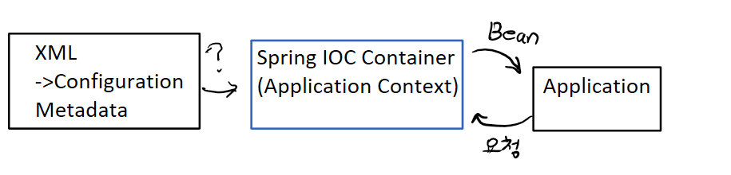

# Spring container
```Java
객체를 생성
-> Application Context (Spring Container (Spring IOC container)) -> 가장 주요한 작업 "Bean"을 생성하고 Bean간의 관계설정 -> Bean Factory

Application Context가 제어권(IOC)를 가지고 직접 만들고 관계(Dependency)를 부여하는 객체 -> Bean

Bean
-> POJO(Plain Old Java Object)
-> Spring IOC/DI contatiner에 의해서 관리한다.

1. class -> Bean으로 등록한 Java Class(full package)
2. id -> Bean의 고유 식별자
3. scope -> singleton, prototype, request, session
4. constructor -arg : Bean 생성시 생성자에게 전달할 인자를 표현
5. property : Bean 객체 생성시 setter에게 전달할 인자를 표현
```
### Application Context을 Bean을 사용하기 위한 설정정보필요
```
설정정보 -> Configuration MeataData -> 기본은 XML 너무 복잡하고 어려워지기 때문에 Annotation을 사용한다.
```


## Bean 등록방법
```java
1. 수동방법
외부 library를 Bean으로 등록해야하는 경우

Class Myresource{

}
등록하기 위한 설정 정보가 있어야 한다. (annotation을 이용해서 처리한다.)

@Configruation
Class MyResourceconfig {
    @Bean
    public MyResource getResource(){
        return new MyResource();
    }
   
}
/* @Configuration -> 있어야지 Bean 객체를 찾는다.
@Component 의 하위 annotation 은 @controller, @Service, @Repositry, @Configuration
자동으로 등록되는 Bean의 ID(소문자로 자동으로 등록)
와 수동(본인입력)으로 등록되는 Bean의 ID가 다르다.
getResource -> Bean ID
*/ 

2. 자동방법
(편하고 좋아요 -> 이 방식을 이용한다.)
// @ComponentScan, @Component 을 통해서 자동으로 설정한다.
```

## Maven 프로젝트로 바꾸기
```
Maven 프로젝트로 바꾸고
maven repostiroy 사이트에서 -> spring context 5.3.20, MySQL Connector Java 8.0.28  repository 등록
```

## Singleton Registry
```
Application Context의 기능 중 하나는 -> Singleton Registry!

Singleton으로 Bean을 관리하는 이유는?
Spring은 Server쪽 application을 구현하기 위해서 사용 -> 여러 client에 의해서 공유되는 객체가 필요하다 -> singleton으로 처리해야 효율이 좋다.
```

## 의존관계 (dependency)
```
두개의 class를 대상으로 해요. 방향성을 명시해야한다.
A ------> B
A가 B에 의존한다
A의 입장에서는 의존 대상인 B가 변하면 그 영향이 A에 미친다는 의미이다.

Application Context, Bean, Configuration MetaData (annotation)
```

## XML을 이용한 설정
```
xml file이 있어야 해요
-> xml은 문서의 구조가 미리 정해진 형태로 만들어 졌는지 검증하는 기능이 있다.
즉, 어떤 XML이냐에 따라 사용가능한 Tag의 구조가 이미 결정되어있다.

2가지로 작업을 수행한다
1. DTD 
2. Schema -> Namespace를 이용해서 추가적인 기능을 포함할 수 있어요
```


### 다양한 XML 설정
```
Spring legacy
Spring Boot 
Boot 를 하면 좋으나 legacy 부터 차근차근 해보는게 낫다.
maven repostiroy 사이트 -> Spring Context » 5.3.20
```


## test code
```Java
MessageBean.java
package springioc.sample1;

public interface MessageBean {
	
//	public abstract void sayHello();
	void sayHello();
	
}

MessageBeanImpl.java
package springioc.sample1;

public class MessageBeanImpl implements MessageBean {

	private String fruit;
	private int cost;
	
	public MessageBeanImpl() {
		System.out.println("MessageBeanImpl 기본 생성자 호출");
	}
	
	public MessageBeanImpl(String fruit) {
		this.fruit = fruit;
		System.out.println("MessageBeanImpl 기본 생성자 호출 - " + fruit);
	}
	
	public MessageBeanImpl(String fruit, int cost) {
		this.fruit = fruit;
		this.cost = cost;
		System.out.println("MessageBeanImpl 기본 생성자 호출 - " + fruit + "," + cost);
	}
	
	public void setCost(int cost) {
		this.cost = cost;
	}
	

	@Override
	public void sayHello() {
		System.out.println(fruit + "," + cost);
	}
	
}


Test.java
package springioc.sample1;

import org.springframework.context.ApplicationContext;
import org.springframework.context.support.ClassPathXmlApplicationContext;

public class Test {
	public static void main(String[] args) {

		// ApplicationContext부터 생성해 보아요
		ApplicationContext context = new ClassPathXmlApplicationContext("applicationContext.xml", MessageBean.class);

		System.out.println("===== IOC/DI 컨테이너 생성 ====");

		MessageBean myBean = context.getBean("messageBean", MessageBean.class);

		// scope가 Singleton 인 경우 이미 context안에 존재하는 Bean을 찾아서 return하고
		// scope가 prototype 인 경우 이 시점에  bean 객체를 생성해서 리턴해요!

		myBean.sayHello(); 

		System.out.println(myBean);
		System.out.println(context.getBean("messageBean", MessageBean.class));

		((ClassPathXmlApplicationContext)context).close();
	}
}

applicationContext.xml
<?xml version="1.0" encoding="UTF-8"?>
<beans xmlns="http://www.springframework.org/schema/beans"
	xmlns:xsi="http://www.w3.org/2001/XMLSchema-instance"
	xsi:schemaLocation="http://www.springframework.org/schema/beans http://www.springframework.org/schema/beans/spring-beans.xsd">

	<bean id="messageBean" class="springioc.sample1.MessageBeanImpl"
		scope="singleton">
		<constructor-arg>
			<value>딸기</value>
		</constructor-arg>
		<property name="cost">
			<value>3000</value>
		</property>
	</bean>

	<bean id="messageBean_1" class="springioc.sample1.MessageBeanImpl">
	</bean>

	<bean id="messageBean_2" class="springioc.sample1.MessageBeanImpl">
		<property name="cost">
			<value>4000</value>
		</property>
	</bean>

	<bean id="messageBean_3" class="springioc.sample1.MessageBeanImpl">
		<constructor-arg index="0" type="java.lang.String" value="바나나 " />
		<constructor-arg index="1" type="int" value="7000" />
	</bean>

</beans>
```

```Java
sample2

Bar.java
package springioc.sample2;

public class Bar {

	public Bar() {
		System.out.println("Bar의 기본 생성자 호출");
	}
}

Foo.java
package springioc.sample2;

public class Foo {

	public Foo() {
		System.out.println("Foo의 기본 생성자 호출");
	}
	
	public Foo(String str) {
		System.out.println("Foo의 생성자 호출 - Str" + str);
	}
	
	public Foo(String str, int num) {
		System.out.println("Foo의 생성자 호출 - Str,Int" + str + "," + num);
	}
	
	public Foo(Bar bar) {
		System.out.println("Foo의 생성자 호출 - + bar" + bar);
	}
}

Test.java
package springioc.sample2;

import org.springframework.context.ApplicationContext;
import org.springframework.context.support.ClassPathXmlApplicationContext;

public class Test {
	
	public static void main(String[] args) {
		
		ApplicationContext context = new ClassPathXmlApplicationContext("applicationContext.xml", Bar.class);
		
		((ClassPathXmlApplicationContext)context).close();
	}
}

applicationContext.xml
<?xml version="1.0" encoding="UTF-8"?>
<beans xmlns="http://www.springframework.org/schema/beans"
	xmlns:xsi="http://www.w3.org/2001/XMLSchema-instance"
	xsi:schemaLocation="http://www.springframework.org/schema/beans http://www.springframework.org/schema/beans/spring-beans.xsd">

	<bean id="foo0" class="springioc.sample2.Foo">
	</bean>

	<bean id="foo1" class="springioc.sample2.Foo">
		<constructor-arg value="abc" />
	</bean>
	
	<bean id="foo2" class="springioc.sample2.Foo">
		<constructor-arg index="0" type="java.lang.String" value="abc" />
		<constructor-arg index="1" type="int" value="1000" />
	</bean>
	
	<bean id="myBar" class="springioc.sample2.Bar"></bean>
	
	<bean id="foo3" class="springioc.sample2.Foo">
		<constructor-arg ref="myBar"></constructor-arg>
	</bean>
	
</beans>

sample3

Test.java

package springioc.sample3;

import org.springframework.context.ApplicationContext;
import org.springframework.context.support.ClassPathXmlApplicationContext;

public class Test {

	public static void main(String[] args) {
		
		// Application Context객체를 생성 => Spring IoC Container 생성!!
		ApplicationContext context = new ClassPathXmlApplicationContext("applicationContext.xml", User.class);
		
		UserService service = context.getBean("userService", UserService.class);
		
		User user = context.getBean("obj1", User.class);
		
		service.addUser(user);
		
		((ClassPathXmlApplicationContext)context).close();
	}
}

User.java

package springioc.sample3;

public class User {
	
	private String userName;
	
	public User() {
		System.out.println("유저의 기본생성자 호출");
	}
	
	public User(String userName) {
		super();
		this.userName = userName;
		System.out.println("유저의 생성자 호출 - " + userName);
	}

	public String getUserName() {
		return userName;
	}

	public void setUserName(String userName) {
		this.userName = userName;
	}

	
}

UserService.java

package springioc.sample3;

public interface UserService {
	
	void addUser(User user);
	
}

UserServiceImpl.java

package springioc.sample3;

public class UserServiceImpl implements UserService {
	
	
	private User user;
	// 예제라서 여기있다 금지!!
	
	public UserServiceImpl() {
		System.out.println("UserserviceImpl 기본생성자");
	}
	
	public UserServiceImpl(User user) {
		this.user = user;
		System.out.println("UserserviceImpl 기본생성자" + user);
	}
	
	public User getUser() {
		return user;
	}

	public void setUser(User user) {
		this.user = user;
	}

	@Override
	public void addUser(User user) {
		// 일반적인 Business Logic처리가 나오면 됩니다.
		System.out.println("UserServiceImpl - addUser() 메소드 호출!");
		
	}
}

applicationContext.xml
<?xml version="1.0" encoding="UTF-8"?>
<beans xmlns="http://www.springframework.org/schema/beans"
	xmlns:xsi="http://www.w3.org/2001/XMLSchema-instance"
	xsi:schemaLocation="http://www.springframework.org/schema/beans http://www.springframework.org/schema/beans/spring-beans.xsd">
	
	<bean id="userService" class="springioc.sample3.UserServiceImpl">
	</bean>
	
	<bean id="obj1" class="springioc.sample3.User">
		<constructor-arg type="java.lang.String" value="홍길동"/>
	</bean>
	
	<bean id="myService" class="springioc.sample3.UserServiceImpl">
		<constructor-arg ref="obj1"></constructor-arg>
	</bean>
	
</beans>


Step4

AbstractDay.java
package springioc.sample4;

import java.util.Calendar;
import java.util.GregorianCalendar;

public abstract class AbstractDay {

	public abstract String dayInfo();

	public static AbstractDay getInstance() {
		// 오늘 날짜의 요일을 알아보아요!
		GregorianCalendar cal = new GregorianCalendar();

		int day = cal.get(Calendar.DAY_OF_WEEK);
		// 해당 날짜에 대한 요일을 숫자로 알려준다. 1 -> 일요일, 2 -> 월요일, 3 -> 화요일

		AbstractDay my_day = null;
		
		switch(day) {
		case 1:
			my_day = new Sunday();
			break;
		case 2:
			my_day = new Monday();
			break;	
		case 3:
			my_day = new Tuesday();
			break;
		}

		return my_day;
	}
}

// 추상클래스로부터 인스턴스를 만드는 방법!

Monday.java

package springioc.sample4;

public class Monday extends AbstractDay {

	@Override
	public String dayInfo() {
		return "월요일";
	}
}

Sunday.java

package springioc.sample4;

public class Sunday extends AbstractDay {

	@Override
	public String dayInfo() {
		return "일요일";
	}
}


Test.java

package springioc.sample4;

import org.springframework.context.ApplicationContext;
import org.springframework.context.support.ClassPathXmlApplicationContext;

public class Test {

	public static void main(String[] args) {
		
	ApplicationContext context = new ClassPathXmlApplicationContext("applicationContext.xml", Monday.class);	
	}
}


applicationContext.xml

<?xml version="1.0" encoding="UTF-8"?>
<beans xmlns="http://www.springframework.org/schema/beans"
	xmlns:xsi="http://www.w3.org/2001/XMLSchema-instance"
	xsi:schemaLocation="http://www.springframework.org/schema/beans http://www.springframework.org/schema/beans/spring-beans.xsd">

	<bean id="day" class="springioc.sample4.AbstractDay" factory-method="getInstance" />

</beans>


Step5

Test.java
package springioc.sample5;

import org.springframework.context.ApplicationContext;
import org.springframework.context.support.ClassPathXmlApplicationContext;

public class Test {

	public static void main(String[] args) {

		ApplicationContext context = new ClassPathXmlApplicationContext("applicationContext.xml", User.class);	
	}
}

User.java

package springioc.sample5;

public class User {

	private String name;
	private String birth;

	public User() {
		// TODO Auto-generated constructor stub
	}

	public User(String name, String birth) {
		super();
		this.name = name;
		this.birth = birth;
	}

	public String getName() {
		return name;
	}

	public void setName(String name) {
		this.name = name;
	}

	public String getBirth() {
		return birth;
	}

	public void setBirth(String birth) {
		this.birth = birth;
	}

	@Override
	public String toString() {
		// TODO Auto-generated method stub
		return super.toString();
	}
}

applicationContext.xml

<?xml version="1.0" encoding="UTF-8"?>
<beans xmlns="http://www.springframework.org/schema/beans"
	xmlns:xsi="http://www.w3.org/2001/XMLSchema-instance"
	xmlns:c="http://www.springframework.org/schema/c"
	xmlns:p="http://www.springframework.org/schema/p"
	xsi:schemaLocation="http://www.springframework.org/schema/beans http://www.springframework.org/schema/beans/spring-beans.xsd">

	<bean id="f1" class="springioc.sample5.User" />

	<bean id="f2" class="springioc.sample5.User">
		<constructor-arg index="0" value="홍길동" />
		<constructor-arg index="1" value="2000-01-01" />
	</bean>

	<!-- f2와 f4를 똑같이 쓰려고 한다. c:birth = c:_1 -->
	<bean id="f4" class="springioc.sample5.User" c:name="홍길동"
		c:_1="2000-01-01" />

	<bean id="f3" class="springioc.sample5.User">
		<property name="name" value="신사임당" />
		<property name="birth" value="2001-12-01" />
	</bean>

	<!-- f3과 f5를 똑같이 쓰려고 한다. c:birth = c:_1 -->
	<bean id="f5" class="springioc.sample5.User" p:name="신사임당"
		p:birth="2001-12-01" />

</beans>

beans.


