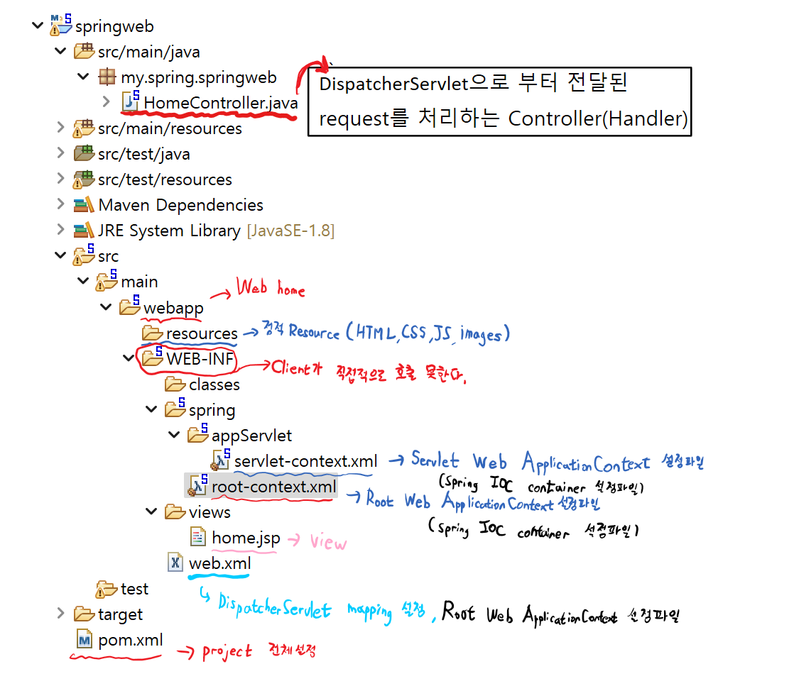
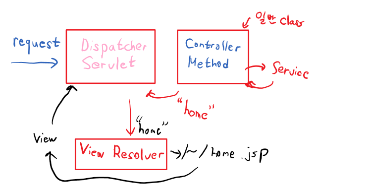
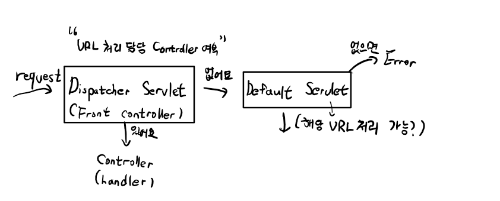
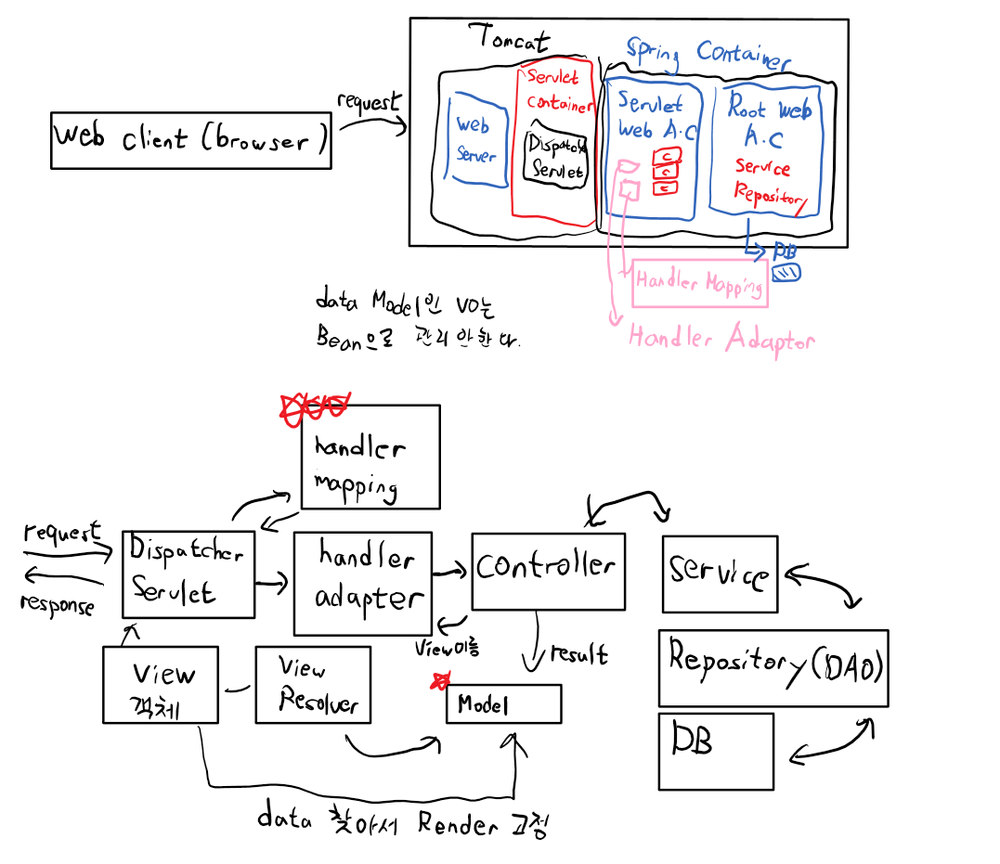

# Spring Web MVC
```java
1. Application Context
2. XML Annotation
3. Bean
을 활용 해보았다.

Spring Legacy Project -> Spring MVC Project 만들기
springweb
my.spring.springweb
왼쪽 아래 New server -> Apache Tomcat v9.0 server -> 
c:\tools 밑 폴더 선택

project 내 src -> webapp -> WEB-INF -> web.xml
설정법 파악하기
WEB-INF -> vies -> home.jsp 파일에
<%@ page contentType="text/html; charset=UTF-8" pageEncoding="UTF-8" language="java" %> 추가하기

src/main/java
my.spring.springweb -> HomeController.java
@Controller

Value
-> requestMethod.GET -> get방식이다.

package my.spring.springweb;

@Controller
public class HomeController {
	
	private static final Logger logger = LoggerFactory.getLogger(HomeController.class);
	
	@RequestMapping(value = "/", method = RequestMethod.GET)
	public String home(Locale locale, Model model) {
		logger.info("Welcome home! The client locale is {}.", locale);
		
		Date date = new Date();
		DateFormat dateFormat = DateFormat.getDateTimeInstance(DateFormat.LONG, DateFormat.LONG, locale);
		
		String formattedDate = dateFormat.format(date);
		
		model.addAttribute("serverTime", formattedDate );
		
		return "home";
	}
	
}

@Controller 어노테이션은 이 클래스가 컨트롤러임을 나타내며, @RequestMapping 어노테이션은 이 클래스가 처리하는 HTTP 요청의 URL 패턴을 지정합니다. 이 경우에는 "/" 요청에 대해 처리합니다.
home 메소드는 이 클래스에서 처리하는 HTTP GET 요청에 대한 메소드입니다. 이 메소드는 브라우저에서 전송된 HTTP 요청의 Locale 정보와 Model 객체를 인자로 받습니다.
이 메소드는 먼저 SLF4J(Logger)를 사용하여 로그를 출력합니다. 이후, 현재 시간을 나타내는 Date 객체를 생성하고, 지역에 맞는 형식의 날짜와 시간 문자열을 만드는 DateFormat 객체를 생성합니다. 그리고 이를 이용하여 날짜와 시간 문자열을 만들고, Model 객체에 "serverTime"이라는 이름으로 추가합니다.
마지막으로, home 메소드는 뷰 이름 "home"을 반환합니다. 이 뷰 이름은 컨트롤러가 처리하는 요청에 대해 렌더링할 JSP 페이지를 나타냅니다. 이 경우 "home"은 home.jsp라는 이름의 뷰 페이지를 의미합니다.
```

## Project 설정
```
1. Servlet-context.xml 
-> 설정파일
Application Context
Bean Factory
IOC container
Spring Container
Servlet Web Application Context
이름만 다르지 다 똑같다.

<context: component - scan ... />
-> Annotation 설정이 가능하도록 만든다.
class에 @Componenet를 찾아서 Bean으로 등록한다. -> 포괄적인 선언
@Controller
@Service
@Repository
@Configuration
역할에 집중된 선언
식별하기 쉽게 하기 위해 component의 하위를 나눠놓았다.

Servlet-context.xml 파일은
Servlet Web ApplicationContext
 -> Controller 

Root Web ApplicationContext
-> Service, Repository
로 나뉘어져있다.

<context:component-scan base-package="my.spring.springweb" />
로 파일 설정이 잡혀있지만 따로 설정하는게 맞다.
Servlet 은 Controller만 잡고 설정하도록 하고 Root는 Service, Repository를 잡고 설정하게 하여야한다.

server-context.xml
<context:component-scan base-package="my.spring.springweb" use-default-filters="false" >
		<context:include-filter type="annotation" expression="org.springframework.stereotype.Controller"/>
</context:component-scan>

root-context.xml
<context:component-scan base-package="my.spring.springweb" use-default-filters="true" >
<context:exclude-filter type="annotation" expression="org.springframework.stereotype.Controller"/>
</context:component-scan>

Spring의 Web project 형태
1. 계층형
src/main/Java
-> my -> spring -> springweb
member, board
controller
service
vo
dao
구조는 단순하나 관리가 힘들다.

2. Domain 타입 (사용예정)
member
controller, service, vo, dao
board
controller, service, vo, dao

pom.xml -> 설정변경하기
java-version -> 1.8로 바꾸기
plugin에서 org.apache.maven.plugins -> source, target 1.8로 바꾸기

org.springframework-version -> 5.3.23
org.aspectj-version -> 1.9.9.1
org.slf4j-version -> 1.7.36
log4j2.version -> 2.17.1

dependency -> groupId log4j (version 1.2.15) 부분 삭제

<!-- servlet --> 전부날리고 붙여넣자
<!-- https://mvnrepository.com/artifact/javax.servlet/javax.servlet-api -->
<dependency>
   <groupId>javax.servlet</groupId>
   <artifactId>javax.servlet-api</artifactId>
   <version>4.0.1</version>
   <scope>provided</scope>
</dependency>
<!-- https://mvnrepository.com/artifact/javax.servlet.jsp/javaxservlet.jsp-api -->
<dependency>
   <groupId>javax.servlet.jsp</groupId>
   <artifactId>javax.servlet.jsp-api</artifactId>
   <version>2.3.3</version>
   <scope>provided</scope>
</dependency>
<dependency>
   <groupId>javax.servlet</groupId>
   <artifactId>jstl</artifactId>
   <version>1.2</version>
</dependency>

   <!-- Test -->
<dependency>
   <groupId>com.jslsolucoes</groupId>
   <artifactId>ojdbc6</artifactId>
   <version>11.2.0.1.0</version>
</dependency>
<dependency>
   <groupId>org.springframework</groupId>
   <artifactId>spring-jdbc</artifactId>
   <version>${org.springframework-version}</version>
</dependency>
<dependency>
   <groupId>org.springframework</groupId>
   <artifactId>spring-tx</artifactId>
   <version>${org.springframework-version}</version>
</dependency>
<dependency>
   <groupId>org.mybatis</groupId>
   <artifactId>mybatis</artifactId>
   <version>3.5.9</version>
</dependency>
<dependency>
   <groupId>org.mybatis</groupId>
   <artifactId>mybatis-spring</artifactId>
   <version>2.0.7</version>
</dependency>
<dependency>
   <groupId>org.apache.logging.log4j</groupId>
   <artifactId>log4j-api</artifactId>
   <version>${log4j2.version}</version>
</dependency>
<dependency>
   <groupId>org.apache.logging.log4j</groupId>
   <artifactId>log4j-core</artifactId>
   <version>${log4j2.version}</version>
</dependency>
<dependency>
   <groupId>org.apache.logging.log4j</groupId>
   <artifactId>log4j-web</artifactId>
   <version>${log4j2.version}</version>
</dependency>
<!-- https://mvnrepository.com/artifact/commons-fileuploadcommons-fileupload -->
<dependency>
   <groupId>commons-fileupload</groupId>
   <artifactId>commons-fileupload</artifactId>
   <version>1.4</version>
</dependency>
<!-- https://mvnrepository.com/artifact/com.fasterxml.jacksoncore/jackson-databind -->
<dependency>
   <groupId>com.fasterxml.jackson.core</groupId>
   <artifactId>jackson-databind</artifactId>
   <version>2.14.1</version>
</dependency>

root-context.xml
<?xml version="1.0" encoding="UTF-8"?>
<beans:beans
	xmlns="http://www.springframework.org/schema/mvc"
	xmlns:xsi="http://www.w3.org/2001/XMLSchema-instance"
	xmlns:beans="http://www.springframework.org/schema/beans"
	xmlns:context="http://www.springframework.org/schema/context"
	xsi:schemaLocation="http://www.springframework.org/schema/mvc https://www.springframework.org/schema/mvc/spring-mvc.xsd
        http://www.springframework.org/schema/beans https://www.springframework.org/schema/beans/spring-beans.xsd
        http://www.springframework.org/schema/context https://www.springframework.org/schema/context/spring-context.xsd">

	<!-- Root Context: defines shared resources visible to all other web components -->

	<context:component-scan
		base-package="my.spring.springweb">
		<context:exclude-filter type="annotation"
			expression="org.springframework.stereotype.Controller" />
	</context:component-scan>

</beans:beans>
바꾸기
```

```
web.xml
<servlet-mapping>
	<servlet-name>appServlet</servlet-name>
	<url-pattern>/</url-pattern>
</servlet-mapping>

-> url-pattern "/" 는 모든 클라이언트의 요청을 다받는다. 필터 설정도 비슷하다 /를 거치기 떄문에 필터를 무조건 거치게 설정되어 있다. -> DispatcherServlet

Servlet-context.xml
ViewResolver 설정 -> Handler로부터 만약 String이 리턴되면
ViewResolver 가 prefix + suffix 를 통해 경로를 찾는다.
```


```
<resources mapping="/resources/**" location="/resources/" />
-> resources에 있는 정적 resource를 사용하려면 이 장소에서 하라는 표시

<default-servlet-handler />
```

```
HomeController.java

	@RequestMapping(value = "/", method = RequestMethod.GET)
	public String home(Locale locale, Model model) {
		logger.info("Welcome home! The client locale is {}.", locale);
		
		Date date = new Date();
		DateFormat dateFormat = DateFormat.getDateTimeInstance(DateFormat.LONG, DateFormat.LONG, locale);
		
		String formattedDate = dateFormat.format(date);
		
		model.addAttribute("serverTime", formattedDate );
		
		return "home";
	}
```
### Model
```
Model -> 이 class type의 객체가 handler의 parameter로 주입
데이터를 저장하려는 목적이다. parameter가 Model 안에 저장된다.
scope는 request scope이다.
Model에 대한 자세한 설명
Spring에서 Model은 데이터를 뷰로 전달하는데 사용되는 객체입니다. Controller의 메소드에서 Model 객체를 파라미터로 받아들이면, 메소드 내부에서 이를 이용하여 데이터를 추가할 수 있습니다.
예를 들어, HomeController 클래스의 home 메소드에서 Model 객체를 파라미터로 받아들인 후, model.addAttribute("message", "Hello, World!") 코드를 실행하면, "message" 라는 이름으로 "Hello, World!" 라는 문자열 데이터를 Model 객체에 추가할 수 있습니다.
이후 뷰에서는 이러한 데이터를 Model 객체를 통해 가져와서 사용할 수 있습니다. 예를 들어, JSP 파일에서는 ${message} 라는 표현식을 사용하여 Model에 추가된 "Hello, World!" 문자열 데이터를 가져올 수 있습니다.

그러면 model의 scope는 어떻게 될까?
Model 객체는 각각의 HTTP 요청에 대해 새로 생성됩니다. 따라서 각각의 요청에서 사용할 수 있는 범위(scope)는 해당 요청 범위(request scope)로 제한됩니다.
즉, Controller 메소드에서 Model 객체에 데이터를 추가하면 해당 데이터는 요청 처리가 완료되고 응답이 반환될 때까지 유지되며, 응답이 반환되면 Model 객체는 소멸됩니다. 다른 HTTP 요청에서는 이전 요청에서 추가된 Model 데이터를 사용할 수 없습니다.
만약 데이터를 세션(Session)에 저장하고 싶다면, Spring에서는 HttpSession을 사용하여 데이터를 저장하고, 가져올 수 있습니다. HttpSession은 세션 범위(session scope)로 데이터를 저장하며, 여러 요청 간에 데이터를 공유할 수 있습니다.
Spring container, DI Container 이라고 불리는 이유이다.
```
## Front controller pattern
```
Servlet을 동작시킬때

/hello   -> ㅁ + Servlet logic처리
/hi      -> ㅁ + Servlet logic처리
/haha    -> ㅁ + Servlet logic처리

ㅁ -> Front controller pattern
   -> Dispatcher Servlet(공통처리)
가장 큰 장점 -> controller를 만들 때 servlet을 만들 필요가 없다.

웹 어플리케이션(Web application)과 관련된 패턴(Pattern)이다.
모든 리소스(Resource) 요청을 처리해주는 하나의 컨트롤러(Controller)를 두는 패턴이다.
MVC(Model-View-Controller) Pattern과 함께 사용하는 패턴이다.
장점은?
모든 요청(Request)를 하나의 컨트롤러(Controller)를 통해 작업을 한 곳에서 수행할 수 있다.
추적(Tracking)이나 보안(Security)를 적용할 때 하나의 컨트롤러(Controller)에 하기 때문에 편하다.
파일 구조가 바뀌어도 URL을 유지할 수 있다.
```
## handler Mapping
```
-> HandlerMapping interface
인터페이스를 구현한 구현체가 4개정도 제공된다.
1개만 기억하면 된다.
RequestMappingHandlerMapping
class가 아닌 method를 handler로 지정할 수 있다.
```


```
클라이언트가 Spring MVC 웹 애플리케이션에 요청을 보내면 DispatcherServlet은 요청을 수신하고 일련의 단계에 따라 처리합니다.

스프링 MVC에서 요청을 처리하는 단계는 다음과 같습니다.
1. DispatcherServlet : DispatcherServlet은 Spring MVC 웹 응용 프로그램의 전면 컨트롤러입니다. 들어오는 모든 요청을 수신하여 적절한 handler에 위임합니다.
2. handler mapping : 요청이 수신되면 DispatcherServlet은 handler mapping을 참조하여 요청을 처리해야 하는 컨트롤러를 결정합니다. HandlerMapping은 요청을 특정 처리기 또는 컨트롤러에 매핑하는 작업을 담당합니다.
3. handler Adapter: handlermapping이 요청을 처리해야 하는 컨트롤러를 결정하면 DispatcherServlet은 적절한 controller를 호출합니다. HandlerAdapter는 DispatcherServlet의 실행 모델에 컨트롤러를 적용하는 작업을 담당합니다.
4. controller: 컨트롤러는 요청을 처리하고 모델 데이터 및 뷰 이름이 포함된 ModelAndView 개체를 반환합니다.
5. model: 모델은 뷰에서 응답을 렌더링하는 데 사용할 데이터를 보유하는 데이터 구조입니다. 컨트롤러는 요청과 관련된 데이터로 모델을 채웁니다.
6. viewResolver: ViewResolver는 컨트롤러가 반환한 뷰 이름을 실제 View 개체로 확인하는 역할을 합니다. View 개체는 응답 렌더링을 담당합니다.
7. model: model은 응답 렌더링을 담당합니다. 컨트롤러에서 모델 데이터를 수신하고 이를 사용하여 응답을 생성합니다.
요약하면, Spring MVC 웹 애플리케이션에서 요청을 받으면 DispatcherServlet은 요청을 처리하고 모델을 데이터로 채우고 ModelAndView 객체를 반환하는 적절한 컨트롤러에 요청을 위임해야합니다. ViewResolver는 뷰 이름을 View 객체로 확인하고, View 객체는 모델 데이터를 사용하여 응답을 렌더링합니다.
```
### HandlerAdaptor Interface
```
handler Adapter -> HandlerAdapter interface
                  RequestMappingHandlerAdapter
위 과정의 handler adaptor 역시 인터페이스로 되어 있으며, 구현체로 RequestMappingHandlerAdapter를 많이 사용한다.
```
## View 객체(Object)
```
View interface를 구현한 객체를 지칭
-> Model이 가진 정보를 어떻게 표현해야 하는지에 대한 로직을 가지고 있는 Component이다.
구현한 구현 Class가 여러개 있다
1. InternalResourceView
-> JSP 이용시 
Controller 
View view = new InternalResource View("hello.jsp");

return new ModelAndView(view, model);
* Servlet -> response.sendRedirect()
* controller -> new ModelAndView(O,O) -> new RedirectView();
* MarshallingView->XML
* MappingJacksonJsonViewClass -> JSON

```

### log4j
```
console에 System.out.println()을 이용해 출력하는건 여러가지 측면에서 안좋다.
성능X, 관리적측면X, 운영시에 log생성은 필수이다.
spring에서는 log4j를 쉽게 이용할 수 있다. - 확장버전 log4j2 : 2.x.x버전 / logback(spring boot)
먼저 log4j 설명파일부터 (log4.xml) -> log4j2로 변경

log4j에 xml tag들
1. log 출력위치
<appender>
2. 출력 형태
<layout>
3. logger : 메시지를 appender에 전달하는 역할

log4j의 xml tag들
①. log의 출력위치를 지정
-><appender></appender>
(console출력, File출력, DB출력)

<appender name="console" class="org.apache.log4j.ConsoleAppender">
		<param name="Target" value="System.out" />

②. log의 출력형태를 지정
		<layout class="org.apache.log4j.PatternLayout">
			<param name="ConversionPattern" value="%-5p: %c - %m%n" />
		</layout>
	</appender>

③. logger 
메세지를 appender에 전달하는 역할
log의 출력 level에 따라서 출력여부를 결정한다.

게시 한 코드는 Log4j에 대한 구성입니다. A는 콘솔(즉, 표준 출력)에 로그 메시지를 쓰는 log4j 구성 요소입니다.ConsoleAppenderConsoleAppender

<appender name="console" class="org.apache.log4j.ConsoleAppender">
이 줄은 유형의 "console"이라는 새 어펜더를 정의합니다.

<param name="Target" value="System.out" />
이 줄은 어펜더가 표준 출력 스트림인 에 출력을 쓰도록 지정합니다. 즉, 로그 메시지가 콘솔에 인쇄됩니다.System.out

INFO : com.example.MyClass - This is a log message
정확한 출력은 형식 문자열의 자리 표시자 값과 로그 메시지의 내용에 따라 달라집니다.

appender -> 종류가 여러개 있다.
1. ★ Console Appender(console)
2. File Appender(File)
3. RollingFileAppender(용량제한파일)
4. ★ DailyRollingAppender

<layout class="org.apache.log4j.PatternLayout">
이 줄은 appender가 a를 사용하여 출력 형식을 지정해야 함을 지정합니다.PatternLayout

<param name="ConversionPattern" value="%-5p: %c - %m%n" />
이 줄은 . 이 경우 형식 문자열은 .PatternLayout%-5p: %c - %m%n

형식 문자열에는 다음 자리 표시자가 포함됩니다.
%p: 로그 메시지의 우선 순위 수준(예: 디버그, 정보, 경고, 오류, 치명적)
log level(6단계)
FATAL - 가장 높은 레벨, system에 심각한 문제가 있다.
ERROR - 실행중 Error가 발생
WARN - 오류의 원인이 될 수 있는 메세지 출력
INFO - application운영 - > 운영level
DEBUG - 개발시 디버깅용도 -> sysout 대신 사용
TRACE - DEBUG의 상세버전
%c: 로그 메시지를 생성한 로거의 이름
%m: 메시지 텍스트
%d: 로그 발생 시간 출력 (yyyy-mm-dd HH:mm:ss)
%c: 어떤 파일(클래스)에서 발생했는지 출력
%n: 플랫폼 종속 줄 구분 기호(예: Windows의 경우 "\r\n")
in은 모든 필드가 올바르게 정렬되도록 우선 순위 수준 필드의 최소 너비를 지정합니다. 우선 순위 수준이 5자 미만인 경우 공백이 추가되어 5자로 채워집니다.-5%-5p
따라서 로그 메시지가 생성되면 이 형식 문자열을 사용하여 다음과 같은 형식의 문자열을 만듭니다.PatternLayout

<logger name="my.spring.springweb">
	<level value="info" />
</logger>
-> info 이상의 메세지는 출력하지 않는다, Debug 아래부분은 info -> debug로 바꿔주면 된다.

Root Logger -> logger 설정을 안해 주었을시
	<!-- Root Logger -->
	<root>
		<priority value="warn" />
		<appender-ref ref="console" />
	</root>
```
### 내일 할 내용
```
2.@Controller

3.@RequestMapping

4.InternalResourceView class

5.Model
```