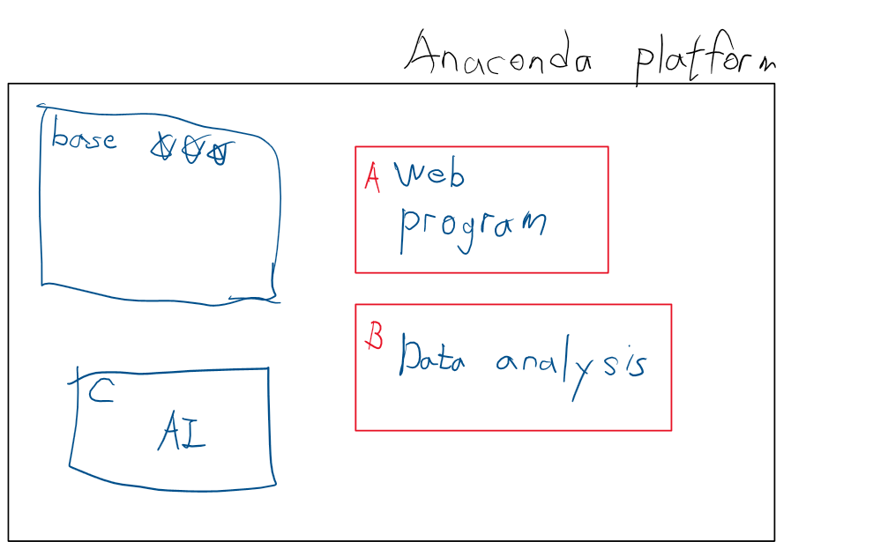

# Python
```
특징
1. 배우기가 쉽다.
2. 문법
3. 데이터처리
4. 중괄호가 없다.
5. Interactive 하게 실행이 가능하다.
6. Library가 많다.
7. python은 version이 많다. (3.0 버젼 사용예정)

개발환경 세팅하기
pycherm => Django web programming
Jupyter notebook (Web 기반의 개발툴) -> Data분석, M'L, D'L
Anaconda platform -> (dependency)편하게 사용하기위해 쓴다.

개발환경 세팅하기
구글드라이브 -> 새폴더 -> 파이썬 실습
새 파일 -> 연결하기 -> 더보기 -> Colaboratory
```
### anaconda platform

```
1. conda create -n data_env python=3.8 openssl
2. conda activate data_env
3. conda install matplotlib
4. conda install nb_conda
(conda install pandas)
5. jupyter notebook --generate-config
6. 450번째 줄
c.NotebookApp.notebook_dir = 'c:/jupyter_home'
7. jupyter notebook
8. 커널 + trust확인

conda env list -> 가상환경 리스트 확인하기

conda install tensorflow -> 설치필요
```

```
NumPy는 Python에서 수치 계산을 위한 가장 기본적이고 핵심적인 라이브러리 중 하나입니다. NumPy는 Numerical Python의 약자로, 다차원 배열 객체와 이를 다루기 위한 다양한 함수와 메소드들을 제공합니다.

NumPy 배열은 파이썬 리스트와 매우 유사하지만, NumPy 배열은 모든 원소가 동일한 데이터 타입을 가지며, 메모리를 효율적으로 사용할 수 있습니다. 이러한 배열은 매우 큰 데이터 집합의 계산을 빠르게 처리할 수 있으며, NumPy의 함수와 메소드들을 활용하여 이러한 계산을 보다 쉽게 수행할 수 있습니다.

NumPy의 기본적인 배열 생성 방법은 다음과 같습니다.

python
Copy code
import numpy as np

a = np.array([1, 2, 3])
b = np.array([[1, 2, 3], [4, 5, 6]])
위의 코드에서 np.array() 함수를 사용하여 NumPy 배열을 생성하고 있습니다. 첫 번째 예시에서는 1차원 배열을 생성하고, 두 번째 예시에서는 2차원 배열을 생성하고 있습니다. 이렇게 생성된 배열은 인덱싱과 슬라이싱 등의 연산이 가능합니다.
NumPy는 다양한 수학 함수를 제공합니다. 예를 들어, np.exp() 함수는 자연 로그의 지수 함수를 계산하고, np.sin() 함수는 사인 함수를 계산합니다. NumPy 배열에서 이러한 함수를 사용할 수 있으며, 배열 전체 또는 각 원소별로 적용할 수 있습니다.
NumPy는 또한 선형대수학 계산을 위한 다양한 함수와 메소드들을 제공합니다. 이러한 함수와 메소드들을 활용하여, 행렬 분해, 선형 방정식 해결, 고유값과 고유벡터 계산 등의 작업을 수행할 수 있습니다. NumPy는 또한 다양한 통계 함수와 메소드를 제공합니다.
이 외에도 NumPy는 다양한 기능을 제공합니다. 예를 들어, np.random 모듈은 난수 생성 기능을 제공하며, np.fft 모듈은 푸리에 변환 기능을 제공합니다. NumPy는 또한 다른 패키지와 함께 사용될 수 있는 많은 인터페이스를 제공합니다. 예를 들어, Pandas 패키지는 데이터 분석을 위한 인터페이스를 제공하며, Matplotlib 패키지는 그래프 작성을 위한 인터페이스를 제공합니다.
NumPy는 다양한 함수와 메소드를 제공하며, 이를 활용하여 수치 계산 작업을 보다 쉽고 빠르게 처리할 수 있습니다. 다음은 NumPy에서 자주 사용되는 함수와 메소드들의 몇 가지 예시입니다.

배열 생성 함수
np.array(): 파이썬 리스트를 NumPy 배열로 변환합니다.
np.zeros(): 모든 원소가 0인 배열을 생성합니다.
np.ones(): 모든 원소가 1인 배열을 생성합니다.
np.arange(): 지정된 범위 내의 값을 가진 배열을 생성합니다.
np.random.rand(): 지정된 크기의 무작위 값을 가진 배열을 생성합니다.
배열 연산 함수
np.add(): 두 배열을 더합니다.
np.subtract(): 두 배열을 뺍니다.
np.multiply(): 두 배열을 곱합니다.
np.divide(): 두 배열을 나눕니다.
np.dot(): 두 배열의 내적(dot product)을 계산합니다.
배열 통계 함수
np.mean(): 배열의 평균 값을 계산합니다.
np.std(): 배열의 표준 편차를 계산합니다.
np.min(): 배열에서 최소값을 찾습니다.
np.max(): 배열에서 최대값을 찾습니다.
np.sum(): 배열의 모든 원소의 합을 계산합니다.
배열 변환 함수
np.reshape(): 배열의 형태를 변경합니다.
np.transpose(): 배열의 전치(transpose)를 계산합니다.
np.concatenate(): 두 배열을 연결합니다.
np.split(): 배열을 분할합니다.
선형대수학 함수
np.linalg.inv(): 역행렬(inverse matrix)을 계산합니다.
np.linalg.det(): 행렬식(determinant)을 계산합니다.
np.linalg.eig(): 고유값과 고유벡터(eigenvalues and eigenvectors)를 계산합니다.
np.linalg.solve(): 선형 방정식의 해를 계산합니다.
이 외에도 NumPy는 다양한 함수와 메소드를 제공합니다. NumPy 공식 문서에서는 이러한 함수와 메소드에 대한 자세한 설명을 제공하고 있으므로, 필요에 따라 문서를 참고하면 됩니다.
```

```python
# 이 상자를 Cell이라고 부른다.
# cell 실행시 Ctrl + Enter를 치면 된다.
# 새로운 Cell을 아래쪽에 추가하려면 shift + enter  또는 Ctrl + m + b
# 위로 추가하려면 a를 누르면 된다.
# print('소리없는 아우성');

# 주석
# 한줄짜리 주석은 #으로 처리하면 됩니다.
# print()
# print()
# '''
# 이것도 주석
# '''


# 변수를 만들고 싶다.
# a = 100
# a = 3.14
# a = '안녕'

# 변수를 삭제 할 수 있다. (추천 X)
# del a 

# Python의 built-in data type

# 1. Numeric(숫자)
# 2. Sequence
# 3. Text Sequence
# 4. Mapping
# 5. Set
# 6. Bool

# 1. Numeric(숫자)
# 정수, 실수, 복소수, 진수(8진수,16진수)
# a = 123       #정수
# b = 3.14159   #실수

# print(type(a)) # class int
# print(type(b)) # class float

# result = 3 / 4
# print (result) # 0.75

# 2. Sequence built-in data type
# Sequence는 3가지가 있다.

# [1]. list (python의 가장 중요한 자리구조이자 data type)
# 객체를 순서대로 저장하는 집합형 자리구조
# Java의 ArrayList와 상당히 유사
# literal은 어떻게 되나요? => []
# myList = list() # 요소가 없는 list객체를 만들어요
# myList = [1, 3.14, 100] #literal로 list를 표현
# print(type(myList))   <class 'list'>

# 중첩 리스트도 가능
# myList = [1, 2, 3, [3.14, 5.25, 100], 4, 5]
# print (myList)
# print(myList[0]) # 1 -> indexing이 가능!
# print(myList[-1]) # 5 -> indexing이 가능!
# print(myList[5]) # 5 -> indexing이 가능!
# print(myList[3][2]) # 100 -> indexing이 가능!

# slicing!
# myList = [1, 2, 3, [3.14, 5.25, 100], 4, 5]
# print(myList[0:2]) # 슬라이싱의 앞쪽은 포함이고 뒤쪽은 불포함이에요 [1,2]
# print(myList[0:1]) [1]
# print(myList[1:])  [2, 3, [3.14, 5.25, 100], 4, 5]
# print(myList[:2])  [1, 2]
# print(myList[:])   [1, 2, 3, [3.14, 5.25, 100], 4, 5]

# list의 연산
# a = [1, 2, 3]
# b = [4, 5, 6]
# c = a + b
# print(c) #[1, 2, 3, 4, 5, 6]
# c = a * 3 
# print(c) #[1, 2, 3, 1, 2, 3, 1, 2, 3]

# list는 객체에요!
# 당연히 많은 메소드를 가지고 있다.
# a = [1, 2, 3]
# a.append(4)
# print(a) # [1, 2, 3, 4]
# a.append([4, 5])
# print(a) # [1, 2, 3, [4, 5]]

# [2]. tuple
# tuple은 기본적으로 list와 동일하다. 그런데 read only!
# literal로 ()를 이용한다.

# a = tuple() #literal이 아니라 class를 이용해서 객체를 생성!
# a = (1, 2, 3, 4) # tuple
# print(type(a)) # <class 'tuple'>
# a = (1,) # 튜플이라는걸 명시해주기위해 , 를 찍어준다. 요소가 1개짜리인 tuple을 이렇게 표현한다.
# a = (1, 2, 3, 4)
# print(a[2]) # 3
# print(a[2:3]) # (3.)
# a[3] = 100 # 튜플의 값은 바꿀 수 없다.

# a = (1, 2, 3, [4, 5, 6], 7)
# a[3][1] = 100
# print(a) # (1, 2, 3, [4, 100, 6], 7) #Readonly의 의미를 잘 파악해야한다.

# a = (1, 2, 3)
# # tuple은 기호를 생략할 수 있다.
# a = 1, 2, 3
# a, b, c = 1, 2, 3

# 나머지는 list와 유사하다.
# a = (1, 2, 3)
# b = list(a)
# print(b) # [1, 2, 3]

# [3]. range
# a = range(10) # 시작은 0부터 시작, 10까지 , 1씩 증가하는 숫자의 범위
# print(a) #range(0, 10)
# print(a[3]) # 3
# a = range(2, 20, 2) # (시작, 끝, 증가)

# 3. Text Sequence
# 문자열 - 사용하는 클래스는 str
# literal은 '', "" 둘 다 사용 할 수 있다. (default는 '') # 문자라는 개념이 없다. 모두 문자열이다.
# Text Sequence는 실제로는 list에요
# list의 성질을 그대로 이어 받는다.
# a = '홍'
# b = '길동'
# print(a + b)
# a = '이것은 소리없는 아우성!!'
# print(a[0]) # 이
# print(a[0:3]) # 이것은
# 기억해야 할 특이한 연산자 한개가 있다.
# print('소리' in a) # True (자바와 달리 true != True 대소문자 구별한다.)
# 문자열은 str class의 객체예요. 그러다보니.. 굉장히 많은 method를 가지고 있다.
# print('이것은 {}없는 {}'.format('소리', '아우성'))

# 4. Mapping
# 우리가 알고 있는 Map 구조(키와 value로 데이터를 저장하는 구조)
# 파이썬에서는 이런 자료구조를 dictionary라고 부른다.
# 당연히 사용하는 class는 dict
# literal로 표현할 수 있다. ->  {} : dictionary
# [] : list, () : tuple
# a = { 'name' : '홍길동', 'age' : 20 }
# print(a) # <class 'dict>
# 자바와 다르게 python의 dictionary는 동적으로 데이터를 추가 할 수 있다.
# a['주소'] = '서울'
# print(a) # {'name': '홍길동', 'age': 20, '주소': '서울'}
# print(a.keys()) #dict_keys(['name', 'age, '주소'])
# 생긴것만 보면 key들을 모아서 list로 만들어서 리턴하는거 같지만
# list와 유사한 자료구조 일 뿐 진짜 list는 아니다.
# 일반적으로 for문을 이용할때 이렇게 쓴다.
# for ~ in (리스트, 튜플, list와 유사한 자료구조)
# for tmp in a.keys():
#     print(tmp)       # 4칸을 들여쓰기를 써야 한다. for문이 감싸는 형태가 된다.
#     print('호호')
# name
# age
# 주소

# 5. Set
# 우리가 알고 있는 그 Set이에요!
# 순서가 없어요. 중복배제

# literal로 Set은 => {}
# [] , {}(key와 value의 쌍으로 표현) , ()

# a = { 1, 2, 3, 4, 1, 2, 3}
# print(a) {1, 2, 3, 4}
# print(type(a)) <class 'set'>

# 6. Bool
# True, False

# control statement
# 제어문(if, for)

# area = ['서울', '부산', '제주']

# if '서울' in area:
#     pass
# else:
#     print('소리없는 아우성!') # 4칸 띄우는거 잘 지키자
    
# for문
# for문은 2가지 형태로 많이 사용된다.
# 1. for ~ in range()
# 2. for ~ in list, dict

# 반복할 횟수를 명시적으로 지정할때 많이 이용
# print() : 인자로 들어온 문자열을 출력하고 한줄을 띄워요!
# for test in range(10):
#     print(test)
# for test in range(10):
#     print(test, end=', ')    

# a = ['홍길동', '신사임당', '강감찬']

# for name in a:
#     print(name)

# 함수 만드는 방법

# Java
# 함수가 없다. 대신 class안에 method가 있어요!
# class A {}

# python에서는 함수를 만들 수 있어요!

# def myFunc(a, b, c):
#     return a + b + c

# result = myFunc(10, 20, 30)
# print(result)
```

```python
# 이제부터 Numpy에 대해서 알아보아요!
# 여기서부터는 약간의 코드와 함께 이해를 동반해야 해요!

# 데이터 분석, 머신러닝, 딥러닝 이런 분야를 할때
# 가장 시간이 많이 걸리고 잘 해야되는게..
# 데이터 수집과 정제

# Numpy(Numerical Python)
# pandas(데이터 분석 module)과 matplotlib(시각화)의
# base가 되는 기본 자료구조를 제공한다.

# numpy는 딱 1개의 자료구조를 우리에게 제공해요!
# ndarray 자료구조를 제공
# n-dimensional array
# 보다 적은 메모리를 필요로 하고 훨씬 더 빠른 처리를 할 수 있다.

# numpy는 외부 module이기 때문에 당연히 설치해야 해요!
# conda install numpy
# 설치하고 나서 import가 필요하다.
# import numpy as np

# a = [1, 2, 3, 4, 5] #python의 list
# print(a) [1, 2, 3, 4, 5]

# b= np.array([1, 2, 3, 4, 5])
# print(b) [1 2 3 4 5]
# print(type(b)) <class 'numpy.ndarray'>
# 기억해야 하는 특징이 있는데 list안에는 아무거나 막 들어올 수 있다.
# c = [1, 3.14, '홍길동', True]
# ndarray는 반드시 같은 데이터 타입끼리만 들어 올 수 있다.
# print(c) [1, 3.14, '홍길동', True]
# d=np.array([1, 2, 3.14, 4, 5])
# print(d) [1.   2.   3.14 4.   5.  ]
# print(d.dtype) float64

# ndarray가 list와 가장 크게 차이가 나는건 차원을 표현할 수 있다는 것이다.
# myList = [[1 ,2 ,3 ], [4, 5, 6]]
# # print(myList) #  [[1, 2, 3], [4, 5, 6]]
# arr = np.array(myList)
# # print(arr) # [[1 2 3]
# #  [4 5 6]]

# print(arr[0,1]) # 2
# print(arr[0]) # [1 2 3]
# print(arr[0][1]) # 2

# 중요한 속성이 있어요!
# 1차원 ndarray를 하나 만들어 보아요!
# arr = np.array([1, 2, 3, 4])
# print(arr) # [1 2 3 4]
# print(arr.dtype) # int32
# print(arr.ndim) # 1
# print(arr.shape)  #중요!! # (4,)

```