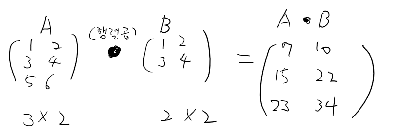

# Python
```
python은 array를 지원하지 않아요
-> 차원표현 X
-> 많은 양의 데이터 처리에는 힘들다.
-> Numpy -> ndarray (다차원 배열)
```
```
Scalar, Vector, Matrix
Scalar는 하나의 값을 나타내는 개념으로 크기만 가지고 있으며 방향이 없습니다. 예를 들면, 온도, 질량, 시간 등이 스칼라입니다.

Vector는 크기와 방향을 모두 가지는 개념으로 순서가 있는 데이터 집합입니다. 따라서 벡터는 일반적으로 화살표로 표현됩니다. 예를 들면, 속도, 위치, 힘 등이 벡터입니다.

Matrix는 숫자들이 직사각형 형태로 배열된 것을 나타내는 개념으로, 2차원 배열로 생각할 수 있습니다. 예를 들면, 회전, 확대/축소, 변환 등에 사용되는 변환행렬 등이 있습니다.

즉, Scalar는 크기만을 가지며 방향이 없는 값, Vector는 크기와 방향을 가지며 벡터의 순서가 중요한 값, 그리고 Matrix는 숫자들이 직사각형 형태로 배열된 값입니다.
```
```
행렬에 대해 사칙연산,    비교연산이 가능
(2차원)    (+, -, *, %) (>, <, =)
행렬곱연산(Matrix Multiplication) -> "product"
```

```
행렬곱(matrix multiplication)은 두 개 이상의 행렬을 곱하는 연산을 말합니다.
C(1,1) = ( A(1,1) * B(1,1) ) + ( A(2,1) * B(1,2) )
C(2,1) = ( A(1,1) * B(2,1) ) + ( A(2,1) * B(2,2) )
이러한 계산을 모든 i와 j에 대해 수행하면 행렬 곱셈이 완료됩니다.
행렬 곱셈은 다양한 분야에서 사용되며, 특히 선형 대수학과 데이터 분석, 머신 러닝에서 자주 사용됩니다.
```
```python
Numpy
# 이제부터 Numpy에 대해서 알아보아요!
# 여기서부터는 약간의 코드와 함께 이해를 동반해야 해요!

# 데이터 분석, 머신러닝, 딥러닝 이런 분야를 할때
# 가장 시간이 많이 걸리고 잘 해야되는게..
# 데이터 수집과 정제

# Numpy(Numerical Python)
# pandas(데이터 분석 module)과 matplotlib(시각화)의
# base가 되는 기본 자료구조를 제공한다.

# numpy는 딱 1개의 자료구조를 우리에게 제공해요!
# ndarray 자료구조를 제공
# n-dimensional array
# 보다 적은 메모리를 필요로 하고 훨씬 더 빠른 처리를 할 수 있다.

# numpy는 외부 module이기 때문에 당연히 설치해야 해요!
# conda install numpy
# 설치하고 나서 import가 필요하다.
import numpy as np

# a = [1, 2, 3, 4, 5] #python의 list
# print(a) [1, 2, 3, 4, 5]

# b= np.array([1, 2, 3, 4, 5])
# print(b) [1 2 3 4 5]
# print(type(b)) <class 'numpy.ndarray'>
# 기억해야 하는 특징이 있는데 list안에는 아무거나 막 들어올 수 있다.
# c = [1, 3.14, '홍길동', True]
# ndarray는 반드시 같은 데이터 타입끼리만 들어 올 수 있다.
# print(c) [1, 3.14, '홍길동', True]
# d=np.array([1, 2, 3.14, 4, 5])
# print(d) [1.   2.   3.14 4.   5.  ]
# print(d.dtype) float64

# ndarray가 list와 가장 크게 차이가 나는건 차원을 표현할 수 있다는 것이다.
# myList = [[1 ,2 ,3 ], [4, 5, 6]]
# # print(myList) #  [[1, 2, 3], [4, 5, 6]]
# arr = np.array(myList)
# # print(arr) 
# [[1 2 3]
#  [4 5 6]]

# print(arr[0,1]) # 2
# print(arr[0]) # [1 2 3]
# print(arr[0][1]) # 2 잘안쓰임임

# 중요한 속성이 있어요!
# 1차원 ndarray를 하나 만들어 보아요!
# arr = np.array([1, 2, 3, 4])
# print(arr) # [1 2 3 4]
# print(arr.dtype) # int32
# print(arr.ndim) # 1
# print(arr.shape)  #중요!! # (4,)

# 데이터 표현부터 알아보아요!
# a = 10 # scalar
# b = [10, 20, 30] # 1차원
# c = [[1, 2, 3], [4, 5, 6]] # 2차원
# d = [[[1, 2, 3], [4, 5, 6]]] # 3차원

# numpy의 ndarray
# arr = np.array(b) # 1차원(vector)
# print(arr)
# arr = np.array(c) # 2차원(matrix-행렬)
# arr = np.array(d) # 3차원
# print(arr)

# ndarray를 만드는 가장 쉬운 방법
# np.array()를 이용해서 만든다.

# 다르게 만드는 방법이 있다.

# arr = np.zeros((3,4))
# print(arr)
# [[0. 0. 0. 0.]
#  [0. 0. 0. 0.]
#  [0. 0. 0. 0.]]

# arr = np.arange(0, 10, 2)
# print(arr) # [0 2 4 6 8]

# 주의해야 할건.python의 range()는 개념이라서 실제 데이터를 메모리에 가지고 있지 않는다.
# numpy의 arrange()는 실제로 가지고 있다.

# arr = np.arange(0, 12, 1)
# print(arr) # 1차원 ndarray

# arr1 = arr.reshape(3,4) 
# arr1 = arr.reshape(-1,2) 데이터를 2차원으로 만들고 -1(어떤 수가 들어오든 상관없다.) 2열로 고정한다.
# arr1 = arr.reshape(3,-1) 데이터를 2차원으로 만들고 3행으로 만들고 -1(어떤 수가 들어오든 상관없다.) 열로 고정한다.
# print(arr1)

# arr[-1] = 100
# reshape은 데이터를 저장하는게 아닌 view를 만드는거일 뿐이다.

# arr2 = arr.reshape(2,2,3)
# print(arr2)

# numpy array가 있으면..
# 당연히 indexing과 slicing을 할 수 있어요!

# arr = np.arange(0,5,1)
# print(arr)  # [0 1 2 3 4]
# print(arr[-1]) # 4

# print(arr[0:2]) # [ 0 1 ]
# print(arr[2:-1]) # [ 0 1 ]
# print(arr[0::2]) # [0 2 4]

# arr = np.arange(1,17,1).reshape(4,4)
# print(arr)
# print(arr[1,2]) # 7
# print(arr[1,2:4]) # [7 8]
# print(arr[:,2]) # [ 3 7 11 15]

# 기본 indexing과 slicing은 간단해요. python과 동일
# indexing에는 특이한 indexing기법이 두개가 더 있는데 Boolean indexing, Fancy indexing

# Boolean indexing은 기본적으로 boolean mask를 이용해서 indexing하는 기법

# arr = np.arange(0, 5, 1)
# print(arr)

# boolean mask 내가 적용하는 ndarray와 shape이 같아야 해요
# boolean_mask = np.array([1,2,3,4,5])
# boolean_mask = np.array([True,False,True,True,False])
# print(arr[boolean_mask])

# arr = np.array([1,2,3,4,5])
# arr1 = np.array([10,20,30,40,50])
# print(arr + arr1) # [11 22 33 44 55]

# arr = np.array([1,2,3,4,5])
# arr1 = np.array([5,4,3,2,1])
# print(arr > arr1)  #[False,False,False,True,True]

# arr = np.arange(0,10,1)
# print(arr[arr % 2 ==0]) # [0 2 4 6 8] Boolean mask라는 것을 알아야한다.


# 또 다른 indexing 방법 -> Fancy indexing
# arr = np.arange(0,12,1).reshape(3,4).copy()
# print(arr)
# print(arr[2,2]) # 10 scalar
# print(arr[1:2,2]) # 행은 슬라이싱 열은 인덱싱 [6] vector
# print(arr[1:2,1:2]) # [[5]] matrix
# print(arr[:2,:-1]) # 0, 1, 2, 4, 5, 6 2차원 배열 출력하기
# print(arr[:2, [0,2]]) # 0, 2, 4, 6

# 기본적인 indexing , slicing , Boolean indexing, Fancy Indexing

# ndarray의 연산!
# arr = np.array([[1,2,3], [4,5,6]])
# arr1 = np.arange(1,7,1).reshape(3,2)
# arr2 = np.arange(1,7,1).reshape(2,3)
# print(arr + arr1) # 당연히 에러다 shape이 같아야한다.

# arr = np.array([1, 2, 3, 4, 5])
# print(arr)
# print(arr + 3) # [4 5 6 7 8] broadcasting

# arr = np.arange(0,6,1).reshape(2,3)
# arr1 = np.array([1,2,3])
# print(arr + 3)
# print(arr+arr1)

# 행렬곱연산은 어떻게 하나요?
# arr1 = np.array([[1,2],[3,4],[5,6]])
# arr2 = np.array([[1,2],[3,4]])
# print(np.dot(arr1,arr2))

# 집계함수와 축!
# arr = np.arange(1,6,1)
# print(arr)
# print(arr.sum())
# print(arr.mean()) # 평균
# print(arr.max())
# print(arr.argmax()) # 필요없을거 같은데 이게 필요해요!
# # 축의 개념이 나온다. axis 1차원 ndarray는 당연히 축이 1개 이걸 숫자로 표현해요
# print(arr.sum(axis=0)) # 15
# # print(arr.sum(axis=1)) # error

# arr = np.arange(1,7,1).reshape(2,3)
# print(arr)
# print(arr.sum()) # 몽땅 더해요! 21
# 2차원인 경우에는 축이 2개다. # 행(이 증가하는)방향 => 0, 열(이 증가하는)방향 => 1
# print(arr.sum(axis=0))
# print(arr.sum(axis=1))

# arr = np.array([[1,2,3,4],
#                [5,6,7,8],
#                [9,10,11,12],
#                [13,14,15,16]])
# print(arr[arr > 10].sum())
```

```python
Pandas
# 데이터 처리(분석)을 하기 위해서 우리가 사용하는 실제적인 module
# 기본적인 자료구조는 2개가 존재

# 1. Series : 1차원 ndarray를 기반으로 만든 자료구조
# 2. DataFrame : Series를 세로로 이어 붙여 만든 2차원 자료구조

# pandas를 설치해야 사용할 수 있다.

# Series부터 알아보아요!
import numpy as np
import pandas as pd

# s = pd.Series([-1, 5, 10, 99], dtype="float64")
# print(s)
# arr = s.values
# print(arr) 

# s = pd.Series([1, 5, -10, 30],
#              dtype=np.float64,
#              index=['c', 'b', 'a', 'k']) # index가 숫자인 형태는 좋지않다.
# print(s)
# print(s[1])  # 5.0
# print(s['b']) # 5.0
# print(s[0:3])
# print(s['c':'a']) # 앞도 포함하고 뒤도 포함한다.
# print(s[s%2==0]) # Boolean Indexing Fancy Indexing 둘다 사용가능
# print(s.shape) #(4, )

# 이번에는 Series를 조금 다르게 만들어 보자.
# dictionary를 이용한다.

# my_dict = { '서울':2000, '부산':3000, '인천':500}
# print(type(my_dict)) # <class 'dict'>

# s = pd.Series(my_dict)
# print(s)

# Series는 1차원 ndarray에 사용자 지정 index를 추가한 자료구조.
# 일반적으로 Series를 직접 만들어 사용하는 경우는 많지 않아요!
# 대부분 DataFrame을 사용해요! (얘가 훨씬 편하고 기능도 많아요)

# my_dict = { 'name':['홍길동', '신사임당', '강감찬'] , 'year':[2020, 2021, 2022], 'point': [3.0, 4.0, np.nan] }
# s = pd.Series(my_dict)
# print(s)
# df = pd.DataFrame(my_dict)
# display(df)
# print(df.shape) #(3,3)
# print(df.size) #9
# print(df.index) #RangeIndex(start=0, stop=3, step=1)
# print(df.values)
# print(df.columns) #Index(['name', 'year', 'point'], dtype='object')

# my_dict = { 'name':['홍길동', '신사임당', '강감찬'] , 'year':[2020, 2021, 2022], 'point': [3.0, 4.0, np.nan] }
# df = pd.DataFrame(my_dict)
# display(df)

# new_df = df.set_index('name', inplace=False)
# display(new_df)

df = pd.read_csv('./data/movies.csv')

display(df.head())
print(df.shape) # (9742, 3)

# DataFrame을 생성해야 해요!

# 이렇게 DataFrame을 생성했으면 이제 DataFrame을 조작하는 방법에 대해서 알아야 해요
my_dict = { '이름': ['홍길동', '신사임당', '강감찬', '이순신', '권율'], 
            '학과': ['컴퓨터', '철학', '기계', '영어영문', '물리학과'],
            '학년': [1,2,2,4,3],
            '학점': [1.5,2.0,3.1,1.1,2.7]}

# df = pd.DataFrame(my_dict, columns=['학과', '이름', '학점', '학년', '등급']) #순서바꾸기가능, 없는거 들어갈시 NAN
df = pd.DataFrame(my_dict, columns=['학과', '이름', '학점', '학년', '등급'], index=['one','two','three','four','five'])
display(df)
display(df.describe()) #계산이 가능한 컬럼에 대해서 기본 통계정보를 알려준다.

# 1. 원하는 컬럼 1개만 추출해 보아요!
# print(df['이름']) #Name: 이름, dtype: object
# 이렇게 컬럼을 추출해서 series를 얻어내면 view를 얻어내개 되요!
# 이 series의 값을 수정하면 원본인 DataFrame의 값이 수정되요!
s = df['이름'].copy()
s['one'] = '아이유'
print(s)
display(df) # .copy()사용이후 바꾸면 원본은 바뀌지 않는다.

# 2. 여러개의 컬럼을 가져오고 싶어요!
# 예를 들어 학과와 이름만 가져오고 싶어요!
# 결과는 DataFrame으로 나와요!
# Fancy Indexing
# display(df['학과','이름']) # 에러
# display(df[['학과','이름']]) 

# 3. 컬럼을 추가하고 싶어요!
# df['나이'] = [20,21,22,21,19]
# display(df)

# 4. 장학생을 선발하고 싶어요!
# 학점이 3.0 이상이면 장학생으로 선정하고 싶어요
# 기존데이터의 연산을 통해서 새로운 컬럼을 추가 할 수 있어요!
# df['장학여부'] = df['학점']>=3.0
# display(df)

# 5. 컬럼을 삭제해 보아요!
# new_df=df.drop('이름', axis=1, inplace=False)
# display(new_df)

# 6. 컬럼에 대한 slicing은 되나요? 안된다.
# df['학과' : '학점']

# 행을 가져와 보자 (row indexing)
# 표현방법을 다르게 쓰는게 속이 편하다.
# loc를 사용한다.
# df.loc['one'] #loc는 반드시 지정 index를 사용해야 한다.
# df.iloc[0] # iloc는 반드시 default인 숫자 index를 사용해야 한다.
# df.loc['one':'three']
# df.loc['one':] # OK!!
# df.loc['one':-1] # ERROR!!
# df.loc[['one', 'four']]
# df.loc[['two','four'],['이름','학년']]
```
