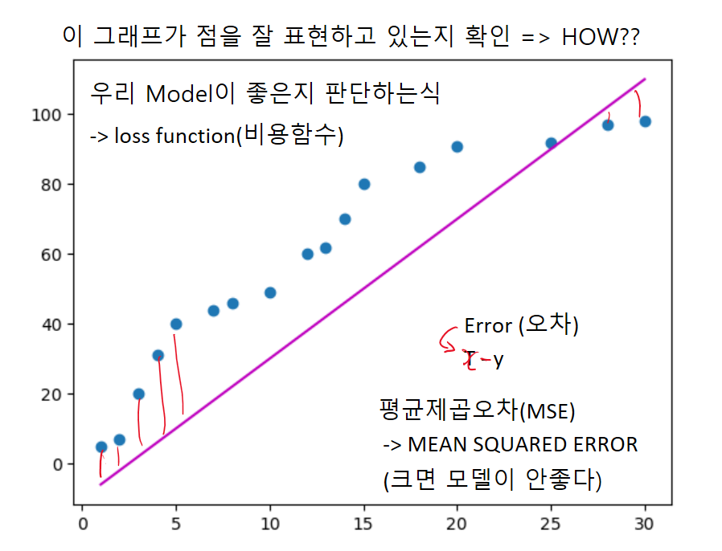
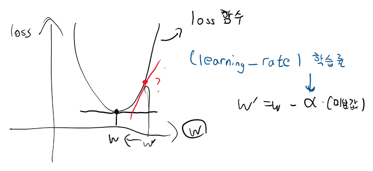
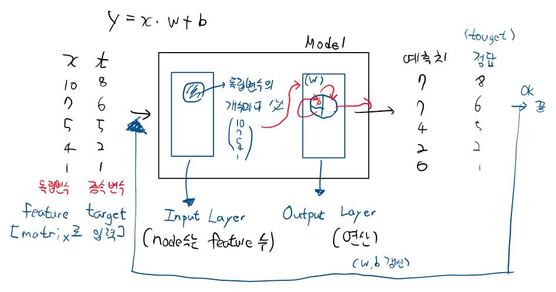

# Machine Learning
```
AI(인공지능, Artificial Intelligence)
-> 사람의 사고능력을 구현한 소프트웨어(시스템)
1. Strong AI
사람과 구별이 불가능한 AI -> 목표지향점
2. Weak AI
특정분야에 구현된 AI(바둑, 자율주행, 챗봇....)

CS쪽에서 Data기반 -> 학습(program) -> 예측(prediction)
-> Machine Learning

지금까지 우리가 하고 있는 일반적인 program은 Rule Based Program(Explicit program)
Data -> 입력 -> 로직 -> 결과 -> 해답

Machine Learning
Data + 해답
입력 -> 처리 -> 규칙성(수식으로 도출된다. "Model: -> prediction" 오징어)

기법
1. Regression (통계에서 가져왔다.)
2. SVM (Support Vector Machine)
3. Decision Tres, Random Forest
4. KNN
5. Naive Bayes
6. Artificial Neutral Netwark(ANN)인공신경망 -> 발전 Deep Learning
7. K-Means, DBSCAN
8. Reinforcement Learning(강화학습)

1~6 -> 지도학습 기법
7. 비지도학습 기법 
8. 강화 학습 기법

1~5와 6의 가장 큰 차이는 Data의 형태 차이에 있다.
정형Data -> 일반적인 Machine Learning
비정형Data -> Deep Learning

Machine Learning Type
Data Label -> program -> 규칙성(model) => 지도학습(supervised Learning)
Data -> program -> clustering model -> 비지도학습(Unsupervised Learning)
Data Lavel X -> program -> clustering model -> 준지도 학습(Semi supervised Learning)
강화학습  -> "알파고"

지도학습
Regression
ANN
-> Data(학습data, Label) -> 실행(학습) -> Model"수식"
Label(단변량) -> 결과가 연속적인 숫자가 아니라 이산적인 숫자가 나온다(분류) -> classification


그림을 보고 사람, 남자, 성인 이렇게 나오는게 아니라
사람(단변량)
다변량 X (사용할일 없다.)-> 단변량만 기억하자


Regression(회귀)
-> 통계적 기법
-> 어떤 데이터에 대해 그 데이터에 영향을 주는 조건들의 영향력을 이용해서 데이터에 대한 조건부 평균을 구하는 기법

Ex) 우리나라의 아파트 가격은 얼마인가요?? 개개의 가격의 평균
y(가격) = (평수) *8000 + (역세권)*3000 + (학군)*5000

한마디로 평균을 구하는 것이다.
평균은 우리가 대표값(최소값, 최대값, 평균, 최빈값)으로 가장 많이 이용하는 값

조건들의 영향력을 이용해서 데이터에 대해 그 데이터를 가장 잘 표현하는 함수

Regression Model(수식)
독립변수(연속시간, 공부시간)    종속변수(성적)
연속기간   공부시간    성적
1           2         10
3           1         70
5           10        100
feature             target
x-data              label

\beta_0

y = (가증치)β.X
예측치

독립변수가 1개일때
y= ax + b (1차직선형태)

독립변수가 1개일 때 -> y=ax+b형태로 만들어진다.
Classical Lineur Regression Model
독립변수가 2개일 때 -> y = ax + bx + c -> 평면
"회귀계수"


Regression
-> 평균
만약 데이터가 평균을 사용하기 힘든 데이터라면 회귀모델 사용을 고려애햐 한다.

1800년대 찰스다윈 "종의 기원"
프란시스 골턴 -> 우성학

```

```
y=wx+b
Error = t -y
 = t-(wx+b)

loss = MSE를 사용(평균제곱오차)
MSE = 1/n * Σ(yi - ŷi)^2
여기서 n은 데이터의 개수를, yi는 실제값을, ŷi는 예측값을 나타냅니다. 따라서 MSE는 예측값과 실제값 사이의 차이를 제곱한 값의 평균으로, 값이 작을수록 모델의 성능이 좋다고 판단할 수 있습니다.
우리 loss는 결국 w,b의 2차함수
그래프로 그려보면 
```


loss 함수의 최소값(미분값)은 0이다.
```
미분???
미분(Differentiation)은 함수의 기울기를 구하기 위한 수학적인 개념으로, 함수의 작은 변화량에 따른 출력값의 변화량을 나타내는 것입니다.
어떤 함수 f(x)에서 x의 아주 작은 변화량을 dx만큼 적용했을 때, f(x)의 변화량은 f(x+dx) - f(x)가 됩니다. 이 때, x에서 x+dx로 이동한 거리를 dx라고 하며, 이동한 거리를 점점 작게 하여 dx를 0에 가깝게 한다면, f(x)의 변화량은 x에서의 순간적인 기울기로 접선(tangent)의 기울기가 됩니다. 이러한 접선의 기울기를 구하는 것이 미분입니다.
```
```
최소 제곱법???
최소 제곱법(Least Squares Method)은 회귀 분석에서 사용되는 기법 중 하나로, 주어진 데이터에 대해 오차를 최소화하는 모델 파라미터를 찾는 방법입니다.
최소 제곱법은 주어진 데이터에 대해 모델 예측값과 실제값의 차이(잔차, Residual)를 제곱한 값들의 합을 최소화하는 모델 파라미터를 찾는 것입니다. 예를 들어, 단순 선형 회귀 분석에서는 다음과 같은 모델을 사용합니다.
y = β0 + β1x + ε
여기서 y는 종속 변수, x는 독립 변수, β0와 β1은 모델 파라미터, ε는 오차항(Error)을 나타냅니다. 최소 제곱법은 이 모델에서 잔차의 합을 최소화하는 β0와 β1을 구하는 것입니다.
최소 제곱법을 계산하기 위해서는 다음과 같은 과정을 거칩니다.
주어진 데이터(x, y)를 이용하여 잔차를 구합니다.
잔차를 제곱하여 합산합니다.
이 값을 최소화하는 β0와 β1을 구합니다.
최소 제곱법은 오차의 제곱을 이용하여 모델 파라미터를 구하기 때문에, 이상치(outlier)에 민감하게 반응할 수 있습니다. 이러한 경우에는 다른 회귀 분석 기법이 필요할 수 있습니다.
```
```
Model -> y=wx+b
loss function => MSE -> 1/n * Σ(yi - ŷi)^2

독립  종속   
x     t
10    8
5     7
3     2
1     0
-> Machine Learning
w, b를 갱신
w`=w-α(미분값)
b`=b-α(미분값)

y = wx + b
-> Machine Learning Model


python으로 하는것(구현도 어렵고 성능도 안좋다.)
대표적인 library
메타의 pytouch
구글의 Tensorflow + keras (사용)
Optimizer 담당 (GD)
```



```python
코드실습

import numpy as np
import pandas as pd
import matplotlib.pyplot as plt

# df = pd.DataFrame({
#  '공부시간(x)' : [1,2,3,4,5,7,8,10,12,13,14,15,18,20,25,28,30],
#  '시험점수(t)' : [5,7,20,31,40,44,46,49,60,62,70,80,85,91,92,97,98]
# })

# display(df.head())

# 그래프로 데이터의 분포를 알고 싶어요
# scatter()를 이용하면 된다.
# plt.scatter(df['공부시간(x)'], df['시험점수(t)'])

# 우리가 찾고 싶은건 classical linear regression model
# 현재 데이터에 대해서는 1차 직선으로 표현
# y = ax + b
# 직선을 그랠 때는 plot()를 이용하면 된다.
# plt.plot(df['공부시간(x)'], 2*df['공부시간(x)'] + 3, color='r')
# plt.plot(df['공부시간(x)'], 5*df['공부시간(x)'] - 7, color='b')
# plt.plot(df['공부시간(x)'], 1*df['공부시간(x)'] + 8, color='g')
# plt.plot(df['공부시간(x)'], 4*df['공부시간(x)'] - 10, color='m')


# plt.show()

# tensorflow library가 import 되어야 한다.
from tensorflow.keras.models import Sequential
from tensorflow.keras.layers import Flatten, Dense
from tensorflow.keras.optimizers import SGD

# Training Data Set
x_data = np.array([1,2,3,4,5]).reshape(-1,1)
t_data = np.array([3,5,7,9,11]).reshape(-1,1)

# Model
keras_model = Sequential() # 그림에서 모델 사각형

# Layer 생성
input_layer = Flatten(input_shape=(1,))
output_layer = Dense(1, activation='linear')

# Model에 Layer을 추가
keras_model.add(input_layer)
keras_model.add(output_layer)

# Model 동작 설정
keras_model.compile(optimizer=SGD(learning_rate=1e-2), loss='mse')

# Model 학습
keras_model.fit(x_data,t_data,epochs=2000)

result = keras_model.predict([[10]])
print(result)
```
