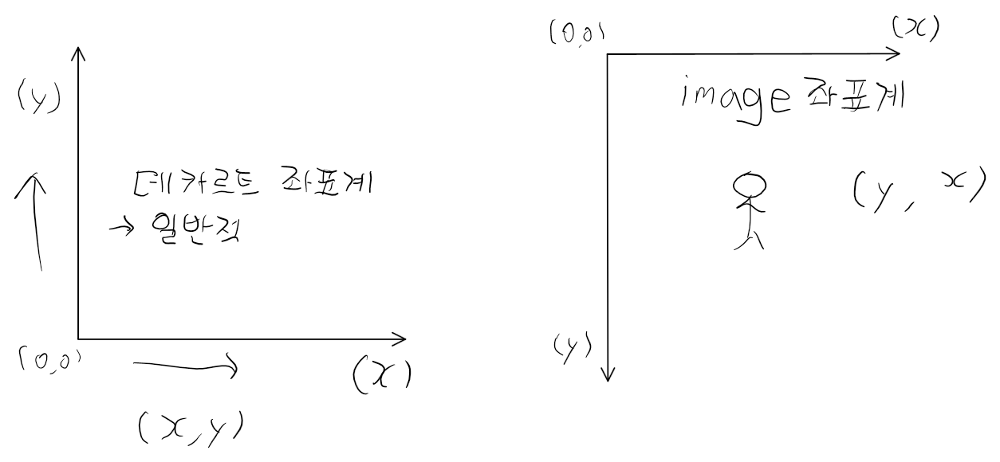
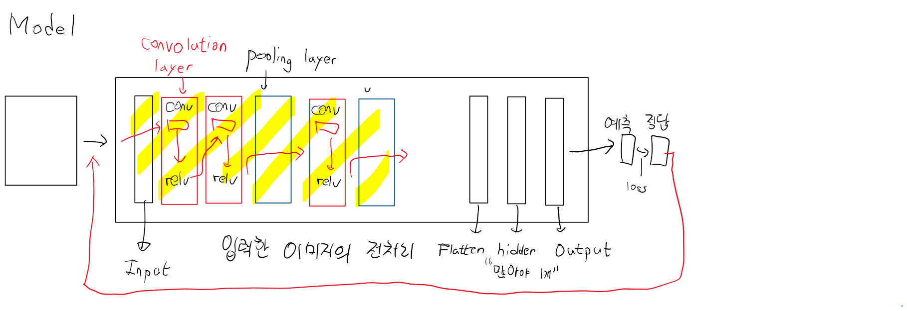

## Linuer Regression
-> 종속변수가 연속적인 숫자값
학습데이터의 상태(종속변수)가 변해요

## Logistic Regression (binary classification)
-> 학습데이터의 상태(종속변수)가 다시 변해요

## Multinomial classification(O)
-> "BMI 지수 학습"
class별 확률값 -> (0.6 0.3 0.1)
-> 데이터가 변해요(비정형 데이터)
학습이 안되는게 아니라 정확도가 떨어진다.

## ANN(Artificial Neural Network) 인공신경망
-> keras Model을 기본으로 생각하면 쉬워요
Layer를 추가로 input<->output (hidden layer  추가)

## DNN(Deep Neural Network)
```
-> Deep Learning "알파고"
Image를 DNN을 이용해서 학습하면 좋을까?? (공간지각능력 X)

이미지 입력 -> 기본적으로 3차원이다.
DNN 입력은 2차원

해결하기 위한 알고리즘 -> CNN 알고리즘
```
```
설정법
google drive -> 런타임 Gpu로 잡기
왼쪽에서 구글 드라이브 마운트 하기.
```
## Image파일에 대해서 기억해야 하는것 
1. 좌표계

```
모든 image는 3차원이다.
(가로, 세로, color(R 10, G 150, B 20)) -> color image
(가로, 세로, color(R 60, G 60, B 60)) -> Gray scale image
```
```python
import numpy as np
from PIL import Image  # 이미지처리하기 편한 라이브러리
import matplotlib.pyplot as plt

color_img = Image.open('/content/drive/MyDrive/파이썬 실습/fruits.jpg')

plt.imshow(color_img)
plt.show()

# 우리가 필요한건 ndarray예요!

color_pixel = np.array(color_img)

# pixel데이터를 이용해서 그림을 그려보아요!
plt.imshow(color_pixel)
plt.show()
print('shape : {}'.format(color_pixel.shape))

# 위의 그림을 흑백으로 바꿔볼꺼예요!
# 각 pixel의 RGB값을 평균내서 RGB칸에다 설정하면 흑백처리되요!

gray_pixel = color_pixel.copy()

for y in range(gray_pixel.shape[0]):
    for x in range(gray_pixel.shape[1]):
        gray_pixel[y,x] = np.mean(gray_pixel[y,x])

plt.imshow(gray_pixel)  
plt.show()
print(gray_pixel.shape) 

# 3 차원 흑백이미지 생성
# 흑백은 2차원으로 표현하면 사이즈가 줄어든다.

gray_2d_pixel = gray_pixel[:,:,0]
print(gray_2d_pixel.shape)

# 이미지를 2차원으로 바껐어요!
plt.imshow(gray_2d_pixel, cmap='gray')
plt.show()

```
### 비정형 데이터의 가장 대표적인 image를 학습하려면 어떻게 해야할까
-> CNN (Convolutional Neutarl Network) 합성곱신경망
-> convnet (컨브넷)
```
DNN은 Deep Neural Network의 약자로, 많은 수의 뉴런을 포함하는 심층 인공신경망을 의미합니다. DNN의 각 계층은 여러 개의 뉴런으로 구성되며, 이러한 뉴런들은 입력과 출력 사이에 존재합니다.

DNN의 hidden layer는 입력 레이어와 출력 레이어 사이에 존재하는 레이어입니다. hidden layer는 입력 데이터를 다양한 특징(feature)으로 변환하는 일종의 특징 추출기 역할을 하며, 이를 통해 입력 데이터의 고차원적인 정보를 추출할 수 있습니다.

DNN에서 hidden layer는 보통 여러 개로 구성되며, 각 hidden layer는 이전 레이어의 출력을 입력으로 받습니다. hidden layer의 각 뉴런은 입력 데이터에서 특정한 패턴을 찾아내는 역할을 하며, 이러한 패턴은 hidden layer의 뉴런들이 가중치와 활성화 함수를 통해 계산됩니다.

따라서, hidden layer의 뉴런 수가 많을수록 더 복잡한 패턴을 추출할 수 있으며, 더 많은 hidden layer를 추가할수록 더 깊은 특징을 추출할 수 있습니다. 하지만 hidden layer가 너무 많으면 학습이 어려워지는 등의 문제가 발생할 수 있기 때문에 적절한 hidden layer의 수를 선택하는 것이 중요합니다. 
(많아야 1개)
```

## CNN (Convolutional Neutral Network)


```
Convolution 연산은 신호나 이미지 처리 분야에서 많이 사용되는 기법 중 하나입니다. 이 연산은 입력 데이터와 학습 가능한 가중치인 필터(혹은 커널)를 이용하여 새로운 특징 맵(feature map)을 만드는 과정입니다.

Convolution 연산은 입력 데이터와 필터를 겹쳐가며 계산하는데, 이때 필터의 크기와 건너뛰기(stride) 값에 따라 출력 특징 맵의 크기가 결정됩니다.

필터는 각각의 위치에서 입력 데이터와 요소별(element-wise) 곱셈을 수행하고, 이 결과를 더하여 하나의 값을 출력합니다. 이렇게 계산된 값은 출력 특징 맵의 해당 위치에 저장됩니다. 이때 필터는 입력 데이터의 각 위치에서 동일한 계산을 수행하므로, 학습이 진행됨에 따라 입력 데이터의 특징을 인식할 수 있는 필터를 찾아내는 것이 가능합니다.

Convolution 연산은 학습 가능한 가중치를 사용하므로, 딥러닝에서는 Convolution Neural Network(CNN)에서 많이 사용됩니다. CNN은 이미지 분류, 객체 검출, 세그멘테이션 등 다양한 컴퓨터 비전 문제를 해결하는 데에 적용됩니다.
/////
Convolution 연산은 2차원 이미지나 1차원 시계열 데이터와 같은 신호 데이터를 처리하는 데에 사용됩니다. Convolution 연산은 주로 필터 또는 커널(kernel) 이라고 불리는 작은 가중치 행렬을 사용합니다. 이 가중치 행렬은 입력 데이터의 각 위치에서 적용되며, 이를 통해 출력 데이터인 특징 맵(feature map)을 생성합니다.

2차원 이미지를 예로 들면, 각각의 픽셀은 RGB 값으로 이루어져 있습니다. 이때, 입력 이미지와 필터를 곱하여 새로운 값(새로운 특징)을 얻어내는 것을 Convolution 연산이라고 합니다.

Convolution 연산은 다음과 같은 단계를 거칩니다.

1. 입력 데이터와 필터를 정의합니다.
2. 필터를 입력 데이터에 겹쳐가며 연산합니다.
3. 연산된 값들을 더하여 하나의 값으로 만듭니다.
4. 이 과정을 모든 위치에서 반복합니다.

이러한 Convolution 연산을 통해 생성된 특징 맵은 다음 계층으로 전달되며, 더 복잡한 패턴을 인식하도록 학습됩니다. 또한, Convolution 연산은 학습 가능한 가중치를 사용하므로, 이 가중치를 학습함으로써 이미지 분류, 객체 검출 등의 다양한 컴퓨터 비전 문제를 해결할 수 있습니다.

Convolution 연산은 다양한 하이퍼파라미터를 가지고 있습니다. 필터의 크기와 스트라이드(stride) 값은 출력 특징 맵의 크기를 조절하는 데에 사용됩니다. 또한, 패딩(padding) 값을 조절하여 입력 이미지의 가장자리에서도 필터를 적용할 수 있습니다. 이러한 하이퍼파라미터를 적절히 조절하면 높은 정확도를 얻을 수 있는 Convolution Neural Network(CNN)을 구축할 수 있습니다.
```
```
합성곱연산
합성곱(Convolution) 연산은 Convolution Neural Network(CNN)에서 사용되는 연산 중 하나입니다. CNN은 이미지 분류, 객체 검출, 세그멘테이션 등의 다양한 컴퓨터 비전 문제를 해결하는 데에 사용됩니다.

합성곱 연산은 입력 이미지와 필터(kernel)를 곱하고, 결과값을 더하는 연산을 반복하여 특징 맵(feature map)을 생성하는 과정입니다. 이때 입력 이미지와 필터는 2차원 배열로 표현됩니다.

합성곱 연산은 다음과 같은 과정으로 이루어집니다.

입력 이미지와 필터(kernel)를 정의합니다.
필터를 입력 이미지의 모든 위치에 적용합니다. 이때 필터의 크기에 맞게 입력 이미지의 일부분에만 적용하는 경우도 있습니다.
필터의 크기와 스트라이드(stride) 값을 조정하여 출력 특징 맵의 크기를 조절합니다.
모든 위치에서 적용된 값을 더하여 하나의 값을 출력합니다.
합성곱 연산을 통해 생성된 특징 맵은 다음 계층으로 전달되어 더 복잡한 패턴을 인식하도록 학습됩니다. 이때 필터의 값을 학습하여 입력 이미지에서 특징을 인식하는 역할을 수행합니다.

합성곱 연산은 다음과 같은 특징을 가지고 있습니다.

파라미터 공유(Parameter sharing) : 입력 이미지의 모든 위치에서 동일한 필터를 사용하므로, 필터의 개수가 줄어들어 연산 효율성이 높아집니다.
지역성(Locality) : 입력 이미지의 특정 위치에서 생성된 특징 맵은 그 주변 영역의 특징에만 영향을 받습니다. 이로 인해 지역적인 패턴을 인식하는 데에 효과적입니다.
등변성(Translation invariance) : 입력 이미지의 이동에 대해서도 강인하게 대처할 수 있습니다.
이러한 특징으로 인해 합성곱 연산은 컴퓨터 비전 분야에서 널리 사용되는 연산 중 하나입니다.
```

```python
import numpy as np
import tensorflow as tf
import matplotlib.pyplot as plt
import matplotlib.image as img

# 도화지를 준비해요!
fig = plt.figure(figsize=(10,10))  # 가로세로 크기 inch단위

# 도화지를 두 부분으로 나눠요!
ax1 = fig.add_subplot(1,2,1)
ax2 = fig.add_subplot(1,2,2)

color_image = Image.open('/content/drive/MyDrive/파이썬 실습/girl-teddy.jpg')
# print(color_image)
ori_image = np.array(color_image)

print(ori_image.shape) 
# (429, 640, 3)
# Convolution input image.shape : (1, 429, 640, 3)

# 입력이미지의 형태
# (1, 429, 640, 3) => (이미지 개수, height, width, color)
input_image = ori_image.reshape((1,) + ori_image.shape)
input_image = input_image.astype(np.float32)
print('Convolution input image.shape : {}'.format(input_image.shape))

# 입력이미지 channel 변경
# (1, 429, 640, 1) => (이미지 개수, height, width, color)
# slicing을 이용하여 첫번째 R(Red) 값만 이용
channel_1_input_image = input_image[:,:,:,0:1]
print('Channel 변경 input_image.shape : {}'.format(channel_1_input_image.shape))

weight = np.array([[[[-1]],[[0]],[[1]]],
                   [[[-1]],[[0]],[[1]]],
                   [[[-1]],[[0]],[[1]]]])
print('적용할 filter shape : {}'.format(weight.shape))

conv2d = tf.nn.conv2d(channel_1_input_image,
                      weight,
                      strides=[1,1,1,1],
                      padding='VALID').numpy()

print('Convolution 결과 shape : {}'.format(conv2d.shape))

t_img = conv2d[0,:,:,:]
ax1.imshow(color_image)
ax2.imshow(t_img)

fig.tight_layout()
plt.show()
```
```
합성곱 연산 수행시??
(convolution)
이미지의 특징을 뽑아내서 학습에 중요 이미지를 만드는것!
filter(kernel)에 따라 달라지고 여러개의 filter를 사용
이미지 1개 -> 특징만 추출한 이미지 여러개로 만들어져요
너무 많은 양의 데이터가 생성된다. (이미지 사이즈가 약간 줄어요)
-> 이문제를 해결하기 위해 Image size를 줄여요 -> pooling
```
## MAX pooling
```
image에 fillter를 거쳐서 특징을 뽑아낸 이미지 -> Feature map
-> pooling 해요 ( MAX pooling )
kernel (2*2) stride 2


MAX pooling은 CNN(Convolutional Neural Networks)에서 사용되는 pooling 기법 중 하나입니다. 주어진 feature map에서 일정 영역(일반적으로 2x2)안에서 가장 큰 값을 선택하여 다음 layer로 전달하는 방법입니다.

예를 들어, 2x2 filter로 stride 2로 이동하면서 MAX pooling을 적용한다면, feature map의 크기는 절반으로 줄어들게 됩니다. 이를 통해, feature map에서 중요한 정보만을 추출하고, 불필요한 정보는 제거할 수 있습니다.

이 과정은 overfitting을 방지하고, 계산량을 줄이며, 모델의 일반화 성능을 향상시키는 효과를 가져올 수 있습니다.
```

```python
# MNIST CNN으로 구현해 볼거에요!
# 1. MNIST를 Multinomial Classification으로 구현 -> 정확도
# 2. MNIST를 DNN으로 구현 => 정확도
# 3. MNIST를 CNN으로 구현 => 정확도

# 공통코드
import numpy as np
import pandas as pd
from sklearn.model_selection import train_test_split
from sklearn.preprocessing import MinMaxScaler
from tensorflow.keras.models import Sequential
from tensorflow.keras.layers import Flatten, Dense
from tensorflow.keras.optimizers import Adam
from tensorflow.keras.callbacks import EarlyStopping

# Raw Data Loading
df = pd.read_csv('/content/drive/MyDrive/파이썬 실습/train.csv')
# display(df.head(), df.shape)
# 결측치와 이상치가 없다.

# 데이터를 나눌꺼예요!(train(7), test(3))
x_data_train, x_data_test, t_data_train, t_data_test = \
train_test_split(df.drop('label', axis=1, inplace=False),
                 df['label'],
                 test_size=0.3)

# 정규화 진행
scaler = MinMaxScaler()
scaler.fit(x_data_train)
x_data_train_norm = scaler.transform(x_data_train)
x_data_test_norm = scaler.transform(x_data_test)

# 첫번째 Model => Multinomial Classification(머신러닝)
model_1 = Sequential()

model_1.add(Flatten(input_shape=(784,)))
model_1.add(Dense(10, activation='softmax'))

model_1.compile(optimizer=Adam(learning_rate=1e-4),
                loss='sparse_categorical_crossentropy',
                metrics=['accuracy'])

early_stopping = EarlyStopping(monitor='val_loss',
                               patience=3,
                               verbose=1,
                               restore_best_weights=True)

model_1.fit(x_data_train_norm,
            t_data_train,
            epochs=2000,
            validation_split=0.2,
            verbose=1,
            batch_size=100,
            callbacks=[early_stopping])

## 첫번째 Model => Multinomial Classification(머신러닝)
# 평가는??  ===> 0.9187
print(model_1.evaluate(x_data_test_norm, t_data_test))

# 두번째 Model => DNN(딥러닝)
model_2 = Sequential()

model_2.add(Flatten(input_shape=(784,)))

# hidden layer가 포함되어야 해요!
model_2.add(Dense(64, activation='relu'))
model_2.add(Dense(128, activation='relu'))
model_2.add(Dense(32, activation='relu'))

model_2.add(Dense(10, activation='softmax'))

model_2.compile(optimizer=Adam(learning_rate=1e-4),
                loss='sparse_categorical_crossentropy',
                metrics=['accuracy'])

early_stopping = EarlyStopping(monitor='val_loss',
                               patience=3,
                               verbose=1,
                               mode='auto',
                               restore_best_weights=True)

model_2.fit(x_data_train_norm,
            t_data_train,
            epochs=2000,
            validation_split=0.2,
            verbose=1,
            batch_size=100,
            callbacks=[early_stopping])

## 두번째 Model => DNN(딥러닝)
# 평가는??  ===> 첫번째 0.9187
#                두번째 0.9557
print(model_2.evaluate(x_data_test_norm, t_data_test))

# 세번째 Model => CNN(딥러닝)
from tensorflow.keras.layers import Conv2D, MaxPooling2D, Dropout

model_3 = Sequential()

# Feature Extraction(Convolution처리)
model_3.add(Conv2D(filters=32,
                   kernel_size=(3,3),
                   activation='relu',
                   input_shape=(28,28,1)))

model_3.add(MaxPooling2D(pool_size=(2,2)))

model_3.add(Conv2D(filters=64,
                   kernel_size=(3,3),
                   activation='relu'))

model_3.add(MaxPooling2D(pool_size=(2,2)))

model_3.add(Conv2D(filters=64,
                   kernel_size=(3,3),
                   activation='relu'))

model_3.add(Flatten())
# hidden layer가 포함되어야 해요!
model_3.add(Dense(128, activation='relu'))
model_3.add(Dense(10, activation='softmax'))

model_3.compile(optimizer=Adam(learning_rate=1e-4),
                loss='sparse_categorical_crossentropy',
                metrics=['accuracy'])

early_stopping = EarlyStopping(monitor='val_loss',
                               patience=3,
                               verbose=1,
                               mode='auto',
                               restore_best_weights=True)

model_3.fit(x_data_train_norm.reshape(-1,28,28,1),
            t_data_train,
            epochs=2000,
            validation_split=0.2,
            verbose=1,
            batch_size=100,
            callbacks=[early_stopping])

# 세번째 Model => CNN(딥러닝)
# 평가는??  ===> 첫번째 모델 : 0.9217
#                두번째 모델 : 0.955
#                세번째 모델 : 0.9825 
print(model_3.evaluate(x_data_test_norm.reshape(-1,28,28,1), 
                       t_data_test))
                       
```

## CNN을 이용해서 Model을 학습하면 Image 학습, 예측에 좋은 결과를 얻을 수 있어요!!
```
데이터는 어떠한 형태로 입력해야 하나요?
Model은 어떻게 만드나요? -> Keras
Model 학습 평가 -> Keras
```